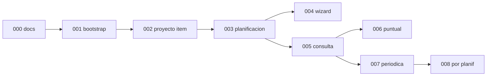

# Backlog — Gestión del trabajo

**Última actualización:** 2026-06-13

Índice de **tickets y épicas** de Planificacion 2.0. La documentación de producto (dominio, arquitectura, C4) permanece en [`docs/`](../docs/).

> **Leer primero:** [protocolo-trabajo-tickets.md](protocolo-trabajo-tickets.md) · [vista-general.md](vista-general.md) · [dudas-y-resoluciones.md](dudas-y-resoluciones.md) (FAQ-103)

---

## Referencia común (no son tickets)

| Documento | Propósito |
|-----------|-----------|
| [vista-general.md](vista-general.md) | Capas, contratos, checklist pre-implementación |
| [dudas-y-resoluciones.md](dudas-y-resoluciones.md) | FAQ de diseño (Ticket 000, Pasos 1–13); FAQ-103: modelo `docs/` vs `backlog/` |
| [protocolo-trabajo-tickets.md](protocolo-trabajo-tickets.md) | Flujo de trabajo por tickets |
| [protocolo_TODOs.md](protocolo_TODOs.md) | Commits (un commit por subticket) |

---

## Qué documento usar

| Necesitas… | Lee… |
|------------|------|
| Decisiones de diseño, FAQ por tema | [dudas-y-resoluciones.md](dudas-y-resoluciones.md) (historico hasta **Ticket 000 — Paso 13**) |
| Pasos 1–13 del plan documental, tabla paso ↔ FAQ | [000-planificacion-inicial/README.md](000-planificacion-inicial/README.md) |
| Roadmap tickets 001+, ticket activo | **Este README** (sección Épicas) |
| Detalle de una épica (alcance, subtickets) | `00N-nombre/README.md` |
| Protocolo de ejecución y commits | [protocolo-trabajo-tickets.md](protocolo-trabajo-tickets.md), [protocolo_TODOs.md](protocolo_TODOs.md) |

---

---

## Épicas

| ID | Carpeta | Estado | Alcance |
|----|---------|--------|---------|
| **000** | [000-planificacion-inicial/](000-planificacion-inicial/) | **Cerrada** | Steps 1–13: documentación y validación |
| **001** | [001-bootstrap/](001-bootstrap/) | **Pendiente** | Andamiaje ejecutable; sin negocio |
| **002** | [002-proyecto-item/](002-proyecto-item/) | **Pendiente** | UC-01.2, UC-01.3 — módulos Proyecto e Item |
| **003** | [003-planificacion/](003-planificacion/) | **Pendiente** | UC-01.4, UC-01.5, UC-03 — módulo Planificación (ZC-3) |
| **004** | [004-wizard-uc01/](004-wizard-uc01/) | **Pendiente** | UC-01.1 — wizard creación (ZC-4) |
| **005** | [005-consulta-ocurrencias/](005-consulta-ocurrencias/) | **Pendiente** | UC-02.1 — calendario / consulta (ZC-1) |
| **006** | [006-gestion-puntual/](006-gestion-puntual/) | **Pendiente** | UC-02.2 — edición puntual individual |
| **007** | [007-gestion-periodica/](007-gestion-periodica/) | **Pendiente** | UC-02.3 — periódicas + materialización (ZC-2) |
| **008** | [008-gestion-por-planificacion/](008-gestion-por-planificacion/) | **Pendiente** | UC-02.4 — gestión por planificación |

---

## Ticket activo

**001-bootstrap** — ver [001-bootstrap/README.md](001-bootstrap/README.md).

Tras cerrar 001, siguiente recomendado: **002-proyecto-item**.
