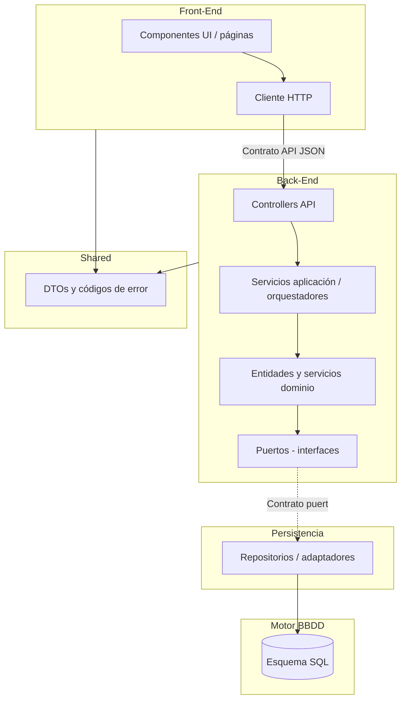

# Vista general — capas, contratos e implementación

**Última actualización:** 2026-06-12

Documento de referencia para entender **cómo encajan** dominio, contenedores, contratos y código en Planificacion 2.0. Forma parte de la **documentación previa obligatoria** antes de implementar lógica de negocio o ampliar código más allá del bootstrap ([Ticket 001](001-bootstrap/README.md)).

> **Principio:** documentar primero, implementar después. Los contratos (externos e internos) fijan qué se puede codificar sin sorpresas de acoplamiento.

---

## 1. Mapa mental (de fuera hacia dentro)

---

## 2. Tipos de “clases” (no confundir)

### 2.1 Entidades de dominio (negocio)

Objetos que representan **conceptos del negocio** y sus reglas.

| Agregado | Ejemplos | Dónde se documenta |
|----------|----------|-------------------|
| Proyecto | Identidad, nombre, unicidad | [proyectos.md](../docs/entidades/proyectos.md) |
| Item | Pertenece a proyecto | [items.md](../docs/entidades/items.md) |
| Planificación | Tipos temporal, RT-*, RC-*; subclases Sin planificar / Puntual / Periódica | [planificaciones.md](../docs/entidades/planificaciones.md), [modelo-clases-planificacion.md](../docs/entidades/modelo-clases-planificacion.md) |
| Ocurrencia materializada | RO-*, materialización individual | [ocurrencias.md](../docs/entidades/ocurrencias.md) |

En código (previsto): `implementacion/back-end/nestjs-typescript/src/domain/{proyecto,item,planificacion,ocurrencia}/`.

**No son:** tablas SQL, componentes React ni clases de repositorio.

### 2.2 Clases de organización (por contenedor)

El resto de clases **organizan** el sistema dentro de cada contenedor; no son entidades de negocio.

| Contenedor | Ejemplos | Rol |
|------------|----------|-----|
| Back-End | `OccurrenceQueryService`, `WizardOrchestrator`, `PlanificacionController` | Servicios, orquestación, HTTP |
| Persistencia | `ProyectoRepository`, `PgConnectionAdapter` | Implementación de puertos, SQL |
| Front-End | `CalendarView`, `PlanificacionCaptureFeature` | UI, estado, cliente API |
| Shared | `CrearProyectoInput`, enum de `codigo` | Contrato compartido FE/BE |

Trazabilidad: C4 N3 (componentes) → N4 canónico (subcomponentes lógicos) → N4 implementación (nombres TS/React/Nest).

---

## 3. Dos vertientes de contrato

Un **contrato** es un acuerdo estable entre partes. En este proyecto se distinguen **dos vertientes** complementarias:

### 3.1 Contratos de interfaz externa

**Qué expone un componente hacia fuera** para que otros contenedores (o el usuario vía API) lo consuman **sin conocer su tecnología interna**.

| Frontera | Contrato | Documentación principal |
|----------|----------|-------------------------|
| Front-End ↔ Back-End | API REST (HTTP/JSON), DTOs, paginación, códigos de error | [contratos-minimos.md](../docs/arquitectura/contratos-minimos.md) §3, [errores-validaciones-capas.md](../docs/arquitectura/errores-validaciones-capas.md), N4 [back-end/.../README.md](../docs/diagramas-c4/c4-nivel-4/implementacion/back-end/nestjs-typescript/README.md) |
| Back-End ↔ Persistencia | Puertos de repositorio y conexión (`*RepositoryPort`, `DatabaseConnectionPort`) | [contratos-minimos.md](../docs/arquitectura/contratos-minimos.md) §1–2, N4 [persistencia/.../zc-5-persistencia.md](../docs/diagramas-c4/c4-nivel-4/implementacion/persistencia/typescript/zc-5-persistencia.md) |
| Persistencia ↔ BBDD | Esquema relacional, migraciones, restricciones | [modelo-entidad-relacion.md](../docs/entidades/modelo-entidad-relacion.md), N4 [bbdd/.../zc-5-persistencia-esquema.md](../docs/diagramas-c4/c4-nivel-4/implementacion/bbdd/postgresql/zc-5-persistencia-esquema.md) |
| Front-End ↔ Back-End (tipos) | Shapes de DTO y catálogo de `codigo` | `implementacion/shared/typescript/` (código), alineado a contratos-minimos |
| Presentación ↔ usuario | i18n por `codigo` | [internacionalizacion.md](../docs/politicas-transversales/internacionalizacion.md) |

**Política transversal:** [desacoplamiento-componentes-contratos.md](../docs/politicas-transversales/desacoplamiento-componentes-contratos.md).

Cambiar tecnología en un componente **no** debe romper contratos externos salvo **versión explícita** del contrato (p. ej. API v2).

### 3.2 Contratos de diseño interno

**Cómo se estructuran las clases dentro de cada componente** para que todo el equipo (y la documentación N4) siga la misma forma, independientemente del detalle de negocio.

| Ámbito | Qué fija | Documentación principal |
|--------|----------|-------------------------|
| Módulos de negocio y agregados | Límites Proyecto / Item / Planificación / Ocurrencia | [granularidad-modulos-negocio.md](../docs/arquitectura/granularidad-modulos-negocio.md) |
| Capas Back-End | `api/` → `application/` → `domain/` → `ports/` | N4 [back-end/nestjs-typescript/](../docs/diagramas-c4/c4-nivel-4/implementacion/back-end/nestjs-typescript/), [docs/implementacion/back-end/](../docs/implementacion/back-end/) (Step 12b) |
| Subcomponentes lógicos (ZC) | Algoritmos, pseudocódigo, puertos de lectura | [pseudocodigo/](../docs/diagramas-c4/c4-nivel-4/pseudocodigo/) |
| Traducción al stack | Mapeo lógico → clase → archivo | [implementacion/](../docs/diagramas-c4/c4-nivel-4/implementacion/) por `{componente}/{tecnologia}/` |
| Árbol de código | Carpetas por componente y tecnología | [implementacion/README.md](../../implementacion/README.md) |
| Transacciones y errores internos | Unidades de trabajo, taxonomía por capa | [transacciones-consistencia.md](../docs/arquitectura/transacciones-consistencia.md), [errores-validaciones-capas.md](../docs/arquitectura/errores-validaciones-capas.md) |
| Convenciones por contenedor (agnósticas) | Prácticas sin atar al stack en el texto | [docs/implementacion/](../docs/implementacion/) (Step 12b) |

Los contratos de diseño interno **no sustituyen** a los externos: definen la **forma** del código; los externos definen la **frontera** con vecinos.

---

## 4. Cadena documental (orden recomendado)

| Orden | Capa | Pregunta que responde |
|-------|------|------------------------|
| 1 | Casos de uso | ¿Qué hace el usuario? |
| 2 | Entidades + ER | ¿Qué existe en negocio y en BD? |
| 3 | C4 N1–N3 | ¿Qué contenedores y componentes hay? |
| 4 | Arquitectura + **contratos externos** | ¿Qué se expone en cada frontera? |
| 5 | N4 canónico | ¿Cómo funciona por dentro (lógica)? |
| 6 | N4 implementación + **contratos internos** | ¿Cómo se nombra y organiza en el stack? |
| 7 | Ticket 000 — Paso 12b (guías componente) | ¿Qué convenciones agnósticas aplican? |
| 8 | Ticket 000 — Paso 13 (validación) | ¿Todo es coherente? |
| 9 | Ticket 001 (bootstrap) | ¿Arranca el andamiaje sin negocio? |
| 10 | Implementación UC-* | ¿Reglas de negocio en código? |

---

## 5. Bootstrap — qué es y qué no es

Resumen: andamiaje ejecutable **mínimo** (monorepo, arranque FE/BE, migraciones, shared, DI), **sin lógica de negocio**.

Detalle, stack, requisitos e subtickets: **[001-bootstrap/README.md](001-bootstrap/README.md)**.

---

## 6. Checklist: documentación antes de implementar negocio

Usar antes del **bootstrap con lógica de negocio** o al cerrar Step 13.

### Contratos de interfaz externa

- [x] API/DTOs alineados con [contratos-minimos.md](../docs/arquitectura/contratos-minimos.md)
- [x] Puertos de persistencia definidos; dominio no referencia SQL ni `pg`
- [x] ER cerrado en [modelo-entidad-relacion.md](../docs/entidades/modelo-entidad-relacion.md)
- [x] Códigos de error estables; i18n en FE ([internacionalizacion.md](../docs/politicas-transversales/internacionalizacion.md))
- [x] [desacoplamiento-componentes-contratos.md](../docs/politicas-transversales/desacoplamiento-componentes-contratos.md) leído

### Contratos de diseño interno

- [x] ZC canónicas en [pseudocodigo/](../docs/diagramas-c4/c4-nivel-4/pseudocodigo/)
- [x] N4 implementación por componente en [implementacion/](../docs/diagramas-c4/c4-nivel-4/implementacion/)
- [x] Granularidad de módulos en [granularidad-modulos-negocio.md](../docs/arquitectura/granularidad-modulos-negocio.md)
- [x] Guías por componente en [docs/implementacion/](../docs/implementacion/) (Step 12b)
- [x] Árbol de código acordado en [implementacion/README.md](../../implementacion/README.md)

### Plan y stack

- [x] [planificacion-inicial.md](000-planificacion-inicial/planificacion-inicial.md) y [dudas-y-resoluciones.md](dudas-y-resoluciones.md) al día
- [x] Stack activo en [historial-stack.md](../docs/stack-tecnologico/historial-stack.md)

**Validación Step 13 (2026-06-12; re-validado):** [validacion-documental-step13.md](000-planificacion-inicial/validacion-documental-step13.md).

---

## 7. Ejemplo rápido: UC-02.1 (calendario)

| Pieza | Tipo | Artefacto |
|-------|------|-----------|
| Reglas RO-3, RO-7 | Dominio / canónico | [ocurrencias.md](../docs/entidades/ocurrencias.md), [zc-1](../docs/diagramas-c4/c4-nivel-4/pseudocodigo/zc-1-consulta-ocurrencias.md) |
| `GET /ocurrencias?desde&hasta` | Contrato **externo** API | N4 back-end, DTO shared |
| `OccurrenceQueryService` | Contrato **interno** + clase | N4 [zc-1 implementación](../docs/diagramas-c4/c4-nivel-4/implementacion/back-end/nestjs-typescript/zc-1-consulta-ocurrencias.md) |
| `CalendarView` | Contrato **interno** FE | N4 [zc-6](../docs/diagramas-c4/c4-nivel-4/implementacion/front-end/react-typescript/zc-6-presentacion.md) |
| Consulta SQL materializadas | Contrato **externo** persistencia↔BBDD | N4 [zc-5](../docs/diagramas-c4/c4-nivel-4/implementacion/persistencia/typescript/zc-5-persistencia.md) |

---

## 8. Referencias cruzadas

| Tema | Ubicación |
|------|-----------|
| Plan por fases | [planificacion-inicial.md](000-planificacion-inicial/planificacion-inicial.md) |
| FAQ y decisiones | [dudas-y-resoluciones.md](dudas-y-resoluciones.md) |
| Arquitectura | [docs/arquitectura/README.md](../docs/arquitectura/README.md) |
| Desacoplamiento | [desacoplamiento-componentes-contratos.md](../docs/politicas-transversales/desacoplamiento-componentes-contratos.md) |
| Tres rutas «implementación» | [desambiguacion-implementacion.md](../docs/politicas-transversales/desambiguacion-implementacion.md) |
| C4 | [diagramas-c4/README.md](../docs/diagramas-c4/README.md) |
