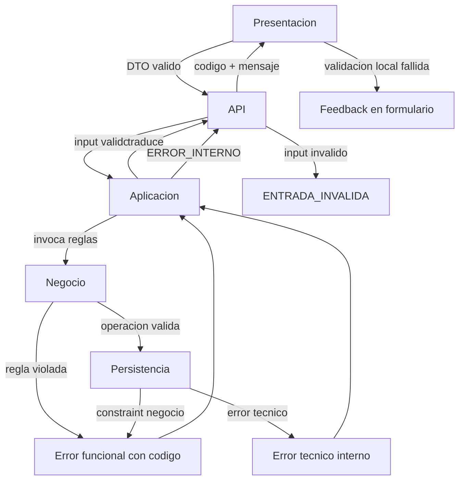

# Politicas de errores y validaciones por capa

Este documento define como se clasifican, validan y propagan los errores en Planificacion 2.0, respetando la arquitectura por capas y los contratos acordados.

## Objetivo

Establecer que valida cada capa, que tipo de error puede originar y como se expone al usuario o a la API sin filtrar detalles tecnicos internos.

## Modelo de error estandar

Todo error funcional expuesto fuera de Persistencia sigue esta estructura minima:

| Campo | Descripcion |
|-------|-------------|
| `codigo` | Identificador estable y machine-readable (ej. `PROYECTO_NOMBRE_DUPLICADO`) |
| `campo` | Opcional; indica el campo de formulario o input afectado |
| `mensaje` | Opcional en API; resuelto por i18n en Presentacion a partir de `codigo` (ver `docs/politicas-transversales/internacionalizacion.md`) |
| `capaOrigen` | Presentacion, API, Aplicacion, Negocio o Persistencia (solo para trazabilidad interna) |

Reglas del modelo:

- Negocio emite solo `codigo` (y `campo` si aplica); no construye textos traducibles.
- Los contratos de servicios de aplicacion propagan `codigo`; no exponen stack traces ni SQL.
- Los errores de infraestructura se traducen en Aplicacion a `ERROR_INTERNO`.
- Un mismo `codigo` debe mapear siempre a la misma clave i18n en todos los flujos (UC-01.1, UC-01.2, UC-01.4, etc.).

## Taxonomia de errores

| Tipo | Capa tipica de origen | Ejemplo | Respuesta al usuario |
|------|----------------------|---------|---------------------|
| Validacion de formato | Presentacion / API | Campo obligatorio vacio | Mensaje en formulario o campo resaltado |
| Validacion de entrada (DTO) | API / Aplicacion | ID invalido, paginacion negativa | Error de solicitud con codigo `ENTRADA_INVALIDA` |
| Regla de negocio | Negocio | Nombre de proyecto duplicado | Mensaje funcional especifico |
| Restriccion de integridad | Negocio / Aplicacion | Eliminar ultimo item del proyecto | Mensaje funcional con accion sugerida |
| Recurso no encontrado | Aplicacion / Negocio | Proyecto inexistente | Codigo `*_NO_ENCONTRADO` |
| Conflicto de estado | Negocio | Cambio de tipo de planificacion no permitido | Mensaje funcional segun regla RT-* |
| Cancelacion de flujo | Presentacion | Usuario cancela UC-01.5 | Sin error; retorno controlado al invocador |
| Infraestructura | Persistencia | Fallo de conexion a BBDD | Mensaje generico; detalle solo en logs |

## Validaciones por capa

### Capa de Presentacion

Responsabilidad:

- Validar formato y completitud de formularios antes de invocar API o servicios de aplicacion.
- Implementar UC-01.5 (captura de datos de planificacion) con validaciones de interfaz.
- Mostrar mensajes de error devueltos por capas inferiores sin reinterpretarlos.

Validaciones propias:

- Campos obligatorios no vacios.
- Formatos basicos (fecha, hora, longitud maxima de texto).
- Seleccion de tipo/subtipo de planificacion coherente con el formulario visible.
- Reglas de captura del catalogo comun (`docs/entidades/planificaciones.md`): RC-1, RC-2, RC-3.

No valida en Presentacion (delegado a Negocio):

- Unicidad de nombres en BD.
- Existencia de referencias (proyecto, item, planificacion).
- Restricciones de eliminacion (ultimo item, ultima planificacion).
- Cambios de tipo de planificacion (RT-1 a RT-5).

Comportamiento ante error:

- Errores de validacion local: feedback inmediato en el formulario, sin llamada a API.
- Errores devueltos por API/Aplicacion: resolver texto via i18n (`error.<codigo>`) a partir del `codigo` recibido.
- Cancelacion UC-01.5: no genera error; informa al invocador que no hay datos para persistir.

### Capa API

Responsabilidad:

- Validar estructura y tipos de los DTOs de entrada antes de invocar Aplicacion.
- Traducir errores de Aplicacion a respuestas HTTP genericas (sin acoplar codigo a un framework concreto en esta fase).

Validaciones propias:

- Presencia y tipo de campos requeridos en inputs (`CrearProyectoInput`, etc.).
- Identificadores con formato valido.
- Parametros de paginacion y filtros dentro de rangos aceptables.
- Rango temporal obligatorio en consultas de ocurrencias (RN-2.1.1).

No valida en API:

- Reglas de dominio e invariantes de agregado.
- Logica de calculo de ocurrencias.

Comportamiento ante error:

- Entrada invalida: codigo `ENTRADA_INVALIDA` con detalle del campo.
- Error de negocio propagado desde Aplicacion: reenviar `codigo` (y `campo` si aplica); `mensaje` traducido es opcional segun `docs/politicas-transversales/internacionalizacion.md`.
- Error interno: codigo `ERROR_INTERNO`.

### Capa de Aplicacion

Responsabilidad:

- Orquestar casos de uso y delimitar unidades transaccionales.
- Invocar validaciones de Negocio antes de persistir.
- Traducir excepciones de dominio a errores estandarizados.
- Traducir errores tecnicos de Persistencia a `ERROR_INTERNO`.

Validaciones propias:

- Coherencia de operaciones multi-modulo (wizard, creacion automatica).
- Verificacion de existencia de recursos referenciados antes de orquestar (proyectoId, itemId, planificacionId).
- Comprobacion previa a eliminacion en cascada segun RC-T2 (minimos) y RC-T3 (RE-3, RE-4 en cada planificacion del ambito).

No valida en Aplicacion:

- Reglas intra-agregado profundas (pertenecen a Negocio).
- Validacion de formulario de captura (pertenece a Presentacion / UC-01.5).

Comportamiento ante error:

- Error de Negocio: propagar sin alterar `codigo` ni `mensaje`.
- Error de Persistencia tras rollback: mapear a `ERROR_INTERNO`.
- Cancelacion de UC-01.5 recibida: finalizar sin iniciar transaccion ni devolver error.

### Capa de Negocio

Responsabilidad:

- Aplicar reglas de dominio e invariantes de agregado.
- Emitir errores funcionales con codigos estables cuando una operacion viola una regla.

Validaciones por modulo:

| Modulo | Reglas aplicadas | Fuente |
|--------|-----------------|--------|
| Proyecto | Unicidad de nombre (RN-2.1) | UC-01.2 |
| Item | Unicidad de nombre por proyecto (RN-3.1); minimo un item (RN-3.3) | UC-01.3 |
| Planificacion | Minimo una planificacion por item (RN-3.4); reglas de persistencia (RN-4.*); catalogo RC-* (incl. RC-8 unicidad Sin planificar); cambios de tipo RT-*; `IdentificablePorUsuario` | UC-01.4, entidades/planificaciones.md |
| Ocurrencia | Transiciones de estado; materializacion (RO-*); tipo puntual vs periodico (RN-2.2.3, RN-2.3.*) | UC-02.*, entidades/ocurrencias.md |

Comportamiento ante error:

- Lanzar error de dominio con `codigo` definido en el catalogo de esta seccion (sin literales de UI).
- No capturar ni enmascarar errores de infraestructura; dejar que Aplicacion los traduzca.

### Capa de Persistencia

Responsabilidad:

- Ejecutar operaciones sobre `DatabaseConnectionPort`.
- Detectar violaciones de restricciones tecnicas (unicidad en BD, FK, timeout).

Validaciones propias:

- Ninguna regla de negocio; solo integridad tecnica del motor de datos.

Comportamiento ante error:

- Violacion de constraint de unicidad: propagar a Aplicacion para mapear al codigo de negocio correspondiente (ej. `PROYECTO_NOMBRE_DUPLICADO`).
- Violacion de FK o error de conexion: propagar como error tecnico; Aplicacion responde `ERROR_INTERNO`.
- No exponer SQL, nombres de tablas ni detalles del motor al exterior.

## Catalogo de codigos de error de negocio

Codigos acordados alineados con casos de uso y entidades existentes. La columna "Mensaje orientativo" es referencia para el locale `es` en i18n; Negocio no emite este texto.

| Codigo | Mensaje orientativo (locale `es`) | Modulo | Regla origen |
|--------|--------------------|--------|--------------|
| `PROYECTO_NOMBRE_DUPLICADO` | Ya existe un proyecto con ese nombre. Por favor, ingrese otro. | Proyecto | RN-2.1 |
| `PROYECTO_NO_ENCONTRADO` | El proyecto solicitado no existe. | Proyecto | — |
| `ITEM_NOMBRE_DUPLICADO` | Ya existe un item con ese nombre en este proyecto. Por favor, ingrese otro. | Item | RN-3.1 |
| `ITEM_NO_ENCONTRADO` | El item solicitado no existe. | Item | — |
| `ITEM_ULTIMO_NO_ELIMINABLE` | No se puede eliminar el ultimo item del proyecto. Para eliminar este item, debe eliminar el proyecto completo. | Item | RN-3.3 |
| `PLANIFICACION_NO_ENCONTRADA` | La planificacion solicitada no existe. | Planificacion | — |
| `PLANIFICACION_ULTIMA_NO_ELIMINABLE` | No se puede eliminar la ultima planificacion del item. | Planificacion | RN-3.4 / RN-4.2 |
| `PLANIFICACION_COMPLETADA_NO_ELIMINABLE` | No se puede eliminar una planificacion completada. Editelo y cambie el estado a Pendiente. | Planificacion | RE-3, RN-4.3 |
| `PLANIFICACION_CON_OCURRENCIAS_NO_ELIMINABLE` | No se puede eliminar: hay ocurrencias gestionadas. Anulelas o restaurelas en la gestion por planificacion. | Planificacion | RE-4, RN-4.4 |
| `ELIMINACION_PROYECTO_BLOQUEADA` | No se puede eliminar el proyecto. Las planificaciones listadas deben prepararse antes. | Proyecto | RE-3, RE-4, RE-5; ver payload |
| `ELIMINACION_ITEM_BLOQUEADA` | No se puede eliminar el item. Las planificaciones listadas deben prepararse antes. | Item | RE-3, RE-4, RE-5; ver payload |
| `PLANIFICACION_CONFIGURACION_INVALIDA` | La configuracion de planificacion no es valida para el tipo seleccionado. | Planificacion | RC-1, RC-2, RC-3 |
| `PLANIFICACION_SIN_PLANIFICAR_OBSERVACIONES_DUPLICADAS` | Ya existe una planificacion Sin planificar con esas observaciones en este item. | Planificacion | RC-8 |
| `PLANIFICACION_CAMBIO_TIPO_NO_PERMITIDO` | No se permite el cambio de tipo de planificacion solicitado. | Planificacion | RT-4, RT-5 |
| `PLANIFICACION_A_SIN_PLANIFICAR_BLOQUEADA` | No se puede cambiar a Sin planificar: existen ocurrencias modificadas o la planificacion esta completada. | Planificacion | RT-2, RT-3 |
| `OCURRENCIA_NO_ENCONTRADA` | La ocurrencia solicitada no existe. | Ocurrencia | — |
| `OCURRENCIA_TIPO_NO_SOPORTADO` | Esta operacion no aplica al tipo de planificacion indicado. | Ocurrencia | RN-2.2.3 |
| `RANGO_TEMPORAL_INVALIDO` | Debe indicar un rango de fechas valido para la consulta. | Planificacion / Ocurrencia | RN-2.1.1 |
| `ENTRADA_INVALIDA` | La solicitud contiene datos invalidos o incompletos. | API / Aplicacion | — |
| `ERROR_INTERNO` | Ha ocurrido un error inesperado. Intente de nuevo mas tarde. | Aplicacion | — |

### Payload — bloqueos al eliminar proyecto o item (RE-5)

Los codigos `ELIMINACION_PROYECTO_BLOQUEADA` y `ELIMINACION_ITEM_BLOQUEADA` incluyen un array `bloqueos` con **todas** las planificaciones que impiden el borrado. La capa de Negocio/Aplicacion lo construye antes de iniciar la transaccion de cascada (ZC-5 `listarBloqueosEliminacion*`).

```
ESTRUCTURA IdentificablePorUsuario:
  proyecto_nombre: Texto               // nombre visible del proyecto
  item_nombre: Texto                   // nombre visible del item
  naturaleza: PERIODICA | PUNTUAL | SIN_PLANIFICAR
  tipo_periodo: Texto | NULL           // TipoPeriodo.codigo si PERIODICA; NULL en PUNTUAL / SIN_PLANIFICAR
  observaciones: Texto
  fecha_inicio: Fecha | NULL           // solo PERIODICA
  fecha_fin: Fecha | NULL
  hora: Hora | NULL                    // PERIODICA y PUNTUAL
  fecha: Fecha | NULL                  // solo PUNTUAL

Fuente canonica de composicion: [planificaciones.md](../entidades/planificaciones.md) — seccion IdentificablePorUsuario.

ESTRUCTURA BloqueoEliminacionPlanificacion:
  planificacion_id: Entero
  identificable_por_usuario: IdentificablePorUsuario
  motivos: Lista<MotivoBloqueo>      // al menos uno
  cantidad_ocurrencias_materializadas: Entero | NULL   // obligatorio si motivos contiene OCURRENCIAS_MATERIALIZADAS

ENUM MotivoBloqueo:
  COMPLETADA                  // RE-3
  OCURRENCIAS_MATERIALIZADAS  // RE-4
```

Ejemplo de respuesta API (orientativo):

```json
{
  "codigo": "ELIMINACION_PROYECTO_BLOQUEADA",
  "bloqueos": [
    {
      "planificacion_id": 12,
      "identificable_por_usuario": {
        "proyecto_nombre": "Marketing 2026",
        "item_nombre": "Campaña Q1",
        "naturaleza": "PERIODICA",
        "tipo_periodo": "Semanal",
        "observaciones": "Reunión de seguimiento",
        "fecha_inicio": "2026-03-01",
        "fecha_fin": "2026-12-31",
        "hora": "10:00:00"
      },
      "motivos": ["COMPLETADA"],
      "cantidad_ocurrencias_materializadas": null
    },
    {
      "planificacion_id": 18,
      "identificable_por_usuario": {
        "proyecto_nombre": "Marketing 2026",
        "item_nombre": "Soporte",
        "naturaleza": "PERIODICA",
        "tipo_periodo": "Diario",
        "observaciones": "Daily standup",
        "fecha_inicio": "2026-01-01",
        "fecha_fin": "2026-06-30",
        "hora": "09:00:00"
      },
      "motivos": ["COMPLETADA", "OCURRENCIAS_MATERIALIZADAS"],
      "cantidad_ocurrencias_materializadas": 2
    }
  ]
}
```

**Requisitos de presentacion (RE-5):**

1. El mensaje visible **no** puede limitarse a «hay planificaciones que impiden el borrado» sin listar cuales.
2. Cada linea o fila debe mostrar el **`IdentificablePorUsuario`** completo de la planificacion bloqueante (sin ambiguedad).
3. Debe indicarse el **motivo** de bloqueo por entrada (Completada, ocurrencias gestionadas, o ambos).
4. Presentacion formatea `identificable_por_usuario` segun naturaleza (ZC-6 `formatearIdentificablePorUsuario`).

Mensaje orientativo compuesto (locale `es`, proyecto):

> No se puede eliminar el proyecto «Marketing 2026». Prepare las siguientes planificaciones antes de reintentar:
> • Proyecto «{proyecto}» · Item «{item}» · {tipo_periodo} · «{observaciones}» · {fecha_inicio}–{fecha_fin} · {hora} — Completada
> • Proyecto «{proyecto}» · Item «{item}» · {tipo_periodo} · «{observaciones}» · … — Completada; N ocurrencias gestionadas

La plantilla i18n vive en Presentacion (ZC-6); Negocio emite codigo + `bloqueos` con `identificable_por_usuario`.

## Flujo de propagacion



Reglas del flujo:

1. Presentacion puede repetir validaciones de formato, pero nunca sustituir la validacion de Negocio.
2. Negocio es la unica capa que decide si una regla de dominio se cumple.
3. Aplicacion es el unico punto que traduce errores tecnicos a `ERROR_INTERNO`.
4. API no altera codigos de negocio al reenviarlos a Presentacion.
5. Presentacion resuelve el texto visible via i18n; ver `docs/politicas-transversales/internacionalizacion.md`.

## Duplicidad de validacion aceptada

Algunas reglas se validan en mas de una capa con distinto proposito:

| Regla | Presentacion (UX) | Negocio (autoridad) |
|-------|-------------------|---------------------|
| Campos obligatorios planificacion | Si (UC-01.5) | Si (RC-1, RC-2, RC-3) |
| Unicidad nombre proyecto | No | Si (RN-2.1) |
| Rango fecha inicio/fin | Si (UC-01.5) | Si (RC-2) |
| Ultimo item no eliminable | No | Si (RN-3.3) |

Principio: la capa de Negocio siempre tiene la ultima palabra; la validacion en Presentacion mejora la experiencia pero no sustituye la del dominio.

## Trazabilidad con casos de uso

| Caso de uso | Capa principal de validacion | Errores tipicos |
|-------------|------------------------------|-----------------|
| UC-01.1 Wizard | Presentacion + Aplicacion + Negocio | `PROYECTO_NOMBRE_DUPLICADO`, `PLANIFICACION_CONFIGURACION_INVALIDA` |
| UC-01.2 Gestion proyecto | Negocio | `PROYECTO_NOMBRE_DUPLICADO`, `ELIMINACION_PROYECTO_BLOQUEADA` (payload RE-5) |
| UC-01.3 Gestion item | Negocio | `ITEM_NOMBRE_DUPLICADO`, `ITEM_ULTIMO_NO_ELIMINABLE`, `ELIMINACION_ITEM_BLOQUEADA` (payload RE-5) |
| UC-01.4 Gestion planificacion | Presentacion (via UC-01.5) + Negocio | `PLANIFICACION_ULTIMA_NO_ELIMINABLE`, RT-* |
| UC-01.5 Captura datos | Presentacion | `PLANIFICACION_CONFIGURACION_INVALIDA`, campos obligatorios |
| UC-02.1 Visualizacion | API + Negocio | `RANGO_TEMPORAL_INVALIDO` |
| UC-02.2 / UC-02.3 / UC-02.4 | Negocio + Ocurrencia | `OCURRENCIA_TIPO_NO_SOPORTADO`, RO-* |
| UC-03 Listar Sin planificar | Aplicacion (solo lectura) | `ENTRADA_INVALIDA` en filtros |

## Resultado

Quedan definidas las politicas de errores y validaciones para:

- modelo de error estandar alineado con contratos,
- reparto de responsabilidades por capa,
- catalogo de codigos de negocio trazable a reglas existentes,
- reglas de propagacion y duplicidad aceptada entre Presentacion y Negocio.

Los mensajes orientativos de este documento alimentan el catalogo i18n del locale `es` (ver `docs/politicas-transversales/internacionalizacion.md`).

Este documento es base para el Step 11 (stack tecnologico), cierre del Step 9 de arquitectura.
