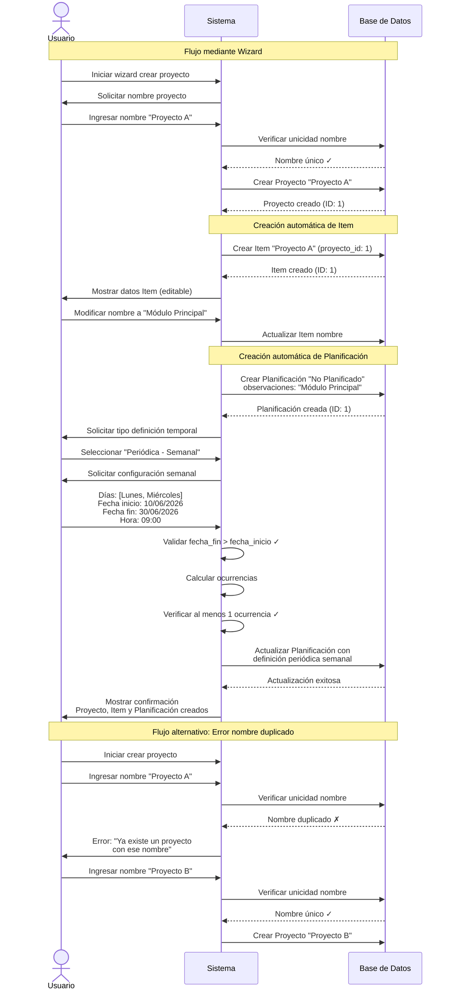

# UC-01: Crear Proyecto, Item y Planificación

**ID:** UC-01  
**Nombre:** Crear Proyecto, Item y Planificación  
**Prioridad:** Alta  
**Última actualización:** 2026-06-10

---

## Descripción

Permite al usuario crear la estructura jerárquica completa del sistema: Proyecto, Item y Planificación con su definición temporal correspondiente. El sistema soporta dos flujos: creación mediante wizard único o creación por pasos separados.

---

## Actores

- **Usuario**: Persona que utiliza el sistema para gestionar planificaciones

---

## Precondiciones

- El usuario tiene acceso al sistema
- El sistema está operativo

---

## Flujo Principal

### Opción A: Creación mediante Wizard

1. El usuario inicia el wizard de creación de proyecto
2. El sistema solicita el nombre del proyecto
3. El usuario ingresa el nombre del proyecto
4. El sistema valida que el nombre no exista
5. El sistema crea el proyecto
6. **El sistema crea automáticamente un Item con el mismo nombre que el proyecto**
7. El sistema solicita datos del Item (nombre editable, descripción)
8. El usuario confirma o modifica el nombre del Item y añade descripción
9. **El sistema crea automáticamente una Planificación tipo "No Planificado" con observaciones = nombre del Item**
10. El sistema solicita configuración de la planificación
11. El usuario selecciona el tipo de definición temporal:
    - **Puntual**: Ver flujo alternativo FA-1
    - **Periódica**: Ver flujo alternativo FA-2
    - **No Planificado**: Se mantiene la planificación creada automáticamente
12. El usuario guarda la configuración
13. El sistema muestra confirmación de creación exitosa

### Opción B: Creación por Pasos Separados

1. El usuario selecciona "Crear Proyecto"
2. El sistema solicita el nombre del proyecto
3. El usuario ingresa el nombre del proyecto
4. El sistema valida que el nombre no exista
5. El sistema crea el proyecto
6. **El sistema crea automáticamente un Item con el mismo nombre que el proyecto** y **El sistema crea automáticamente una Planificación tipo "No Planificado" con observaciones = nombre del Item**
7. El sistema muestra confirmación de creación exitosa
8. El sistema muestra el proyecto creado con su Item automático
9. El usuario navega por el proyecto y selecciona "Configurar Item" sobre uno ya existente o "Crear Item" para añadir uno nuevo
10. El sistema muestra o solicita datos del Item (nombre, descripción)
11. El usuario ingresa o modifica los datos
12. El sistema valida que no exista un Item con el mismo nombre en el proyecto
13. El sistema actualiza o crea el Item
14. El sistema muestra confirmación de creación o modificación exitosa
15. **Si el Item es nuevo, el sistema crea automáticamente una Planificación tipo "No Planificado" con observaciones = nombre del Item**
16. El usuario accede a las planificaciones del Item
17. El usuario selecciona "Configurar Planificación" sobre una existente o "Crear Planificación" para añadir una nueva
18. El sistema solicita configuración de la planificación
19. El usuario selecciona el tipo de definición temporal (ver paso 11 de Opción A)
20. El usuario guarda la configuración
21. El sistema muestra confirmación de creación o modificación exitosa

---

## Flujos Alternativos

### FA-1: Definición Temporal Puntual

1. El usuario selecciona "Puntual"
2. El sistema solicita:
   - Fecha
   - Hora (obligatoria)
   - Observaciones (opcional)
3. El usuario ingresa los datos
4. El sistema guarda la planificación puntual
5. Retorna al flujo principal

### FA-2: Definición Temporal Periódica

1. El usuario selecciona "Periódica"
2. El sistema solicita:
   - Fecha inicio
   - Fecha fin
   - Tipo de periodo: Diaria, Semanal, Mensual
   - Hora (obligatoria)
   - Observaciones (opcional)
3. El usuario selecciona el tipo de periodo

#### FA-2.1: Periodo Diario

1. El sistema solicita seleccionar frecuencia:
   - **Todos los días**
   - **De Lunes a Viernes**
   - **Fin de semana** (Sábado y Domingo)
2. El sistema solicita hora de ejecución
3. El usuario ingresa los datos
4. El sistema valida que fecha_fin > fecha_inicio
5. El sistema valida que se genere al menos una ocurrencia válida
6. El sistema guarda la planificación periódica diaria
7. Retorna al flujo principal

#### FA-2.2: Periodo Semanal

1. El sistema muestra checkboxes para seleccionar días:
   - ☐ Lunes
   - ☐ Martes
   - ☐ Miércoles
   - ☐ Jueves
   - ☐ Viernes
   - ☐ Sábado
   - ☐ Domingo
2. El usuario selecciona uno o más días
3. El sistema solicita hora de ejecución
4. El usuario ingresa hora
5. El sistema valida que fecha_fin > fecha_inicio
6. El sistema valida que se genere al menos una ocurrencia válida en el rango de fechas
7. El sistema guarda la planificación periódica semanal
8. Retorna al flujo principal

#### FA-2.3: Periodo Mensual

1. El sistema solicita:
   - Día del mes (1-31)
   - Hora de ejecución
2. El usuario ingresa los datos
3. **Si el día es mayor que 28**, el sistema solicita elegir comportamiento para meses con menos días:
   - **Utilizar el último día del mes** (ej: 28 o 29 feb, 30 abr)
   - **Establecer el día 1 del mes siguiente**
   - **Omitir mes** (no generar ocurrencia)
4. El sistema valida que fecha_fin > fecha_inicio
5. El sistema valida que se genere al menos una ocurrencia válida
6. El sistema guarda la planificación periódica mensual
7. Retorna al flujo principal

### FA-3: Error - Nombre de Proyecto Duplicado

1. El sistema detecta que ya existe un proyecto con ese nombre
2. El sistema muestra mensaje de error: "Ya existe un proyecto con ese nombre"
3. El sistema solicita ingresar un nombre diferente
4. Retorna al paso de ingreso de nombre

### FA-4: Error - Nombre de Item Duplicado en Proyecto

1. El sistema detecta que ya existe un Item con ese nombre en el proyecto
2. El sistema muestra mensaje de error: "Ya existe un Item con ese nombre en este proyecto"
3. El sistema solicita ingresar un nombre diferente
4. Retorna al paso de ingreso de nombre del Item

### FA-5: Error - Validación de Fechas Periódicas

1. El sistema detecta que fecha_fin <= fecha_inicio
2. El sistema muestra mensaje de error: "La fecha fin debe ser posterior a la fecha inicio"
3. El sistema solicita corregir las fechas
4. Retorna al paso de ingreso de fechas

### FA-6: Error - No se Genera Ninguna Ocurrencia

1. El sistema detecta que la configuración no genera ninguna ocurrencia válida
   - Ejemplo: Periodo Lunes-Martes configurado como "Semanal - Jueves"
   - Ejemplo: Periodo de 2 días configurado como "Mensual - día 15"
2. El sistema muestra mensaje de error: "La configuración no genera ninguna planificación válida en el rango de fechas especificado"
3. El sistema solicita ajustar la configuración
4. Retorna al paso de configuración del periodo

### FA-7: Usuario Cancela la Operación

1. En cualquier punto del wizard, el usuario selecciona "Cancelar"
2. El sistema muestra confirmación: "¿Desea cancelar? Los cambios no guardados se perderán"
3. Si el usuario confirma:
   - El sistema descarta todos los datos ingresados
   - Retorna a la vista anterior
4. Si el usuario no confirma:
   - Retorna al paso actual del wizard

---

## Postcondiciones

### Éxito
- Se ha creado un Proyecto con nombre único
- Se ha creado al menos un Item asociado al Proyecto
- El Item tiene al menos una Planificación (automática "No Planificado" o configurada por el usuario)
- Si la planificación es periódica, el sistema puede calcular todas sus ocurrencias futuras

### Fallo
- No se crea ningún elemento
- El sistema mantiene su estado anterior

---

## Reglas de Negocio

### RN-1: Unicidad de Nombres de Proyecto
Los nombres de proyectos deben ser únicos en todo el sistema.

### RN-2: Unicidad de Nombres de Items por Proyecto
Dentro de un mismo proyecto, no puede haber dos Items con el mismo nombre. Items en proyectos diferentes pueden tener el mismo nombre.

### RN-3: Creación Automática de Item
Al crear un Proyecto, se crea automáticamente un Item con el mismo nombre del proyecto. Este nombre es editable posteriormente.

### RN-4: Creación Automática de Planificación
Al crear un Item, se crea automáticamente una Planificación tipo "No Planificado" cuyas observaciones coinciden con el nombre del Item.

### RN-5: Validación de Fechas Periódicas
En planificaciones periódicas, la fecha fin debe ser estrictamente posterior a la fecha inicio.

### RN-6: Validación de Ocurrencias
Una planificación periódica debe generar al menos una ocurrencia válida dentro del rango de fechas especificado.

### RN-7: Gestión de Estados de Ocurrencias
Las ocurrencias de planificaciones periódicas tienen tres estados posibles:
- **Completada**: Marcada explícitamente como finalizada
- **Pendiente**: No completada pero la fecha aún es futura
- **Sin definir**: Hereda el comportamiento de la planificación principal

### RN-8: Modificación de Estados Masiva
Al cambiar el estado de una planificación periódica desde su configuración, el cambio se aplica a todas las ocurrencias en estado "Sin definir", pero respeta las ocurrencias con estado "Completada" o "Pendiente" asignado explícitamente.

### RN-9: Periodos Diarios - Opciones Fijas
Las planificaciones con periodo diario solo admiten tres opciones:
- Todos los días (7 días/semana)
- De Lunes a Viernes (5 días/semana)
- Fin de semana (Sábado y Domingo)

### RN-10: Periodos Semanales - Selección Múltiple
Las planificaciones con periodo semanal permiten seleccionar uno o más días de la semana (no necesariamente consecutivos ni todos).

### RN-11: Periodos Mensuales - Gestión de Día >28
Para planificaciones mensuales con día mayor a 28, el usuario debe especificar el comportamiento para meses con menos días:
- Último día del mes
- Día 1 del mes siguiente
- Omitir ese mes

### RN-12: Pre-llenado de Observaciones
Las observaciones de una planificación solo se pre-llenan automáticamente cuando se configura la planificación automática creada junto con el Item (RN-4). Al crear planificaciones adicionales, el campo observaciones está vacío.

### RN-13: Hora Obligatoria
Todas las planificaciones (puntuales y periódicas) deben tener una hora específica definida. No se permiten planificaciones sin hora. La hora se almacena por separado de la fecha.

### RN-14: Cálculo Dinámico de Ocurrencias
Las ocurrencias de planificaciones periódicas NO se crean físicamente en la base de datos al momento de crear la planificación. Se calculan dinámicamente en tiempo de ejecución basándose en la definición temporal (fecha inicio, fecha fin, periodo, días, hora).

### RN-15: Materialización de Ocurrencias Modificadas
Cuando se modifica una ocurrencia específica de una planificación periódica (cambio de estado, hora, observaciones, o fecha), esa ocurrencia SE DEBE crear físicamente en la base de datos como un registro independiente vinculado a la planificación periódica.

### RN-16: Registro de Ocurrencias Eliminadas
Cuando se elimina una ocurrencia específica de una planificación periódica, se debe registrar la fecha de la eliminación en la base de datos. Al calcular las ocurrencias dinámicamente, las fechas eliminadas no se muestran.

### RN-17: Modificación de Fecha de Ocurrencia
Al modificar la fecha de una ocurrencia:
1. Se registra una eliminación en la fecha original
2. Se crea una ocurrencia modificada en la nueva fecha
3. Si existe un registro de eliminación en la nueva fecha, éste se anula (la modificación prevalece sobre la eliminación previa)

### RN-18: Separación de Fecha y Hora en Ocurrencias
La hora de las planificaciones se registra por separado de las fechas. Para verificar si una ocurrencia ha sido modificada o eliminada, solo se compara por fecha (sin considerar la hora). Esto permite modificar solo la hora de una ocurrencia sin afectar su fecha.

---

## Diagrama de Secuencia



---

## Notas Técnicas

### Gestión de Ocurrencias de Planificaciones Periódicas

El sistema implementa un **modelo híbrido** de gestión de ocurrencias que optimiza el almacenamiento y permite flexibilidad en la modificación individual de ocurrencias.

#### Modelo de Datos Requerido

**Tabla: Planificacion**
- Define la planificación periódica base con fecha_inicio, fecha_fin, periodo, hora, etc.
- NO contiene registros individuales de cada ocurrencia
- La hora se almacena como campo separado (tipo TIME)

**Tabla: OcurrenciaModificada**
- `id` (PK)
- `planificacion_id` (FK → Planificacion)
- `fecha_original` (DATE) - Fecha donde naturalmente ocurriría según el cálculo dinámico
- `fecha_modificada` (DATE, nullable) - Nueva fecha si fue movida, NULL si solo se modificó estado/hora
- `hora_modificada` (TIME, nullable) - Nueva hora si fue modificada, NULL si usa la hora base
- `estado` (ENUM: 'Completada', 'Pendiente') - Estado específico de esta ocurrencia
- `observaciones_modificadas` (TEXT, nullable) - Observaciones específicas para esta ocurrencia
- `es_eliminada` (BOOLEAN) - TRUE si la ocurrencia fue eliminada, FALSE si solo modificada
- `fecha_creacion` (TIMESTAMP) - Para auditoría
- Constraint: UNIQUE(planificacion_id, fecha_original)

#### Algoritmo de Cálculo de Ocurrencias

```pseudocode
FUNCTION calcularOcurrencias(planificacion_id):
    // 1. Obtener definición de planificación periódica
    planificacion = DB.obtenerPlanificacion(planificacion_id)
    
    // 2. Calcular todas las fechas naturales según el periodo
    fechas_calculadas = []
    fecha_actual = planificacion.fecha_inicio
    
    WHILE fecha_actual <= planificacion.fecha_fin:
        IF cumpleCondicionesPeriodo(fecha_actual, planificacion.periodo, planificacion.configuracion):
            fechas_calculadas.append(fecha_actual)
        fecha_actual = siguiente_fecha(fecha_actual, planificacion.periodo)
    
    // 3. Obtener todas las modificaciones registradas
    modificaciones = DB.obtenerOcurrenciasModificadas(planificacion_id)
    
    // 4. Construir lista final de ocurrencias
    ocurrencias = []
    
    FOR EACH fecha IN fechas_calculadas:
        modificacion = modificaciones.buscar(fecha_original == fecha)
        
        IF modificacion EXISTS AND modificacion.es_eliminada == TRUE:
            // Ocurrencia eliminada - no incluir
            CONTINUE
        
        IF modificacion EXISTS AND modificacion.es_eliminada == FALSE:
            // Ocurrencia modificada - usar datos modificados
            ocurrencia = {
                fecha: modificacion.fecha_modificada OR fecha,
                hora: modificacion.hora_modificada OR planificacion.hora,
                estado: modificacion.estado,
                observaciones: modificacion.observaciones_modificadas OR planificacion.observaciones,
                es_modificada: TRUE,
                modificacion_id: modificacion.id
            }
        ELSE:
            // Ocurrencia natural - usar datos base
            ocurrencia = {
                fecha: fecha,
                hora: planificacion.hora,
                estado: calcularEstadoDinamico(fecha, planificacion.hora),
                observaciones: planificacion.observaciones,
                es_modificada: FALSE,
                modificacion_id: NULL
            }
        
        ocurrencias.append(ocurrencia)
    
    // 5. Añadir ocurrencias modificadas que fueron movidas a fechas fuera del rango natural
    FOR EACH modificacion IN modificaciones:
        IF modificacion.fecha_modificada NOT NULL AND modificacion.fecha_modificada NOT IN fechas_calculadas:
            // Ocurrencia movida fuera del patrón natural
            ocurrencia = {
                fecha: modificacion.fecha_modificada,
                hora: modificacion.hora_modificada OR planificacion.hora,
                estado: modificacion.estado,
                observaciones: modificacion.observaciones_modificadas OR planificacion.observaciones,
                es_modificada: TRUE,
                modificacion_id: modificacion.id
            }
            ocurrencias.append(ocurrencia)
    
    // 6. Ordenar por fecha y hora
    ocurrencias.sort(BY fecha, hora)
    
    RETURN ocurrencias
```

#### Ejemplos de Casos de Uso

**Planificación Base:**
- ID: 1
- Periodo: Semanal - Lunes y Miércoles
- Fecha inicio: 10/06/2026
- Fecha fin: 30/06/2026
- Hora: 09:00
- Fechas naturales calculadas: 10/06, 12/06, 17/06, 19/06, 24/06, 26/06

---

**Caso 1: Eliminar ocurrencia del 17/06/2026**

*Acción del usuario:* Desde el calendario, elimina la ocurrencia del 17/06

*Registro en DB:*
```sql
INSERT INTO OcurrenciaModificada 
(planificacion_id, fecha_original, es_eliminada) 
VALUES (1, '2026-06-17', TRUE)
```

*Resultado al calcular:* Las fechas mostradas son: 10/06, 12/06, ~~17/06~~, 19/06, 24/06, 26/06

---

**Caso 2: Marcar ocurrencia del 19/06/2026 como "Completada"**

*Acción del usuario:* Desde el calendario, marca la ocurrencia del 19/06 como completada

*Registro en DB:*
```sql
INSERT INTO OcurrenciaModificada 
(planificacion_id, fecha_original, estado, es_eliminada) 
VALUES (1, '2026-06-19', 'Completada', FALSE)
```

*Resultado al calcular:* La fecha 19/06 se muestra con estado "Completada" en vez de calcularse dinámicamente

---

**Caso 3: Mover ocurrencia del 24/06/2026 al 25/06/2026**

*Acción del usuario:* Arrastra la ocurrencia del 24/06 al 25/06

*Proceso del sistema:*
1. Verificar si existe eliminación en 25/06 → No existe
2. Crear registro de modificación

*Registro en DB:*
```sql
INSERT INTO OcurrenciaModificada 
(planificacion_id, fecha_original, fecha_modificada, es_eliminada) 
VALUES (1, '2026-06-24', '2026-06-25', FALSE)
```

*Resultado al calcular:* 
- La fecha 24/06 NO aparece (eliminada implícitamente por el movimiento)
- La fecha 25/06 SÍ aparece (nueva ubicación)
- Fechas mostradas: 10/06, 12/06, 19/06, 25/06, 26/06

---

**Caso 4: Mover ocurrencia a fecha donde había una eliminada**

*Estado previo:* La ocurrencia del 17/06 está eliminada (ver Caso 1)

*Acción del usuario:* Mueve la ocurrencia del 26/06 al 17/06

*Proceso del sistema:*
1. Verificar si existe eliminación en 17/06 → SÍ existe
2. Eliminar el registro de eliminación del 17/06
3. Crear registro de modificación para el movimiento

*Operaciones en DB:*
```sql
-- Eliminar la marca de eliminación previa
DELETE FROM OcurrenciaModificada 
WHERE planificacion_id = 1 AND fecha_original = '2026-06-17' AND es_eliminada = TRUE;

-- Registrar el movimiento
INSERT INTO OcurrenciaModificada 
(planificacion_id, fecha_original, fecha_modificada, es_eliminada) 
VALUES (1, '2026-06-26', '2026-06-17', FALSE)
```

*Resultado:* La modificación prevalece sobre la eliminación previa

---

**Caso 5: Cambiar solo la hora de una ocurrencia**

*Acción del usuario:* Modifica la hora del 12/06 de 09:00 a 14:30

*Registro en DB:*
```sql
INSERT INTO OcurrenciaModificada 
(planificacion_id, fecha_original, hora_modificada, es_eliminada) 
VALUES (1, '2026-06-12', '14:30', FALSE)
```

*Resultado al calcular:* 
- Fecha 12/06 se muestra a las 14:30 en vez de 09:00
- El resto de ocurrencias mantienen la hora 09:00

---

**Caso 6: Modificar múltiples atributos de una ocurrencia**

*Acción del usuario:* Para la ocurrencia del 10/06:
- Cambia la hora de 09:00 a 10:00
- Marca como "Completada"
- Añade observación específica: "Primera reunión - exitosa"

*Registro en DB:*
```sql
INSERT INTO OcurrenciaModificada 
(planificacion_id, fecha_original, hora_modificada, estado, observaciones_modificadas, es_eliminada) 
VALUES (1, '2026-06-10', '10:00', 'Completada', 'Primera reunión - exitosa', FALSE)
```

*Resultado al calcular:* La fecha 10/06 muestra todos los cambios aplicados

---

#### Consideraciones de Rendimiento

**Optimizaciones recomendadas:**

1. **Caché de ocurrencias calculadas:** Para planificaciones con muchas ocurrencias, cachear el resultado del cálculo con TTL corto

2. **Índices en OcurrenciaModificada:**
   ```sql
   CREATE INDEX idx_ocurrencia_planificacion ON OcurrenciaModificada(planificacion_id);
   CREATE INDEX idx_ocurrencia_fecha ON OcurrenciaModificada(fecha_original);
   ```

3. **Paginación:** Al mostrar calendario, solo calcular ocurrencias del rango visible (mes actual)

4. **Cálculo diferido:** Para listados, mostrar solo próximas N ocurrencias en vez de calcular todas

#### Validaciones Necesarias

Antes de crear/modificar una ocurrencia, validar:

1. **Fecha dentro del rango:** `fecha >= planificacion.fecha_inicio AND fecha <= planificacion.fecha_fin` (excepto para movimientos fuera del rango)
2. **No duplicar modificaciones:** Verificar que no existe ya una modificación para esa fecha_original
3. **Consistencia de estado:** Al marcar como "Completada", registrar timestamp
4. **Integridad referencial:** Verificar que planificacion_id existe

#### Casos Especiales a Documentar

**¿Qué pasa si se modifica la definición base de la planificación periódica?**
- Si se cambia la hora base: Solo afecta a ocurrencias futuras sin modificación de hora
- Si se cambia el periodo/días: Las modificaciones existentes se mantienen, pero el cálculo dinámico usa la nueva definición
- Si se cambia fecha_fin: Ocurrencias modificadas fuera del nuevo rango siguen existiendo

**Recomendación:** Crear UC-04 "Gestionar Ocurrencias Individuales" para documentar todas estas operaciones en detalle.

---

**Fin del documento UC-01**
