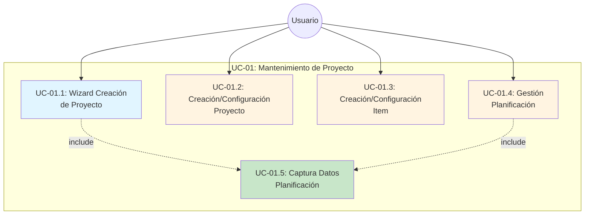
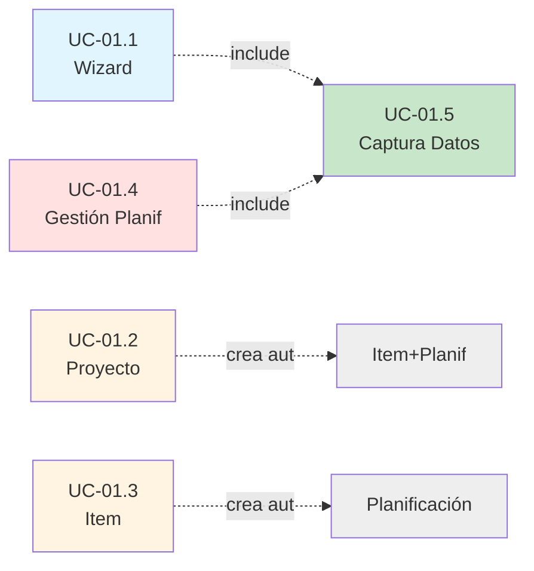

# UC-01: Mantenimiento de Proyecto

**ID:** UC-01  
**Nombre:** Mantenimiento de Proyecto  
**Prioridad:** Alta  
**Última actualización:** 2026-06-10

---

## Descripción

Permite al usuario gestionar el ciclo de vida completo de proyectos, items y planificaciones. El sistema ofrece dos modalidades de trabajo: un wizard guiado para creación rápida, y una gestión manual detallada para configuración avanzada.

---

## Diagrama de Casos de Uso



---

## Casos de Uso Componentes

### [UC-01.1: Wizard Creación de Proyecto](UC-01.1-wizard-creacion-proyecto.md)
**Descripción:** Flujo guiado paso a paso que solicita todos los datos necesarios (proyecto, item y planificación) en una única sesión.

**Datos solicitados:**
- Nombre del proyecto
- Descripción del proyecto
- Nombre del item
- Descripción del item
- Planificación inicial (incluye UC-01.5)

**Ventaja:** Creación rápida y completa en un solo proceso.

---

### [UC-01.2: Creación/Configuración Proyecto](UC-01.2-gestion-proyecto.md)
**Descripción:** Gestión manual de proyectos permitiendo crear nuevos proyectos o modificar existentes.

**Características:**
- Al crear un proyecto, se crea automáticamente un item con el mismo nombre (sin pasar por UC-01.3)
- Al crear el item automático, se crea una planificación "No planificado" (sin pasar por UC-01.4)
- Permite editar nombre y descripción de proyectos existentes

**Flujo:** Proyecto → Creación automática directa en BD (Item + Planificación)

---

### [UC-01.3: Creación/Configuración Item](UC-01.3-gestion-item.md)
**Descripción:** Gestión manual de items dentro de un proyecto, permitiendo crear nuevos items o modificar existentes.

**Características:**
- Al crear un item, se crea automáticamente una planificación "No planificado" (sin pasar por UC-01.4)
- Validación de nombres únicos dentro del proyecto
- Permite editar nombre y descripción de items existentes
- Permite eliminar items (con confirmación)

**Flujo:** Item → Creación automática directa en BD (Planificación)

---

### [UC-01.4: Gestión Planificación](UC-01.4-gestion-planificacion.md)
**Descripción:** Gestión de persistencia de planificaciones en base de datos.

**Características:**
- Invoca UC-01.5 para capturar/editar datos
- Persiste/actualiza/elimina planificaciones en BD

**Responsabilidad:** Capa de persistencia de planificaciones.

---

### [UC-01.5: Captura Datos de Planificación](UC-01.5-captura-datos-planificacion.md)
**Descripción:** Componente reutilizable que captura y valida datos de configuración de planificaciones. NO persiste en BD.

**Características:**
- Reutilizado por UC-01.1 (wizard) y UC-01.4 (gestión)
- Solo captura y valida, no guarda
- Devuelve datos estructurados al invocador
- Puede pre-llenar con datos previos para edición
- Tipos: Puntual, Periódica (Diaria/Semanal/Mensual), No planificado

**Responsabilidad:** Interfaz de captura de datos consistente.

---

## Relaciones entre Casos de Uso



**Leyenda:**
- 🔵 **UC-01.1 (Wizard):** Incluye UC-01.5 para capturar datos, luego crea todo atómicamente
- 🟡 **UC-01.2, UC-01.3:** Gestión manual que CREA AUTOMÁTICAMENTE registros (NO pasa por flujos)
- 🔴 **UC-01.4 (Gestión):** Incluye UC-01.5 para capturar datos, luego persiste en BD
- 🟢 **UC-01.5 (Captura):** Componente reutilizable, solo captura/valida, NO persiste

### Relaciones Clave:

- **UC-01.1 (Wizard)** invoca **UC-01.5** para capturar configuración de planificación, luego crea todo junto (atómico)
- **UC-01.4 (Gestión)** invoca **UC-01.5** para capturar/editar datos, luego persiste en BD
- **UC-01.2 (Gestión Proyecto)** crea automáticamente Item + Planificación SIN pasar por UC-01.3, UC-01.4 o UC-01.5
- **UC-01.3 (Gestión Item)** crea automáticamente Planificación "No planificado" SIN pasar por UC-01.4 o UC-01.5
- **UC-01.5 (Captura Datos)** es reutilizado por UC-01.1 y UC-01.4, garantiza interfaz consistente

---

## Arquitectura Final

### Flujo Wizard (UC-01.1)
```
Usuario
  ↓
UC-01.1: Wizard Creación Proyecto
  ├─ Captura datos Proyecto (nombre, descripción)
  ├─ Captura datos Item (nombre, descripción)
  ├─ include ──→ UC-01.5: Captura Datos Planificación
  │              └─ Devuelve datos validados (NO persiste)
  └─ Crea atómicamente en BD:
     ├─ Proyecto
     ├─ Item
     └─ Planificación
```

### Flujo Gestión Manual
```
Usuario
  ↓
UC-01.2: Gestión Proyecto
  └─ Crear Proyecto
     └─ Creación automática en BD:
        ├─ Proyecto
        ├─ Item (nombre = nombre proyecto)
        └─ Planificación "No planificado"

Usuario
  ↓
UC-01.3: Gestión Item
  └─ Crear Item
     └─ Creación automática en BD:
        └─ Planificación "No planificado"

Usuario
  ↓
UC-01.4: Gestión Planificación
  ├─ Crear Planificación
  │  ├─ include ──→ UC-01.5: Captura Datos
  │  │              └─ Devuelve datos validados
  │  └─ Persiste en BD
  ├─ Editar Planificación
  │  ├─ Recupera datos actuales de BD
  │  ├─ include ──→ UC-01.5: Captura Datos (pre-llenado)
  │  │              └─ Devuelve datos modificados
  │  └─ Actualiza en BD
  └─ Eliminar Planificación
     └─ Elimina de BD
```

### Componente Reutilizable
```
UC-01.5: Captura Datos Planificación
  ├─ Entrada: Datos previos (opcional para edición)
  ├─ Muestra formulario según tipo:
  │  ├─ Puntual (fecha, hora, observaciones)
  │  ├─ Periódica (inicio, fin, patrón, hora, observaciones)
  │  └─ No planificado (observaciones)
  ├─ Valida datos ingresados
  ├─ NO persiste en BD
  └─ Salida: Objeto con datos validados o null (si cancela)
```

### Principios Arquitectónicos

1. **Separación de responsabilidades**: UC-01.5 captura, UC-01.4 persiste
2. **Reutilización**: UC-01.5 usado por UC-01.1 (wizard) y UC-01.4 (gestión)
3. **Atomicidad**: UC-01.1 crea todo junto o nada, UC-01.2 y UC-01.3 crean automáticamente
4. **Consistencia**: Misma interfaz de captura en todos los flujos (UC-01.5)
5. **Sin dependencias circulares**: UC-01.5 no conoce a sus invocadores

---

## Actores

- **Usuario**: Persona que gestiona proyectos y planificaciones en el sistema

---

## Precondiciones

- El usuario tiene acceso al sistema
- El sistema está operativo

---

## Postcondiciones

Dependen del sub-caso de uso ejecutado. Ver documentos individuales UC-01.1 a UC-01.4.

---

**Última revisión:** 2026-06-10