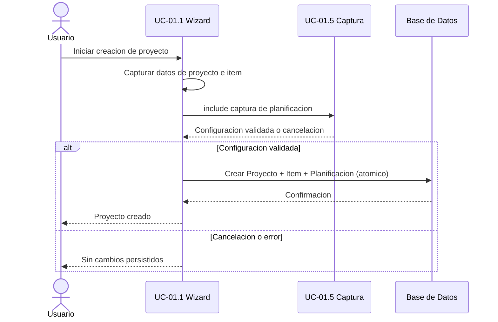

# UC-01.1: Wizard Creación de Proyecto

**ID:** UC-01.1  
**Nombre:** Wizard Creación de Proyecto  
**Padre:** UC-01 Mantenimiento de Proyecto  
**Prioridad:** Alta  
**Última actualización:** 2026-06-10

---

## Descripción

Flujo guiado paso a paso que permite al usuario crear un proyecto completo (proyecto, item y planificación) en una única sesión interactiva tipo wizard.

---

## Diagrama de Secuencia (Wizard)

---

## Características

- **Flujo lineal guiado:** El sistema conduce al usuario a través de cada paso
- **Creación atómica:** Proyecto + Item + Planificación se crean juntos al final (o no se crea nada si se cancela)
- **Validación en cada paso:** No permite avanzar sin completar correctamente
- **Transaccional:** Si el usuario cancela, no se crea ningún elemento
- **Ideal para usuarios nuevos:** Interfaz intuitiva y sin opciones complejas

---

## Datos Solicitados

### 1. Datos del Proyecto
- **Nombre del proyecto** (obligatorio, único en el sistema)
- **Descripción del proyecto** (opcional)

### 2. Datos del Item
- **Nombre del item** (obligatorio, ingresado por el usuario)
- **Descripción del item** (opcional)

### 3. Planificación Inicial
- Redirige a **UC-01.5: Captura Datos de Planificación**
- UC-01.5 devuelve la configuración sin crear la planificación en BD
- La definición de tipos/subtipos y reglas de captura pertenece a UC-01.5

---

## Flujo Básico

1. Usuario selecciona "Crear Proyecto con Wizard"
2. Sistema solicita **nombre del proyecto**
3. Usuario ingresa nombre y presiona "Siguiente"
4. Sistema valida unicidad del nombre (sin crear en BD)
5. Sistema solicita **descripción del proyecto** (opcional)
6. Usuario ingresa descripción y presiona "Siguiente"
7. Sistema solicita **nombre del item**
8. Usuario ingresa nombre y presiona "Siguiente"
9. Sistema solicita **descripción del item** (opcional)
10. Usuario ingresa descripción y presiona "Siguiente"
11. Sistema invoca **UC-01.5: Captura Datos de Planificación**
12. UC-01.5 captura y valida los datos de la planificación, luego devuelve los datos al wizard
13. Sistema muestra resumen completo:
    - Proyecto: [nombre] - [descripción]
    - Item: [nombre] - [descripción]
    - Planificación: [configuración capturada]
14. Usuario presiona "Finalizar"
15. Sistema crea en BD de forma atómica:
    - Proyecto
    - Item vinculado al proyecto
    - Planificación vinculada al item
16. Sistema muestra confirmación: "Proyecto creado exitosamente"
17. Sistema navega al proyecto creado

---

## Flujos Alternativos

### FA-1: Error - Nombre de Proyecto Duplicado (paso 4)
1. Sistema detecta que el nombre ya existe
2. Sistema muestra error: "Ya existe un proyecto con ese nombre"
3. Retorna al paso 2

### FA-2: Usuario Cancela el Wizard (cualquier paso antes del 14)
1. Usuario selecciona "Cancelar"
2. Sistema muestra confirmación: "¿Desea cancelar? Los datos ingresados se perderán"
3. Si confirma: Descarta todo y retorna a vista anterior (sin crear nada en BD)
4. Si no confirma: Retorna al paso actual

### FA-3: Usuario Retrocede en el Wizard (pasos 5, 9, 13)
1. Usuario selecciona "Atrás"
2. Sistema vuelve al paso anterior manteniendo datos ingresados
3. Usuario puede modificar datos previos

### FA-4: Error en Creación Atómica (paso 15)
1. Sistema intenta crear los elementos en BD
2. Ocurre un error (BD no disponible, violación de restricción, etc.)
3. Sistema deshace cualquier creación parcial (rollback)
4. Sistema muestra error: "No se pudo crear el proyecto. Intente nuevamente."
5. Usuario puede intentar nuevamente o cancelar

---

## Postcondiciones

### Éxito
- Proyecto creado con nombre único
- Item creado vinculado al proyecto
- Planificación creada vinculada al item con la configuración capturada en UC-01.5
- Usuario visualiza el proyecto completo

### Cancelación
- No se crea ningún elemento
- Sistema retorna al estado anterior

---

## Ventajas

✅ **Experiencia guiada:** El usuario no tiene que navegar por menús  
✅ **Creación rápida:** Todo en un solo flujo  
✅ **Menos errores:** Validación paso a paso  
✅ **Ideal para principiantes:** Interfaz simple y clara

---

## Desventajas

⚠️ **Menos flexible:** No permite crear múltiples items de una vez  
⚠️ **No permite configuración avanzada:** Solo cubre el caso básico

---

## Casos de Uso Relacionados

- **Caso padre:** [UC-01: Mantenimiento de Proyecto](UC-01-mantenimiento-proyecto.md)
- **Incluye:** [UC-01.5: Captura Datos de Planificación](UC-01.5-captura-datos-planificacion.md) - Captura configuración sin persistir

⚠️ **Beneficio de reutilización**: UC-01.5 es un componente de captura de datos sin capa de persistencia. Solo captura y valida datos del usuario. Al reutilizar UC-01.5, se garantiza consistencia en la interfaz de configuración de planificaciones independientemente del caso de uso invocador (UC-01.1 wizard o UC-01.4 gestión manual).

---

**Última revisión:** 2026-06-10
