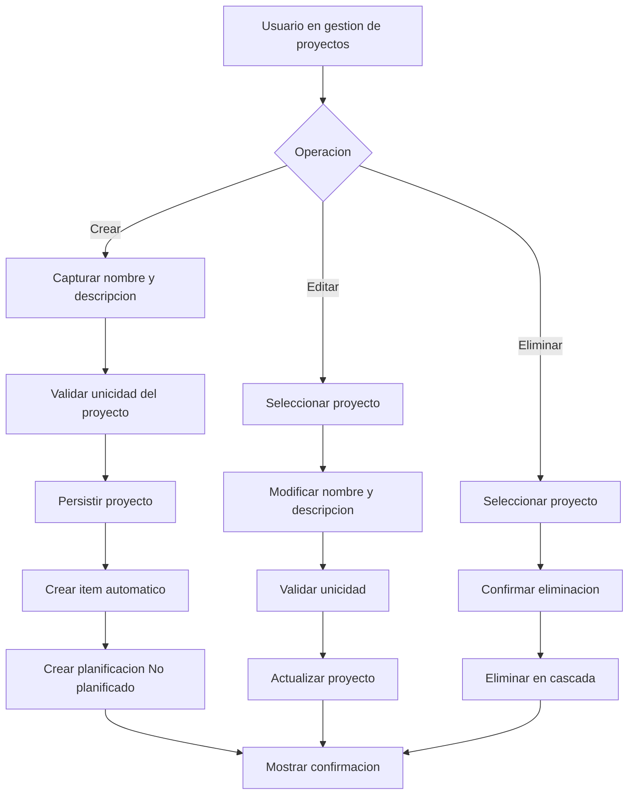

# UC-01.2: Creación/Configuración Proyecto

**ID:** UC-01.2  
**Nombre:** Creación/Configuración Proyecto  
**Padre:** UC-01 Mantenimiento de Proyecto  
**Prioridad:** Alta  
**Última actualización:** 2026-06-10

---

## Descripción

Permite al usuario crear nuevos proyectos o modificar proyectos existentes mediante gestión manual. Al crear un proyecto, el sistema automáticamente crea un item por defecto que a su vez genera una planificación "No planificado".

---

## Diagrama de Flujo (Operaciones)

---

## Características

### Creación de Proyecto
- **Creación automática de Item:** Al crear el proyecto, se genera un item con el mismo nombre
- **Creación automática de Planificación:** El item automático genera una planificación "No planificado"
- **Validación de unicidad:** El nombre del proyecto debe ser único en todo el sistema
- **Datos mínimos:** Solo requiere nombre (descripción opcional)

### Configuración de Proyecto
- **Edición de nombre y descripción:** Permite modificar ambos campos
- **Validación de unicidad:** Al cambiar el nombre, valida que no exista otro proyecto con ese nombre
- **Sin afectar items:** Modificar el proyecto no afecta los items existentes

---

## Operaciones Disponibles

### 1. Crear Proyecto
**Datos requeridos:**
- Nombre del proyecto (obligatorio, único)
- Descripción (opcional)

**Proceso:**
1. Usuario selecciona "Crear Proyecto"
2. Sistema muestra formulario
3. Usuario ingresa nombre y descripción
4. Usuario presiona "Guardar"
5. Sistema valida unicidad del nombre
6. Sistema crea el proyecto
7. **Sistema crea automáticamente un Item con el mismo nombre del proyecto**
8. **Sistema crea automáticamente una Planificación "No planificado" para el item**
9. Sistema muestra confirmación
10. Sistema muestra el proyecto con su item automático

### 2. Editar Proyecto
**Datos modificables:**
- Nombre del proyecto
- Descripción del proyecto

**Proceso:**
1. Usuario selecciona un proyecto existente
2. Usuario selecciona "Editar Proyecto"
3. Sistema muestra formulario con datos actuales
4. Usuario modifica datos
5. Usuario presiona "Guardar"
6. Sistema valida unicidad del nombre (si cambió)
7. Sistema actualiza el proyecto
8. Sistema muestra confirmación

### 3. Eliminar Proyecto
**Proceso:**
1. Usuario selecciona un proyecto existente
2. Usuario selecciona "Eliminar Proyecto"
3. Sistema muestra confirmación: "¿Eliminar proyecto '{nombre}'? Esto eliminará también todos sus items y planificaciones"
4. Usuario confirma
5. Sistema elimina el proyecto y todos sus elementos relacionados (cascada)
6. Sistema muestra confirmación

---

## Flujo Básico - Crear Proyecto

1. Usuario selecciona "Crear Proyecto" desde la vista principal
2. Sistema muestra formulario de creación:
   - Campo: Nombre del proyecto*
   - Campo: Descripción del proyecto
   - Botones: [Guardar] [Cancelar]
3. Usuario ingresa nombre: "Proyecto Marketing 2026"
4. Usuario ingresa descripción: "Campaña de marketing digital Q2 2026"
5. Usuario presiona "Guardar"
6. Sistema valida que el nombre no exista
7. Sistema crea Proyecto con ID=1
8. Sistema crea automáticamente Item:
   - Nombre: "Proyecto Marketing 2026"
   - Descripción: (vacío)
   - proyecto_id: 1
9. Sistema crea automáticamente Planificación:
   - Tipo: "No planificado"
   - Observaciones: "Proyecto Marketing 2026"
   - item_id: (ID del item creado)
10. Sistema muestra mensaje: "Proyecto creado exitosamente"
11. Sistema navega a la vista del proyecto mostrando el item automático

---

## Flujos Alternativos

### FA-1: Error - Nombre Duplicado (paso 6)
1. Sistema detecta que ya existe un proyecto con ese nombre
2. Sistema muestra error: "Ya existe un proyecto con ese nombre. Por favor, ingrese otro."
3. Retorna al paso 3 con los datos ingresados

### FA-2: Usuario Cancela (paso 5)
1. Usuario presiona "Cancelar"
2. Sistema descarta los datos
3. Sistema retorna a la vista anterior

### FA-3: Editar y Cambiar Nombre a uno Duplicado
1. Usuario está editando proyecto "Proyecto A"
2. Usuario cambia nombre a "Proyecto B" (que ya existe)
3. Usuario presiona "Guardar"
4. Sistema valida y detecta duplicado
5. Sistema muestra error: "Ya existe un proyecto con ese nombre"
6. Retorna al formulario de edición

---

## Reglas de Negocio

### RN-2.1: Unicidad de Nombres
Los nombres de proyectos deben ser únicos en todo el sistema. No se permite duplicados.

### RN-2.2: Creación Automática de Item
Al crear un Proyecto, el sistema crea automáticamente un Item con:
- Nombre = Nombre del proyecto
- Descripción = vacío
- El nombre es editable posteriormente (ver UC-01.3)

### RN-2.3: Creación Automática de Planificación
Al crear el Item automático, se crea una Planificación:
- Tipo: "No planificado"
- Observaciones = Nombre del item
- Estado: Pendiente

### RN-2.4: Eliminación en Cascada
Al eliminar un Proyecto, se eliminan automáticamente:
- Todos los Items del proyecto
- Todas las Planificaciones de esos Items
- Todas las Ocurrencias modificadas de esas Planificaciones

---

## Postcondiciones

### Éxito - Crear
- Proyecto creado con nombre único
- Item automático creado y vinculado
- Planificación "No planificado" creada y vinculada
- Usuario puede ver el proyecto completo

### Éxito - Editar
- Proyecto actualizado con nuevos datos
- Items existentes no afectados

### Éxito - Eliminar
- Proyecto y todos sus elementos relacionados eliminados
- Usuario retorna a la lista de proyectos

---

## Diferencia con UC-01.1 (Wizard)

| Aspecto | UC-01.1 Wizard | UC-01.2 Gestión Manual |
|---------|---------------|----------------------|
| **Flujo** | Lineal guiado | Navegación libre |
| **Items** | Solo crea 1 item | Permite crear múltiples después |
| **Planificación** | Opcional configurar | Se crea "No planificado" por defecto |
| **Experiencia** | Paso a paso | Más flexible |
| **Usuario objetivo** | Principiantes | Usuarios avanzados |

---

## Importante: Creación Automática vs Include

⚠️ **No hay dependencias con otros UC**: La creación de Item y Planificación es automática, directa a base de datos con valores por defecto. No se ejecutan los flujos de esos casos de uso.

**¿Qué significa "creación automática"?**
- Sistema crea registros directamente en BD
- No solicita datos al usuario
- Usa valores por defecto (nombre del proyecto, "No planificado", etc.)
- No ejecuta validaciones complejas del flujo

**¿Cuándo se usan UC-01.3 y UC-01.4?**
- Para crear items/planificaciones ADICIONALES
- Para modificar las creadas automáticamente
- Para configuraciones avanzadas

---

**Última revisión:** 2026-06-10
