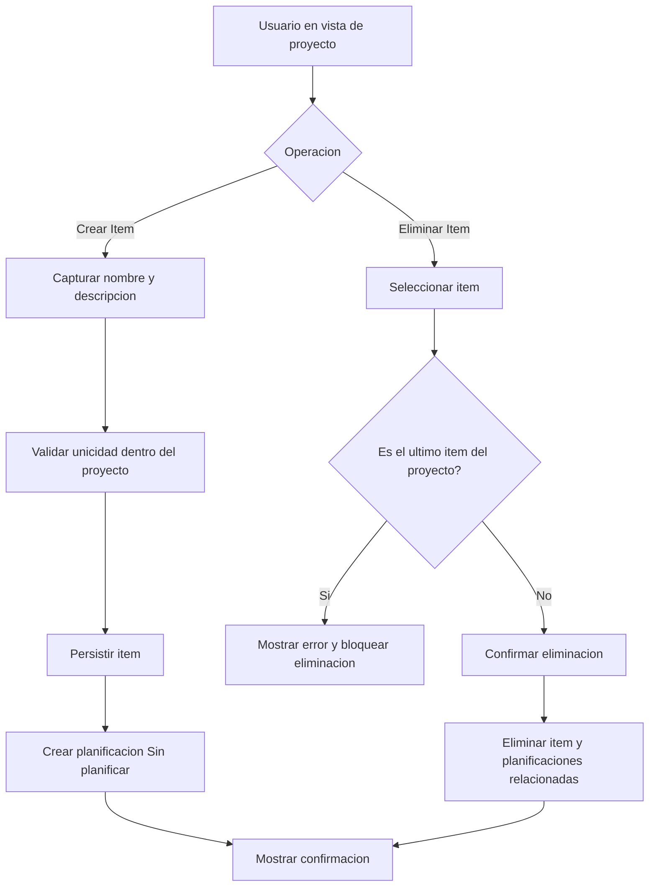

# UC-01.3: Creación/Configuración Item

**ID:** UC-01.3  
**Nombre:** Creación/Configuración Item  
**Padre:** UC-01 Mantenimiento de Proyecto  
**Prioridad:** Alta  
**Última actualización:** 2026-06-10

---

## Descripción

Permite al usuario crear nuevos items dentro de un proyecto o modificar items existentes. Al crear un item, el sistema automáticamente crea una planificación "Sin planificar" asociada.

---

## Diagrama de Flujo (Crear y Eliminar Item)

---

## Características

### Creación de Item
- **Creación automática de Planificación:** Cada item nuevo genera una planificación "Sin planificar"
- **Validación de unicidad por proyecto:** El nombre del item debe ser único dentro del proyecto
- **Items pueden repetirse entre proyectos:** Proyectos diferentes pueden tener items con el mismo nombre
- **Datos mínimos:** Solo requiere nombre (descripción opcional)

### Configuración de Item
- **Edición de nombre y descripción:** Permite modificar ambos campos
- **Validación de unicidad:** Al cambiar el nombre, valida que no exista otro item con ese nombre en el mismo proyecto
- **Sin afectar planificaciones:** Modificar el item no afecta las planificaciones existentes

---

## Operaciones Disponibles

### 1. Crear Item
**Contexto:** Usuario está visualizando un proyecto

**Datos requeridos:**
- Nombre del item (obligatorio, único dentro del proyecto)
- Descripción (opcional)

**Proceso:**
1. Usuario selecciona "Crear Item" desde la vista del proyecto
2. Sistema muestra formulario
3. Usuario ingresa nombre y descripción
4. Usuario presiona "Guardar"
5. Sistema valida unicidad del nombre dentro del proyecto
6. Sistema crea el item
7. **Sistema crea automáticamente una Planificación "Sin planificar"**
8. Sistema muestra confirmación
9. Sistema muestra el item en la lista del proyecto

### 2. Editar Item
**Datos modificables:**
- Nombre del item
- Descripción del item

**Proceso:**
1. Usuario selecciona un item existente
2. Usuario selecciona "Editar Item"
3. Sistema muestra formulario con datos actuales
4. Usuario modifica datos
5. Usuario presiona "Guardar"
6. Sistema valida unicidad del nombre dentro del proyecto (si cambió)
7. Sistema actualiza el item
8. Sistema muestra confirmación

### 3. Eliminar Item
**Proceso:**
1. Usuario selecciona un item existente
2. Usuario selecciona "Eliminar Item"
3. Sistema verifica si es el último item del proyecto
4. Si es el último item: Sistema muestra error "No se puede eliminar el último item del proyecto. Para eliminar este item, debe eliminar el proyecto completo."
5. Si NO es el último item: sistema recorre **todas** las planificaciones del item y detecta bloqueos por RE-3 y/o RE-4 (ocurrencias materializadas solo en **periódicas**)
6. Si hay bloqueos: sistema muestra aviso con la **lista completa** de planificaciones impeditivas (`IdentificablePorUsuario` + motivo por cada una). Ver FA-5 y RN-3.7. Fin sin borrar.
7. Si no hay bloqueos: sistema muestra confirmación: "¿Eliminar item '{nombre}'? Esto eliminará también todas sus planificaciones"
8. Usuario confirma
9. Sistema elimina el item y todas sus planificaciones relacionadas (cascada)
10. Sistema muestra confirmación

---

## Flujo Básico - Crear Item

**Contexto previo:** Usuario está en la vista del "Proyecto Marketing 2026"

1. Usuario selecciona "Crear Item"
2. Sistema muestra formulario de creación:
   - Campo: Nombre del item*
   - Campo: Descripción del item
   - Botones: [Guardar] [Cancelar]
3. Usuario ingresa nombre: "Campaña Redes Sociales"
4. Usuario ingresa descripción: "Gestión de contenido en Instagram, Facebook y LinkedIn"
5. Usuario presiona "Guardar"
6. Sistema valida que el nombre no exista en el proyecto actual
7. Sistema crea Item:
   - Nombre: "Campaña Redes Sociales"
   - Descripción: "Gestión de contenido en Instagram, Facebook y LinkedIn"
   - proyecto_id: (ID del proyecto actual)
8. Sistema crea automáticamente Planificación:
   - Tipo: "Sin planificar"
   - Observaciones: "Campaña Redes Sociales"
   - item_id: (ID del item recién creado)
9. Sistema muestra mensaje: "Item creado exitosamente"
10. Sistema actualiza la vista del proyecto mostrando el nuevo item

---

## Flujos Alternativos

### FA-1: Error - Nombre Duplicado en el Proyecto (paso 6)
1. Sistema detecta que ya existe un item con ese nombre en el proyecto actual
2. Sistema muestra error: "Ya existe un item con ese nombre en este proyecto. Por favor, ingrese otro."
3. Retorna al paso 3 con los datos ingresados

### FA-2: Usuario Cancela (paso 5)
1. Usuario presiona "Cancelar"
2. Sistema descarta los datos
3. Sistema retorna a la vista del proyecto

### FA-3: Nombre Duplicado Pero en Proyecto Diferente (permitido)
1. Proyecto A tiene item "Desarrollo Frontend"
2. Usuario crea item "Desarrollo Frontend" en Proyecto B
3. Sistema permite la creación (mismo nombre, proyectos diferentes)
4. Item creado exitosamente

### FA-4: Intento de Eliminar Último Item (paso 3 de Eliminar)
1. Sistema detecta que el item es el único del proyecto
2. Sistema muestra error: "No se puede eliminar el último item del proyecto. Para eliminar este item, debe eliminar el proyecto completo."
3. Sistema retorna a la vista del proyecto
4. Caso de uso finaliza sin eliminar nada

### FA-5: Planificaciones que impiden eliminar el item (pasos 5–6 de Eliminar)

Mismos **casos posibles por planificación** que FA-4 de UC-01.2 (Completada, ocurrencias gestionadas, o ambos). Ámbito: solo las planificaciones del item.

**Flujo:**
1. Sistema agrega a la lista **cada** planificación bloqueante del item.
2. Sistema muestra aviso **inequívoco** (RN-3.7): por cada entrada, el **`IdentificablePorUsuario`** completo y el **motivo(s)**.
3. Ejemplo orientativo:

   > No se puede eliminar el item «Campaña Q1». Prepare estas planificaciones antes de reintentar:
   > • Proyecto «{proyecto}» · Item «{item}» · {tipo_planificacion} · «{observaciones}» · {fecha_inicio}–{fecha_fin} · {hora} — Completada
   > • Proyecto «{proyecto}» · Item «{item}» · {tipo_planificacion} · «{observaciones}» · … — 3 ocurrencias gestionadas

4. Caso de uso finaliza sin eliminar nada. Código de error: `ELIMINACION_ITEM_BLOQUEADA` (payload RE-5 con `identificable_por_usuario`).

---

## Reglas de Negocio

### RN-3.1: Unicidad de Nombres por Proyecto
Los nombres de items deben ser únicos dentro del mismo proyecto. Items en proyectos diferentes pueden tener el mismo nombre.

**Válido:**
- Proyecto A → Item "Fase 1"
- Proyecto B → Item "Fase 1"

**Inválido:**
- Proyecto A → Item "Fase 1"
- Proyecto A → Item "Fase 1" (duplicado)

### RN-3.2: Creación Automática de Planificación
Al crear un Item, el sistema crea automáticamente una Planificación:
- Tipo: "Sin planificar"
- Observaciones = Nombre del item
- Estado: Pendiente

### RN-3.3: Un Proyecto Debe Tener Al Menos Un Item
Un proyecto debe tener al menos un item. Si se intenta eliminar el último item del proyecto, el sistema debe mostrar un error y solicitar al usuario que elimine el proyecto completo en su lugar.

### RN-3.4: Un Item Debe Tener Al Menos Una Planificación
Un item siempre debe tener al menos una planificación. La planificación automática "Sin planificar" cumple este requisito.

### RN-3.5: RE-3 y RE-4 bloquean la eliminación del item
No se puede eliminar un item si alguna de sus planificaciones está Completada (RE-3) o, si es **periódica**, tiene ocurrencias materializadas (RE-4). Objetivo: evitar borrados masivos accidentales. El usuario debe revertir manualmente con UC-01.4 y UC-02.4 antes de reintentar.

### RN-3.7: Aviso inequívoco de planificaciones bloqueantes (RE-5)
Si el borrado del item está bloqueado, el mensaje al usuario **debe** listar todas las planificaciones impeditivas mostrando el **`IdentificablePorUsuario`** de cada una (ver [planificaciones.md](../entidades/planificaciones.md)) y el **motivo** (Completada, ocurrencias gestionadas con cantidad, o ambos). No se admite un aviso genérico sin detallar cuáles son.

### RN-3.6: Eliminación en Cascada
Cuando se cumple RN-3.5, al eliminar un Item se eliminan automáticamente:
- Todas las Planificaciones del item
- Todas las Ocurrencias materializadas de esas Planificaciones

---

## Postcondiciones

### Éxito - Crear
- Item creado con nombre único dentro del proyecto
- Planificación "Sin planificar" creada y vinculada
- Usuario puede ver el item en la lista del proyecto
- Usuario puede acceder a las planificaciones del item

### Éxito - Editar
- Item actualizado con nuevos datos
- Planificaciones existentes no afectadas

### Éxito - Eliminar
- Item y todas sus planificaciones relacionadas eliminadas
- Usuario visualiza la lista actualizada de items del proyecto

---

## Escenarios de Uso

### Escenario 1: Proyecto de Desarrollo de Software
**Proyecto:** "Sistema CRM 2026"  
**Items posibles:**
- "Análisis de Requisitos"
- "Diseño de Arquitectura"
- "Desarrollo Backend"
- "Desarrollo Frontend"
- "Testing y QA"
- "Despliegue"

Cada item tendrá sus propias planificaciones.

### Escenario 2: Proyecto de Marketing
**Proyecto:** "Campaña Q2 2026"  
**Items posibles:**
- "Investigación de Mercado"
- "Diseño Creativo"
- "Contenido Redes Sociales"
- "Email Marketing"
- "Análisis de Resultados"

---

## Diferencia con Creación Automática (UC-01.2)

| Aspecto | Item Automático (UC-01.2) | Item Manual (UC-01.3) |
|---------|-------------------------|----------------------|
| **Trigger** | Creación de proyecto | Acción explícita del usuario |
| **Nombre inicial** | = Nombre del proyecto | Definido por usuario |
| **Cuándo se usa** | Siempre al crear proyecto | Para añadir más items |
| **Puede eliminarse** | Sí (como cualquier item) | Sí |

---

## Importante: Creación Automática vs Include

⚠️ **No hay dependencias con otros UC**: La creación de Planificación es automática, directa a base de datos con valores por defecto. No se ejecuta ningún flujo adicional.

**¿Qué significa "creación automática"?**
- Sistema crea registro de Planificación "Sin planificar" directamente en BD
- No solicita configuración al usuario
- Usa observaciones = nombre del item
- No ejecuta el flujo complejo de creación de planificaciones

---

## Casos de Uso Relacionados

- **Caso padre:** [UC-01: Mantenimiento de Proyecto](UC-01-mantenimiento-proyecto.md)
- **Entidad:** [items.md](../entidades/items.md), [proyectos.md](../entidades/proyectos.md)

## Trazabilidad C4

| Zona critica N4 | Rol |
|-----------------|-----|
| [ZC-4](../diagramas-c4/c4-nivel-4/pseudocodigo/zc-4-orquestacion-aplicacion.md) | Creacion item + Sin planificar |
| [ZC-5](../diagramas-c4/c4-nivel-4/pseudocodigo/zc-5-persistencia.md) | Transaccion unica |
---

**Última revisión:** 2026-06-10
