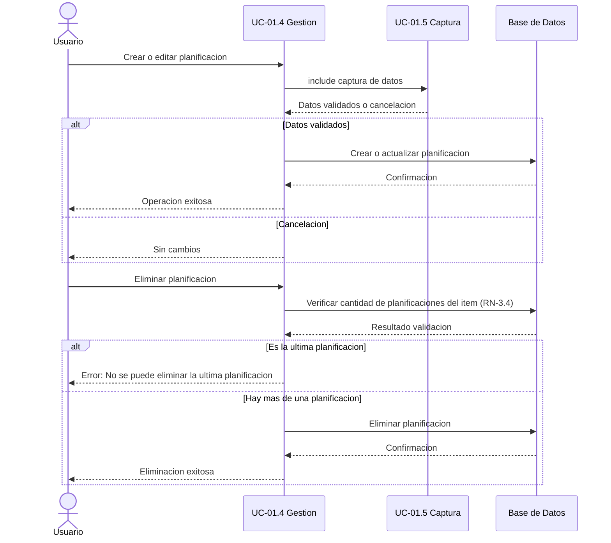

# UC-01.4: Creación/Configuración Planificación

**ID:** UC-01.4  
**Nombre:** Creación/Configuración Planificación  
**Padre:** UC-01 Mantenimiento de Proyecto  
**Prioridad:** Crítica  
**Última actualización:** 2026-06-10

---

## Descripción

Permite al usuario crear y configurar planificaciones mediante la gestión de su persistencia en base de datos. Este caso de uso invoca UC-01.5 para capturar los datos del usuario y luego persiste/actualiza/elimina la información en BD.

**Fuente de tipos y reglas:** Este caso de uso referencia el catálogo común definido en [docs/entidades/planificaciones.md](../entidades/planificaciones.md).

---

## Diagrama de Secuencia (Persistencia de Planificación)

**Responsabilidades:**
- Gestionar la persistencia de planificaciones en BD
- Invocar UC-01.5 para captura/edición de datos
- Validar y guardar los datos recibidos de UC-01.5

---

## Operaciones Principales

### 1. Crear Planificación
**Contexto:** Usuario está visualizando un item existente en BD

**Proceso:**
1. Usuario selecciona "Crear Planificación"
2. Sistema invoca **UC-01.5: Captura Datos de Planificación** (sin datos previos)
3. UC-01.5 muestra formulario y captura datos
4. UC-01.5 devuelve los datos validados de configuración
5. Si UC-01.5 informa cancelación: Finaliza sin crear nada
6. Sistema recibe datos de UC-01.5
7. Sistema crea la planificación en BD con los datos recibidos
8. Sistema muestra confirmación: "Planificación creada exitosamente"
9. Usuario visualiza la nueva planificación

### 2. Configurar/Editar Planificación Existente
**Contexto:** Usuario visualiza una planificación existente

**Proceso:**
1. Usuario selecciona "Configurar Planificación" o "Editar Planificación"
2. Sistema recupera los datos actuales de la planificación
3. Sistema invoca **UC-01.5: Captura Datos de Planificación** (con datos previos)
4. UC-01.5 muestra formulario pre-llenado con datos actuales
5. UC-01.5 devuelve los datos modificados validados
6. Si UC-01.5 informa cancelación: Finaliza sin modificar nada
7. Sistema recibe datos de UC-01.5
8. Sistema actualiza la planificación en BD con los datos recibidos
9. Sistema muestra confirmación: "Planificación actualizada exitosamente"
10. Usuario visualiza la planificación modificada

### 3. Eliminar Planificación
**Contexto:** Usuario visualiza un item con múltiples planificaciones

**Proceso:**
1. Usuario selecciona "Eliminar Planificación"
2. Sistema valida que el item tiene más de una planificación (RN-3.4)
3. Sistema muestra confirmación: "¿Eliminar esta planificación?"
4. Usuario confirma
5. Sistema elimina la planificación de BD
6. Sistema muestra confirmación: "Planificación eliminada"

---

## Flujo Básico - Crear Planificación

**Contexto:** Usuario está visualizando un item existente en BD

1. Usuario selecciona "Crear Planificación"
2. Sistema invoca **UC-01.5: Captura Datos de Planificación** (sin datos previos)
3. UC-01.5 muestra formulario y captura configuración
4. UC-01.5 valida los datos y devuelve la configuración
5. Si UC-01.5 informa cancelación: Finaliza sin crear nada
6. Sistema recibe datos validados de UC-01.5
7. Sistema crea la planificación en BD con los datos recibidos
8. Sistema muestra confirmación: "Planificación creada exitosamente"
9. Usuario visualiza la nueva planificación en el item

---

## Flujos Alternativos

### FA-1: Usuario Cancela en UC-01.5 (paso 4)
1. Usuario presiona "Cancelar" en el formulario de UC-01.5
2. UC-01.5 informa cancelación
3. Sistema no crea nada
4. Sistema retorna a la vista del item

### FA-2: Intento de Eliminar Última Planificación (paso 2 de Eliminar)
1. Sistema detecta que es la única planificación del item
2. Sistema muestra error: "No se puede eliminar la última planificación del item"
3. Sistema retorna a la vista del item
4. Caso de uso finaliza sin eliminar nada

## Reglas de Negocio

### RN-4.1: Persistencia de Configuración de Planificación
UC-01.4 persiste la configuración de la planificación utilizando los datos validados que devuelve UC-01.5.

### RN-4.2: Eliminación Restringida de Planificación
No se puede eliminar la última planificación de un item.

---

## Postcondiciones

### Éxito - Crear
- Planificación creada vinculada al item en BD
- Usuario visualiza la planificación en el item

### Éxito - Configurar/Editar
- Planificación actualizada con nueva configuración en BD
- La actualización respeta las reglas de configuración vigentes
- Usuario visualiza la planificación modificada

### Éxito - Eliminar
- Planificación eliminada de BD
- Usuario visualiza lista actualizada de planificaciones

### Cancelación
- Si usuario cancela en UC-01.5: No se persiste nada
- Sistema retorna al estado anterior

---

## Responsabilidades de UC-01.4

Este caso de uso se centra en la **persistencia de datos**:

- ✅ Invocar UC-01.5 para captura de datos
- ✅ Recibir datos validados de UC-01.5
- ✅ Crear/actualizar/eliminar planificaciones en BD
- ✅ Validaciones de negocio (item debe tener al menos una planificación)

**Nota:** La definición de tipos/subtipos y la captura/validación de campos corresponde a UC-01.5.

Las reglas y tipos de planificación consumidos por UC-01.4 deben mantenerse alineados con [docs/entidades/planificaciones.md](../entidades/planificaciones.md).

---

## Casos de Uso Relacionados

- **Incluye:** 
  - [UC-01.5: Captura Datos de Planificación](UC-01.5-captura-datos-planificacion.md) - Para capturar/editar datos de configuración

---

**Última revisión:** 2026-06-10
