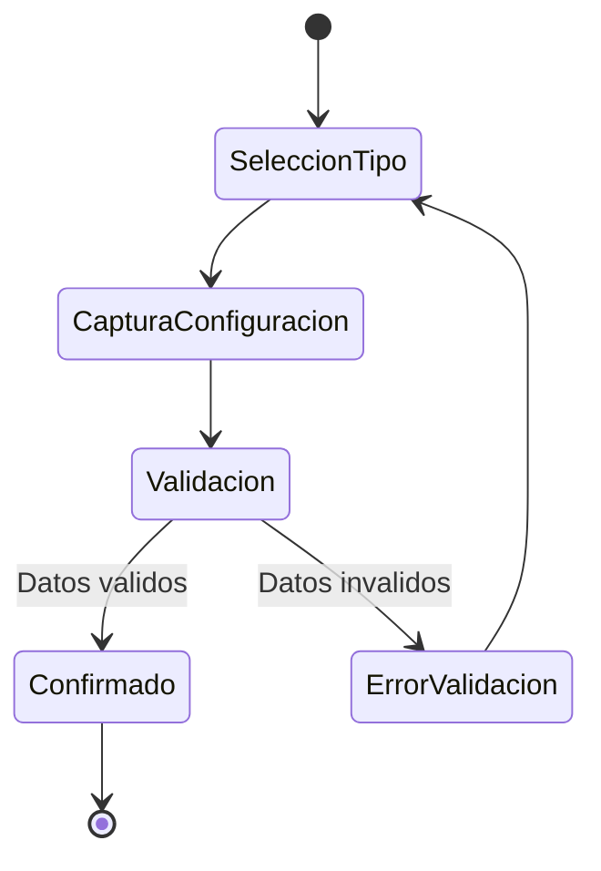

# UC-01.5: Captura Datos de Planificación

**ID:** UC-01.5  
**Nombre:** Captura Datos de Planificación  
**Padre:** UC-01 Mantenimiento de Proyecto  
**Prioridad:** Crítica  
**Última actualización:** 2026-06-10

---

## Descripción

Caso de uso reutilizable que captura y valida los datos de configuración de una planificación. **NO persiste datos en BD**, solo los devuelve al caso de uso invocador.

**Función:** Actúa como formulario de captura de datos que puede ser reutilizado por otros casos de uso.

**Fuente de tipos y reglas:** Este caso de uso consume el catálogo común definido en [docs/entidades/planificaciones.md](../entidades/planificaciones.md).

---

## Diagrama de Estados (Captura)

---

## Características

- **No persiste datos:** Solo captura y valida, no guarda en BD
- **Reutilizable:** Invocado por UC-01.1 (wizard) y UC-01.4 (gestión)
- **Validación completa:** Valida todos los datos antes de devolverlos
- **Interfaz consistente:** Mismo formulario independientemente del invocador
- **Retorna datos capturados:** Devuelve la configuración validada al caso de uso invocador

**Este es el caso de uso más complejo del subgrupo UC-01**, ya que debe manejar múltiples tipos de planificaciones con sus respectivas variantes y validaciones.

---

## Datos Capturados

- Tipo de planificación (desde catálogo común)
- Configuración específica según tipo/variante
- Observaciones (cuando aplique)

Las reglas y campos concretos para cada tipo se toman del documento común [docs/entidades/planificaciones.md](../entidades/planificaciones.md).

---

## Datos Previos (Opcionales)

El caso de uso puede recibir información ya existente para pre-llenar el formulario.

**Uso:** Permite editar planificaciones existentes o mostrar valores por defecto al usuario.

---

## Flujo Básico

1. Sistema invocador llama a UC-01.5 (opcionalmente con datos previos)
2. Sistema muestra formulario de selección de tipo según catálogo común
3. Si hay datos previos, pre-selecciona el tipo
4. Usuario selecciona tipo de planificación
5. Sistema muestra campos específicos según el tipo elegido
6. Si hay datos previos, pre-llena los campos
7. Usuario completa/modifica los datos
8. Usuario presiona "Confirmar"
9. Sistema valida todos los datos según las reglas del catálogo común
10. Sistema devuelve la configuración validada al caso de uso invocador
11. UC-01.5 finaliza

---

## Flujos Alternativos

### FA-1: Error de Validación de Configuración (paso 9)
1. Sistema detecta que la configuración no cumple reglas del catálogo común
2. Sistema muestra error funcional correspondiente
3. Retorna al paso 7 manteniendo los datos ingresados

### FA-2: Usuario Cancela (cualquier paso)
1. Usuario presiona "Cancelar"
2. Sistema muestra confirmación: "¿Desea cancelar? Los datos ingresados no se guardarán"
3. Si confirma: 
   - Sistema informa cancelación al caso de uso invocador
   - UC-01.5 finaliza
4. Si no confirma: Retorna al paso actual

### FA-3: Validación - Campo Obligatorio Vacío (paso 9)
1. Sistema detecta que falta un campo obligatorio
2. Sistema muestra error: "Debe completar todos los campos obligatorios (*)"
3. Sistema resalta campos faltantes
4. Retorna al paso 7

### FA-4: Edición - Pre-llenado con Datos Previos (paso 1)
1. Sistema invocador llama a UC-01.5 con datos previos de una planificación existente
2. Sistema muestra formulario con tipo pre-seleccionado
3. Sistema pre-llena todos los campos con los valores previos
4. Usuario modifica los datos que desee
5. Continúa en paso 8 (Confirmar)

---

## Reglas de Negocio

### RN-5.1: Validación Sin Persistencia
UC-01.5 valida todos los datos pero NO los persiste en BD. La responsabilidad de guardar es del invocador.

### RN-5.2: Reglas por Catálogo Común
Las validaciones y campos exigidos se aplican según el catálogo común de planificaciones.

### RN-5.3: Fechas Pasadas Permitidas
El sistema permite crear planificaciones con fechas pasadas. No hay restricción temporal.

### RN-5.4: Consistencia de Configuración
La configuración debe ser coherente y válida para el tipo seleccionado.

### RN-5.5: Fechas Pasadas Permitidas
El sistema permite configurar fechas pasadas. No hay restricción temporal.

### RN-5.6: Independencia del Invocador
UC-01.5 no necesita saber quién lo invoca. Solo captura datos y los devuelve.

---

## Postcondiciones

### Éxito
- Datos validados y listos para uso
- Configuración devuelta al caso de uso invocador
- UC-01.5 finaliza sin persistir nada

### Cancelación
- Cancelación informada al caso de uso invocador
- No se persiste nada
- UC-01.5 finaliza

---

## Ventajas de la Separación

✅ **Reutilización:** Un solo formulario usado por múltiples casos de uso  
✅ **Atomicidad:** Cada caso de uso tiene una responsabilidad clara  
✅ **Mantenibilidad:** Cambios en el formulario se reflejan en todos los invocadores  
✅ **Testeable:** Se puede probar la captura independientemente de la persistencia  
✅ **Consistencia:** Misma interfaz y validaciones en todos los flujos

---

## Notas de Alcance

- UC-01.5 solo cubre captura y validación de datos.
- La persistencia y las operaciones en base de datos corresponden al caso de uso invocador.
- Cualquier cambio de campos o reglas de captura debe reflejarse aquí para mantener consistencia funcional.

---

## Casos de Uso Relacionados

- **Caso padre:** [UC-01: Mantenimiento de Proyecto](UC-01-mantenimiento-proyecto.md)
- **Es incluido por:** [UC-01.1: Wizard Creación de Proyecto](UC-01.1-wizard-creacion-proyecto.md)
- **Es incluido por:** [UC-01.4: Creación/Configuración Planificación](UC-01.4-gestion-planificacion.md)

## Trazabilidad C4

| Zona critica N4 | Rol |
|-----------------|-----|
| [ZC-3](../diagramas-c4/c4-nivel-4/pseudocodigo/zc-3-planificacion-temporal.md) | ValidadorConfiguracion |
| [ZC-6](../diagramas-c4/c4-nivel-4/pseudocodigo/zc-6-presentacion.md) | Componente captura reutilizable |
---

**Última revisión:** 2026-06-10
