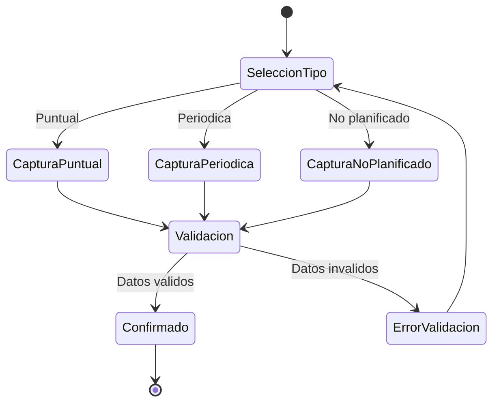

# UC-01.5: Captura Datos de Planificación

**ID:** UC-01.5  
**Nombre:** Captura Datos de Planificación  
**Padre:** UC-01 Mantenimiento de Proyecto  
**Prioridad:** Crítica  
**Última actualización:** 2026-06-10

---

## Descripción

Caso de uso reutilizable que captura y valida los datos de configuración de una planificación según su tipo (Puntual, Periódica, No planificado). **NO persiste datos en BD**, solo los devuelve al caso de uso invocador.

**Función:** Actúa como formulario de captura de datos que puede ser reutilizado por otros casos de uso.

---

## Diagrama de Estados (Captura)

---

## Características

- **No persiste datos:** Solo captura y valida, no guarda en BD
- **Reutilizable:** Invocado por UC-01.1 (wizard) y UC-01.4 (gestión)
- **Validación completa:** Valida todos los datos antes de devolverlos
- **Interfaz consistente:** Mismo formulario independientemente del invocador
- **Retorna datos capturados:** Devuelve la configuración validada al caso de uso invocador

**Este es el caso de uso más complejo del subgrupo UC-01**, ya que debe manejar múltiples tipos de planificaciones con sus respectivas variantes y validaciones.

---

## Tipos de Planificación

### 1. **Puntual**
Planificación que ocurre una única vez en una fecha y hora específica.

**Atributos:**
- Fecha (obligatoria, puede ser pasada o futura)
- Hora (obligatoria)
- Observaciones (opcional)

**Uso típico:** Reuniones únicas, eventos específicos, deadlines puntuales.

### 2. **Periódica**
Planificación que se repite según un patrón temporal definido.

**Subtipos:**

**a) Diaria**
- Todos los días
- De Lunes a Viernes
- Fin de semana (Sábado y Domingo)
- Hora específica

**b) Semanal**
- Selección múltiple de días (Lunes, Martes, etc.)
- Puede elegir 1 o más días (no necesariamente consecutivos)
- Hora específica

**c) Mensual**
- Día del mes (1-31)
- Hora específica
- Si día > 28: elegir comportamiento para meses con menos días:
  - Último día del mes
  - Día 1 del mes siguiente
  - Omitir ese mes

**Atributos comunes:**
- Fecha inicio (obligatoria)
- Fecha fin (obligatoria, debe ser > fecha inicio)
- Hora (obligatoria)
- Observaciones (opcional)

**Uso típico:** Reuniones recurrentes, tareas periódicas, hábitos.

### 3. **No planificado**
Planificación sin fecha ni hora asignada. Útil para backlog o tareas sin fecha definida.

**Atributos:**
- Solo observaciones

**Uso típico:** Ideas futuras, backlog de tareas, planificación pendiente de definir fecha.

---

## Datos Capturados

### Para Planificación Puntual
- Tipo de planificación: Puntual
- Fecha (obligatoria)
- Hora (obligatoria)
- Observaciones (opcional)

### Para Planificación Periódica - Diaria
- Tipo de planificación: Periódica
- Variante: Diaria
- Patrón: Todos los días | Lunes a Viernes | Fin de semana
- Fecha inicio (obligatoria)
- Fecha fin (obligatoria, > fecha inicio)
- Hora (obligatoria)
- Observaciones (opcional)

### Para Planificación Periódica - Semanal
- Tipo de planificación: Periódica
- Variante: Semanal
- Días seleccionados: uno o varios días de la semana
- Fecha inicio (obligatoria)
- Fecha fin (obligatoria, > fecha inicio)
- Hora (obligatoria)
- Observaciones (opcional)

### Para Planificación Periódica - Mensual
- Tipo de planificación: Periódica
- Variante: Mensual
- Día del mes (1-31)
- Comportamiento para día > 28: último día | día 1 del mes siguiente | omitir
- Fecha inicio (obligatoria)
- Fecha fin (obligatoria, > fecha inicio)
- Hora (obligatoria)
- Observaciones (opcional)

### Para Planificación No planificado
- Tipo de planificación: No planificado
- Observaciones (opcional)

---

## Datos Previos (Opcionales)

El caso de uso puede recibir información ya existente para pre-llenar el formulario.

**Uso:** Permite editar planificaciones existentes o mostrar valores por defecto al usuario.

---

## Flujo Básico

1. Sistema invocador llama a UC-01.5 (opcionalmente con datos previos)
2. Sistema muestra formulario de selección de tipo:
   - [ ] Puntual
   - [ ] Periódica
   - [ ] No planificado
3. Si hay datos previos, pre-selecciona el tipo
4. Usuario selecciona tipo de planificación
5. Sistema muestra campos específicos según el tipo elegido
6. Si hay datos previos, pre-llena los campos
7. Usuario completa/modifica los datos
8. Usuario presiona "Confirmar"
9. Sistema valida todos los datos según el tipo
10. Sistema devuelve la configuración validada al caso de uso invocador
11. UC-01.5 finaliza

---

## Flujo Básico - Planificación Periódica Semanal

1. Sistema invocador llama a UC-01.5 (sin datos previos)
2. Sistema muestra opciones de tipo
3. Usuario selecciona "Periódica"
4. Sistema muestra subtipos: [ ] Diaria [ ] Semanal [ ] Mensual
5. Usuario selecciona "Semanal"
6. Sistema muestra formulario:
   - Campo: Fecha inicio*
   - Campo: Fecha fin*
   - Checkboxes: ☐ Lunes ☐ Martes ☐ Miércoles ☐ Jueves ☐ Viernes ☐ Sábado ☐ Domingo
   - Campo: Hora*
   - Campo: Observaciones
7. Usuario ingresa:
   - Fecha inicio: 10/06/2026
   - Fecha fin: 30/06/2026
   - Días: ☑ Lunes ☑ Miércoles
   - Hora: 09:00
   - Observaciones: "Reunión semanal de equipo"
8. Usuario presiona "Confirmar"
9. Sistema valida:
   - fecha_fin > fecha_inicio ✓
   - Al menos un día seleccionado ✓
   - Se generaría al menos 1 ocurrencia ✓
10. Sistema devuelve la configuración semanal validada al caso de uso invocador
11. UC-01.5 finaliza

---

## Flujos Alternativos

### FA-1: Error - Fecha Fin <= Fecha Inicio (paso 9)
1. Sistema detecta que fecha_fin <= fecha_inicio
2. Sistema muestra error: "La fecha fin debe ser posterior a la fecha inicio"
3. Retorna al paso 7 manteniendo los datos ingresados

### FA-2: Error - No Se Genera Ninguna Ocurrencia (paso 9)
1. Usuario configura: 
   - Fecha inicio: 10/06/2026 (Martes)
   - Fecha fin: 11/06/2026 (Miércoles)
   - Periodo: Semanal - Jueves
2. Sistema calcula: No hay ningún jueves entre 10/06 y 11/06
3. Sistema muestra error: "La configuración no genera ninguna planificación válida"
4. Retorna al paso 7 manteniendo los datos

### FA-3: Usuario Cancela (cualquier paso)
1. Usuario presiona "Cancelar"
2. Sistema muestra confirmación: "¿Desea cancelar? Los datos ingresados no se guardarán"
3. Si confirma: 
   - Sistema informa cancelación al caso de uso invocador
   - UC-01.5 finaliza
4. Si no confirma: Retorna al paso actual

### FA-4: Validación - Campo Obligatorio Vacío (paso 9)
1. Sistema detecta que falta un campo obligatorio
2. Sistema muestra error: "Debe completar todos los campos obligatorios (*)"
3. Sistema resalta campos faltantes
4. Retorna al paso 7

### FA-5: Edición - Pre-llenado con Datos Previos (paso 1)
1. Sistema invocador llama a UC-01.5 con datos previos de una planificación existente
2. Sistema muestra formulario con tipo pre-seleccionado
3. Sistema pre-llena todos los campos con los valores previos
4. Usuario modifica los datos que desee
5. Continúa en paso 8 (Confirmar)

---

## Reglas de Negocio

### RN-5.1: Validación Sin Persistencia
UC-01.5 valida todos los datos pero NO los persiste en BD. La responsabilidad de guardar es del invocador.

### RN-5.2: Hora Obligatoria
Todas las planificaciones (excepto "No planificado") deben tener hora definida.

### RN-5.3: Fechas Pasadas Permitidas
El sistema permite crear planificaciones con fechas pasadas. No hay restricción temporal.

### RN-5.4: Validación de Ocurrencias
Para planificaciones periódicas, el sistema debe validar que la configuración calcule al menos 1 ocurrencia.

### RN-5.5: Fechas Pasadas Permitidas
El sistema permite configurar fechas pasadas. No hay restricción temporal.

### RN-5.6: Independencia del Invocador
UC-01.5 no necesita saber quién lo invoca. Solo captura datos y los devuelve.

---

## Postcondiciones

### Éxito
- Datos validados y listos para uso
- Configuración devuelta al caso de uso invocador
- UC-01.5 finaliza sin persistir nada

### Cancelación
- Cancelación informada al caso de uso invocador
- No se persiste nada
- UC-01.5 finaliza

---

## Ventajas de la Separación

✅ **Reutilización:** Un solo formulario usado por múltiples casos de uso  
✅ **Atomicidad:** Cada caso de uso tiene una responsabilidad clara  
✅ **Mantenibilidad:** Cambios en el formulario se reflejan en todos los invocadores  
✅ **Testeable:** Se puede probar la captura independientemente de la persistencia  
✅ **Consistencia:** Misma interfaz y validaciones en todos los flujos

---

## Notas de Alcance

- UC-01.5 solo cubre captura y validación de datos.
- La persistencia y las operaciones en base de datos corresponden al caso de uso invocador.
- Cualquier cambio de campos o reglas de captura debe reflejarse aquí para mantener consistencia funcional.

---

**Última revisión:** 2026-06-10
