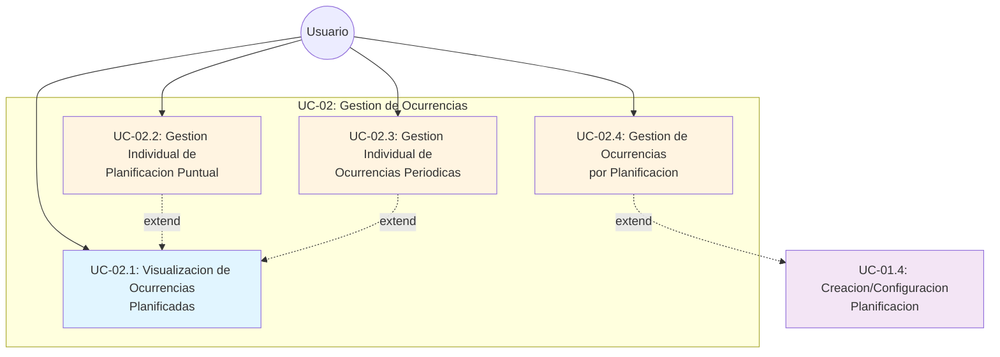

# UC-02: Gestión de Ocurrencias

**ID:** UC-02  
**Nombre:** Gestión de Ocurrencias  
**Prioridad:** Alta  
**Última actualización:** 2026-06-10

---

## Descripción

Define la orquestación de gestión de ocurrencias planificadas mediante cuatro subcasos independientes: visualización por rango, gestión individual puntual, gestión individual periódica y gestión de ocurrencias físicas.

Cada subcaso tiene responsabilidad única y delegada. UC-02.2 y UC-02.3 se activan como extensiones de UC-02.1 según el tipo de ocurrencia seleccionada.

Este caso de uso debe consumir las reglas comunes de [docs/entidades/ocurrencias.md](../entidades/ocurrencias.md).

---

## Diagrama de Casos UML

---

## Subcasos

- [UC-02.1: Visualización de Ocurrencias Planificadas](UC-02.1-visualizacion-ocurrencias.md)
- [UC-02.2: Gestión Individual de Planificación Puntual](UC-02.2-gestion-individual-planificacion-puntual.md)
- [UC-02.3: Gestión Individual de Ocurrencias Periódicas](UC-02.3-gestion-individual-ocurrencias-periodicas.md)
- [UC-02.4: Gestión de Ocurrencias por Planificación](UC-02.4-gestion-ocurrencias-por-planificacion.md)

---

## Reglas de Negocio Comunes

### RN-2.1: Responsabilidad única de subcasos
Cada subcaso (UC-02.1, UC-02.2, UC-02.3, UC-02.4) es independiente y responsable solo de su funcionalidad. No existen referencias entre UC-02.2 y UC-02.3.

### RN-2.2: Extensión por tipo desde UC-02.1
Si un usuario selecciona una ocurrencia de tipo Puntual desde UC-02.1, se activa UC-02.2 como EXTEND.
Si un usuario selecciona una ocurrencia de tipo Periódica desde UC-02.1, se activa UC-02.3 como EXTEND.

### RN-2.3: Extensión contextual desde UC-01.4
UC-02.4 puede activarse como EXTEND desde UC-01.4 para revisar y gestionar cambios de ocurrencias físicas de una planificación concreta.

---

## Casos de Uso Relacionados

- Consume catálogo de ocurrencias: [docs/entidades/ocurrencias.md](../entidades/ocurrencias.md)

---

**Última revisión:** 2026-06-10