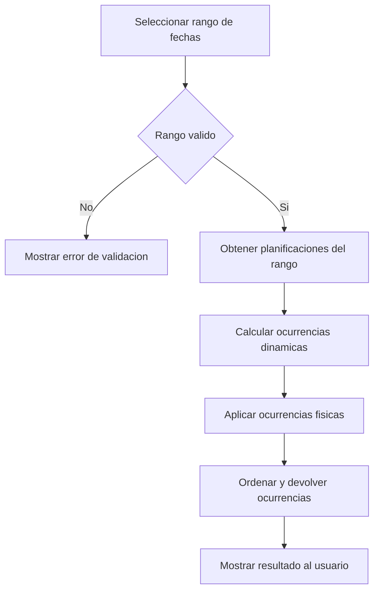

# UC-02.1: Visualización de Ocurrencias Planificadas

**ID:** UC-02.1  
**Nombre:** Visualización de Ocurrencias Planificadas  
**Padre:** UC-02 Gestión de Ocurrencias  
**Prioridad:** Alta  
**Última actualización:** 2026-06-10

---

## Descripción

El usuario selecciona un rango de fechas y el sistema devuelve solo las ocurrencias de planificaciones planificadas (Puntual y Periódica) existentes en ese rango, respetando reglas de cálculo dinámico y precedencia de ocurrencias físicas.

Desde esta visualización, el usuario puede activar gestión individual según tipo de ocurrencia mediante extensiones del caso de uso base.

---

## Flujo Básico

1. Usuario informa fecha desde y fecha hasta.
2. Sistema valida el rango.
3. Sistema obtiene planificaciones planificadas aplicables al rango (excluye tipo "Sin planificar").
4. Sistema calcula ocurrencias dinámicas dentro del rango.
5. Sistema aplica ocurrencias físicas registradas (modificadas/eliminadas).
6. Sistema ordena y devuelve el resultado.
7. Usuario visualiza ocurrencias en el rango solicitado.
8. Opcionalmente, el usuario selecciona una ocurrencia para gestión individual según su tipo (EXTEND a UC-02.2 o UC-02.3).

---

## Diagrama de Flujo

---

## Reglas de Negocio

### RN-2.1.1: Rango obligatorio
Debe informarse un rango de fechas válido para ejecutar la consulta.

### RN-2.1.2: Cobertura de resultados
El resultado incluye ocurrencias dinámicas y físicas dentro del rango solicitado.

### RN-2.1.4: Exclusión de planificaciones de tipo "Sin planificar"
Las planificaciones de tipo "Sin planificar" no forman parte del resultado de este caso de uso.

### RN-2.1.3: Precedencia
Si existe ocurrencia física para una fecha base, prevalece sobre la ocurrencia dinámica.

---

## Casos Relacionados

- Caso padre: [UC-02: Gestión de Ocurrencias](UC-02-gestion-ocurrencias.md)
- Es extendido por: [UC-02.2: Gestión Individual de Planificación Puntual](UC-02.2-gestion-individual-planificacion-puntual.md)
- Es extendido por: [UC-02.3: Gestión Individual de Ocurrencias Periódicas](UC-02.3-gestion-individual-ocurrencias-periodicas.md)
- Reglas comunes: [docs/entidades/ocurrencias.md](../entidades/ocurrencias.md)

## Trazabilidad C4

| Zona critica N4 | Rol |
|-----------------|-----|
| [ZC-1](../diagramas-c4/c4-nivel-4/pseudocodigo/zc-1-consulta-ocurrencias.md) | Composicion en rango |
| [ZC-5](../diagramas-c4/c4-nivel-4/pseudocodigo/zc-5-persistencia.md) | Consulta persistida |
| [ZC-6](../diagramas-c4/c4-nivel-4/pseudocodigo/zc-6-presentacion.md) | Vista calendario |
---

**Última revisión:** 2026-06-10