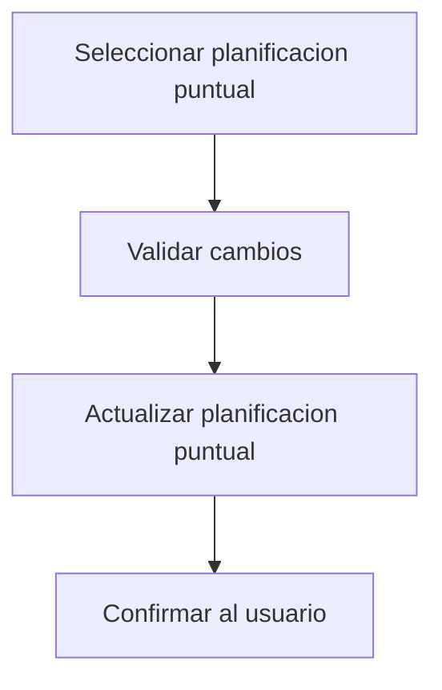

# UC-02.2: Gestión Individual de Planificación Puntual

**ID:** UC-02.2  
**Nombre:** Gestión Individual de Planificación Puntual  
**Padre:** UC-02 Gestión de Ocurrencias  
**Prioridad:** Alta  
**Última actualización:** 2026-06-10

---

## Descripción

Gestiona la edición individual para casos puntuales. En este tipo de planificación no existe una colección de ocurrencias independientes: la acción individual impacta directamente la planificación puntual base.

Este caso de uso diferencia explícitamente el tratamiento puntual del periódico para evitar materializaciones innecesarias.

---

## Flujo Básico

1. Usuario selecciona una planificación de tipo Puntual.
2. Usuario solicita modificación (estado, fecha, hora u observaciones).
3. Sistema valida reglas de planificación puntual.
4. Sistema actualiza directamente la planificación puntual en BD.
5. Sistema confirma la operación.

---

## Diagrama de Flujo

---

## Reglas de Negocio

### RN-2.2.1: Actualización directa
Para tipo Puntual, la modificación individual se aplica sobre la planificación base.

### RN-2.2.2: Sin materialización de ocurrencia puntual
No se crea un registro de ocurrencia física independiente al modificar una puntual.

### RN-2.2.3: Alcance exclusivo
Este caso de uso solo gestiona planificaciones de tipo Puntual. La validación de tipo debe ocurrir antes de invocar UC-02.2.

---

## Casos Relacionados

- Caso padre: [UC-02: Gestión de Ocurrencias](UC-02-gestion-ocurrencias.md)
- Extiende: [UC-02.1: Visualización de Ocurrencias Planificadas](UC-02.1-visualizacion-ocurrencias.md)
- Referencia de tipos: [docs/entidades/planificaciones.md](../entidades/planificaciones.md)

## Trazabilidad C4

| Zona critica N4 | Rol |
|-----------------|-----|
| [ZC-2](../diagramas-c4/c4-nivel-4/pseudocodigo/zc-2-materializacion-ocurrencias.md) | Puntual: mutacion sobre planificacion |
| [ZC-5](../diagramas-c4/c4-nivel-4/pseudocodigo/zc-5-persistencia.md) | Persistencia |
---

**Última revisión:** 2026-06-10