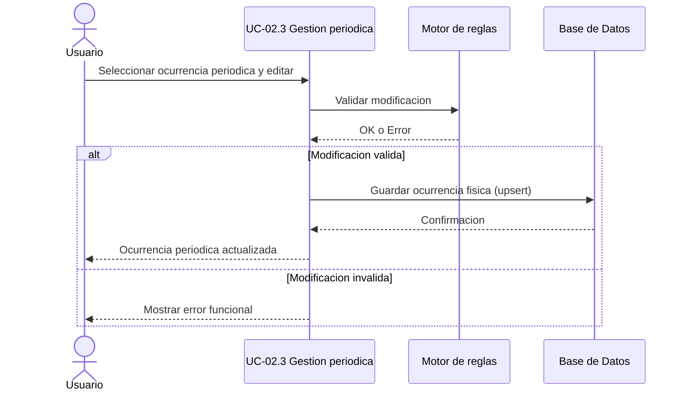

# UC-02.3: Gestión Individual de Ocurrencias Periódicas

**ID:** UC-02.3  
**Nombre:** Gestión Individual de Ocurrencias Periódicas  
**Padre:** UC-02 Gestión de Ocurrencias  
**Prioridad:** Alta  
**Última actualización:** 2026-06-10

---

## Descripción

Permite modificar una ocurrencia individual de una planificación periódica (estado, fecha, hora u observaciones). Si la ocurrencia era dinámica, la modificación se materializa físicamente en BD.

Este caso de uso representa la gestión de ocurrencias propiamente dicha para periodicidad.

---

## Flujo Básico

1. Usuario selecciona una ocurrencia periódica.
2. Sistema identifica si la ocurrencia es dinámica o física.
3. Usuario solicita modificación.
4. Sistema valida reglas de negocio.
5. Sistema persiste la ocurrencia modificada en BD.
6. Sistema confirma operación y actualiza visualización.

---

## Diagrama de Secuencia

---

## Reglas de Negocio

### RN-2.3.1: Materialización de dinámica periódica
Si la ocurrencia periódica modificada era dinámica, debe materializarse en BD como ocurrencia física.

### RN-2.3.2: Persistencia unitaria
La modificación afecta solo a la ocurrencia seleccionada, no al resto de ocurrencias de la planificación.

### RN-2.3.3: Trazabilidad
Debe conservarse referencia a la fecha original para resolver precedencias.

### RN-2.3.4: Exclusión de puntuales
Este caso de uso no gestiona modificaciones de tipo Puntual; esas modificaciones corresponden a UC-02.2.

---

## Casos Relacionados

- Caso padre: [UC-02: Gestión de Ocurrencias](UC-02-gestion-ocurrencias.md)
- Extiende: [UC-02.1: Visualización de Ocurrencias Planificadas](UC-02.1-visualizacion-ocurrencias.md)
- Reglas comunes: [docs/entidades/ocurrencias.md](../entidades/ocurrencias.md)

## Trazabilidad C4

| Zona critica N4 | Rol |
|-----------------|-----|
| [ZC-1](../diagramas-c4/c4-nivel-4/pseudocodigo/zc-1-consulta-ocurrencias.md) | Lectura previa |
| [ZC-2](../diagramas-c4/c4-nivel-4/pseudocodigo/zc-2-materializacion-ocurrencias.md) | Materializacion individual |
| [ZC-5](../diagramas-c4/c4-nivel-4/pseudocodigo/zc-5-persistencia.md) | Persistencia |
---

**Última revisión:** 2026-06-10