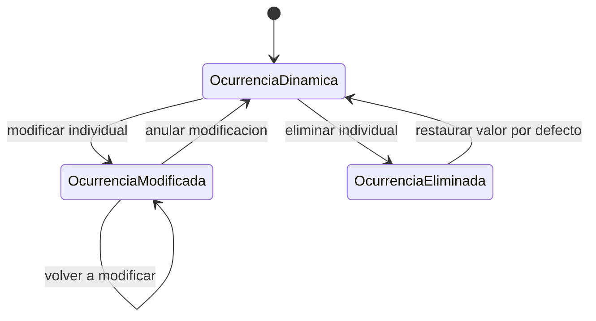

# UC-02.4: Gestión de Ocurrencias por Planificación

**ID:** UC-02.4  
**Nombre:** Gestión de Ocurrencias por Planificación  
**Padre:** UC-02 Gestión de Ocurrencias  
**Prioridad:** Alta  
**Última actualización:** 2026-06-12

---

## Descripción

Permite visualizar las ocurrencias físicas registradas para una planificación, distinguiendo entre modificadas y eliminadas.

- Ocurrencias modificadas: se pueden volver a modificar o anular.
- Ocurrencias eliminadas: solo se pueden restaurar al valor por defecto (recuperar ocurrencia dinámica para esa fecha).

**Relación con eliminación:** mientras quede algún registro materializado (RE-4), no se puede eliminar la planificación (UC-01.4) ni el item o proyecto que la contiene (UC-01.3, UC-01.2). Este caso de uso es el canal para anular o restaurar cada ocurrencia hasta dejar la planificación «limpia».

**Feature futura — vaciado masivo RE-4:** el flujo actual es ocurrencia a ocurrencia (anular / restaurar). Si se añade una acción de **vaciar todas las materializadas de una planificación** para resolver RE-4 de un solo golpe, la persistencia debe acotarse a **una planificación por operación** y tener en cuenta [FAQ-311](../../backlog/000-planificacion-inicial/dudas-y-resoluciones.md) (bloqueos en borrado masivo; no usar `DELETE … WHERE planificacion_id IN (…)` ni cascada multi-planificación en una transacción larga). Para vaciar un item o proyecto entero, repetir la operación **planificación a planificación**.

---

## Flujo Básico

1. Usuario selecciona una planificación.
2. Sistema obtiene ocurrencias físicas de esa planificación.
3. Sistema separa resultados en modificadas y eliminadas.
4. Usuario selecciona una ocurrencia física.
5. Sistema habilita acciones según el tipo de registro.
6. Sistema ejecuta acción y confirma.

---

## Diagrama de Estados

---

## Reglas de Negocio

### RN-2.4.1: Segmentación de registros físicos
La consulta por planificación debe distinguir explícitamente ocurrencias físicas modificadas y eliminadas.

### RN-2.4.2: Acciones permitidas para modificadas
Una ocurrencia modificada puede volver a modificarse o anularse.

### RN-2.4.3: Acciones permitidas para eliminadas
Una ocurrencia eliminada solo puede restaurarse a su valor por defecto (dinámica).

### RN-2.4.4: Alcance de restauración
Restaurar elimina el registro físico y recupera la ocurrencia dinámica para la fecha original.

### RN-2.4.5: Vaciado masivo y RE-4 (feature futura)
Si se implementa vaciado masivo de materializadas para resolver RE-4 sin anular/restaurar una a una, la operación debe limitarse al **`planificacion_id` seleccionado** y cumplir [FAQ-311](../../backlog/000-planificacion-inicial/dudas-y-resoluciones.md). No se admite, en una sola sentencia o transacción larga, borrar ocurrencias de varias planificaciones (p. ej. todo un item) por riesgo de bloqueo de lecturas concurrentes del calendario en motores con READ COMMITTED y locking.

---

## Casos Relacionados

- Caso padre: [UC-02: Gestión de Ocurrencias](UC-02-gestion-ocurrencias.md)
- Puede activarse como EXTEND desde: [UC-01.4: Creación/Configuración Planificación](UC-01.4-gestion-planificacion.md)
- Reglas comunes: [docs/entidades/ocurrencias.md](../entidades/ocurrencias.md)
- RE-4 / borrado masivo: [FAQ-311](../../backlog/000-planificacion-inicial/dudas-y-resoluciones.md)

## Trazabilidad C4

| Zona critica N4 | Rol |
|-----------------|-----|
| [ZC-1](../diagramas-c4/c4-nivel-4/pseudocodigo/zc-1-consulta-ocurrencias.md) | Consulta fisicas |
| [ZC-2](../diagramas-c4/c4-nivel-4/pseudocodigo/zc-2-materializacion-ocurrencias.md) | Gestion por planificacion |
| [ZC-5](../diagramas-c4/c4-nivel-4/pseudocodigo/zc-5-persistencia.md) | Persistencia |
---

**Última revisión:** 2026-06-12