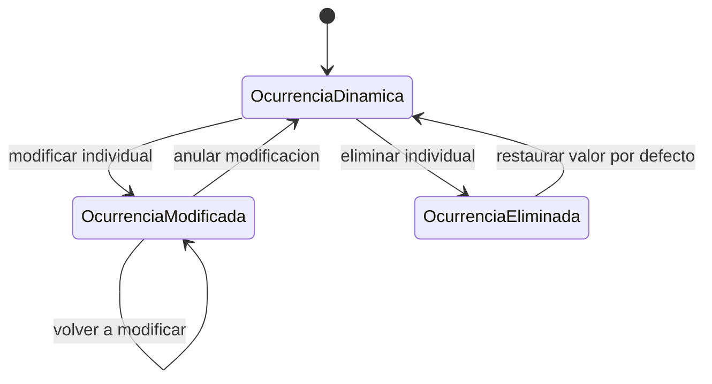

# UC-02.4: Gestión de Ocurrencias por Planificación

**ID:** UC-02.4  
**Nombre:** Gestión de Ocurrencias por Planificación  
**Padre:** UC-02 Gestión de Ocurrencias  
**Prioridad:** Alta  
**Última actualización:** 2026-06-10

---

## Descripción

Permite visualizar las ocurrencias físicas registradas para una planificación, distinguiendo entre modificadas y eliminadas.

- Ocurrencias modificadas: se pueden volver a modificar o anular.
- Ocurrencias eliminadas: solo se pueden restaurar al valor por defecto (recuperar ocurrencia dinámica para esa fecha).

---

## Flujo Básico

1. Usuario selecciona una planificación.
2. Sistema obtiene ocurrencias físicas de esa planificación.
3. Sistema separa resultados en modificadas y eliminadas.
4. Usuario selecciona una ocurrencia física.
5. Sistema habilita acciones según el tipo de registro.
6. Sistema ejecuta acción y confirma.

---

## Diagrama de Estados

---

## Reglas de Negocio

### RN-2.4.1: Segmentación de registros físicos
La consulta por planificación debe distinguir explícitamente ocurrencias físicas modificadas y eliminadas.

### RN-2.4.2: Acciones permitidas para modificadas
Una ocurrencia modificada puede volver a modificarse o anularse.

### RN-2.4.3: Acciones permitidas para eliminadas
Una ocurrencia eliminada solo puede restaurarse a su valor por defecto (dinámica).

### RN-2.4.4: Alcance de restauración
Restaurar elimina el registro físico y recupera la ocurrencia dinámica para la fecha original.

---

## Casos Relacionados

- Caso padre: [UC-02: Gestión de Ocurrencias](UC-02-gestion-ocurrencias.md)
- Puede activarse como EXTEND desde: [UC-01.4: Creación/Configuración Planificación](UC-01.4-gestion-planificacion.md)
- Reglas comunes: [docs/entidades/ocurrencias.md](../entidades/ocurrencias.md)

---

**Última revisión:** 2026-06-10