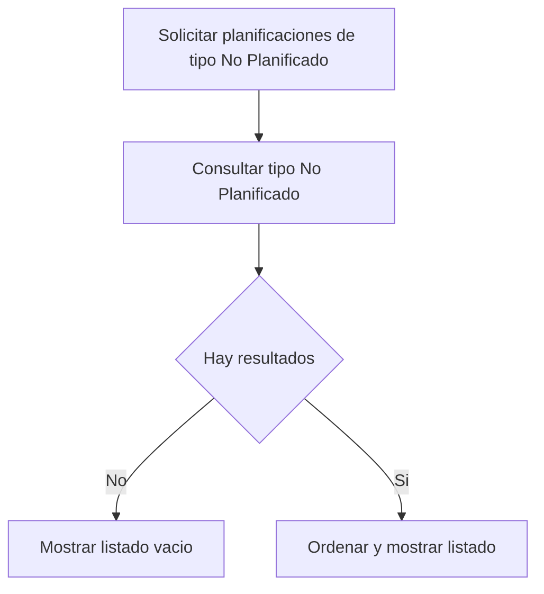

# UC-03: Visualización de Planificaciones de Tipo "No Planificado"

**ID:** UC-03  
**Nombre:** Visualización de Planificaciones de Tipo "No Planificado"  
**Prioridad:** Media  
**Última actualización:** 2026-06-10

---

## Descripción

Recupera las planificaciones de tipo "No Planificado" para su consulta y priorización.

Este caso de uso concentra la funcionalidad anteriormente ubicada en UC-02 y mantiene separada la gestión de ocurrencias planificadas.

---

## Flujo Básico

1. Usuario solicita visualizar planificaciones de tipo "No Planificado".
2. Sistema consulta planificaciones con tipo "No Planificado".
3. Sistema ordena y devuelve resultados.
4. Usuario visualiza el listado de planificaciones de tipo "No Planificado".

---

## Diagrama de Flujo

---

## Reglas de Negocio

### RN-3.1: Filtro exclusivo por tipo
Solo deben recuperarse planificaciones con tipo "No Planificado".

### RN-3.2: Consulta sin ocurrencias dinámicas
Este caso de uso no calcula ocurrencias dinámicas; solo lista planificaciones del tipo indicado.

---

## Casos Relacionados

- Referencia de tipo: [docs/entidades/planificaciones.md](../entidades/planificaciones.md)

---

**Última revisión:** 2026-06-10
