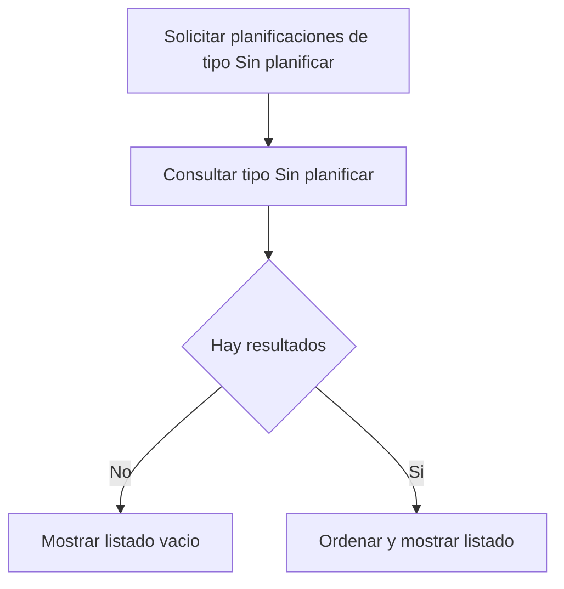

# UC-03: Visualización de Planificaciones de Tipo "Sin planificar"

**ID:** UC-03  
**Nombre:** Visualización de Planificaciones de Tipo "Sin planificar"  
**Prioridad:** Media  
**Última actualización:** 2026-06-12

---

## Descripción

Recupera las planificaciones de tipo "Sin planificar" para su consulta y priorización.

Este caso de uso concentra la funcionalidad anteriormente ubicada en UC-02 y mantiene separada la gestión de ocurrencias planificadas.

---

## Flujo Básico

1. Usuario solicita visualizar planificaciones de tipo "Sin planificar".
2. Sistema consulta planificaciones con tipo "Sin planificar".
3. Sistema ordena y devuelve resultados.
4. Usuario visualiza el listado de planificaciones de tipo "Sin planificar".

---

## Diagrama de Flujo

---

## Reglas de Negocio

### RN-3.1: Filtro exclusivo por tipo
Solo deben recuperarse planificaciones Sin planificar: filas en `PlanificacionesPuntuales` con `sin_planificar = true` (tipo catálogo `SinPlanificar`).

### RN-3.2: Consulta sin ocurrencias dinámicas
Este caso de uso no calcula ocurrencias dinámicas; solo lista planificaciones del tipo indicado.

---

## Casos Relacionados

- Referencia de tipo: [docs/entidades/planificaciones.md](../entidades/planificaciones.md)
- Proyecto / item (filtro): [proyectos.md](../entidades/proyectos.md), [items.md](../entidades/items.md)

## Trazabilidad C4

| Zona critica N4 | Rol |
|-----------------|-----|
| [ZC-3](../diagramas-c4/c4-nivel-4/pseudocodigo/zc-3-planificacion-temporal.md) | `listarSinPlanificar` |
| [ZC-5](../diagramas-c4/c4-nivel-4/pseudocodigo/zc-5-persistencia.md) | Query `PlanificacionesPuntuales` con `sin_planificar = true` |
---

**Última revisión:** 2026-06-10
