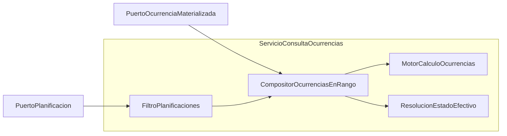

# ZC-1: Consulta y calculo de ocurrencias

**Componente N3:** `Ocurrencia`, `Planificacion` (lectura)  
**Prioridad:** Alta  
**Reglas:** `docs/entidades/ocurrencias.md` (RO-1, RO-3, RO-7)  
**Casos de uso:** UC-02.1, UC-02.3 (lectura previa), UC-02.4

---

## Estructura logica



| Subcomponente | Responsabilidad |
|---------------|-----------------|
| `ServicioConsultaOcurrencias` | Orquesta consulta en rango (UC-02.1) |
| `FiltroPlanificaciones` | Excluye tipo No planificado; acota al rango |
| `CompositorOcurrenciasEnRango` | Lee fisicas primero; compone resultado sin doble trabajo |
| `MotorCalculoOcurrencias` | Genera naturales pendientes, excluyendo fechas ya materializadas (RO-1, RO-3) |
| `ResolucionEstadoEfectivo` | Estado propio, herencia y expirado (RO-7) |

---

## Tipos logicos

```
TIPO OcurrenciaVista =
  planificacion_id
  fecha_efectiva          // fecha mostrada (puede diferir de original)
  fecha_original          // fecha base del patron periodico
  hora
  observaciones
  estado_registrado       // opcional; null = heredar de planificacion
  es_materializada        // true si proviene de registro persistido
  es_eliminada            // true si registro de eliminacion virtual
  origen                  // NATURAL | MODIFICADA | ELIMINADA
```

---

## Pseudocodigo

### Estrategia de composicion

Evita calcular todas las naturales para despues fusionarlas con las fisicas (doble trabajo en rangos amplios o con muchas materializaciones). Orden:

1. **Leer fisicas** (modificadas y eliminadas) que afecten al rango.
2. **Generar naturales pendientes**: iterar el patron; si `fecha_original` ya tiene registro fisico, omitir (RO-3).
3. **Devolver** fisicas no eliminadas + naturales pendientes, con estado efectivo resuelto.

La clave de exclusion es siempre `fecha_original`, no `fecha_efectiva` (RO-5).

### Consulta en rango (UC-02.1)

```
FUNCION obtenerOcurrenciasEnRango(desde, hasta, filtros_opcionales):
  SI NOT validarRango(desde, hasta):
    LANZAR ErrorFuncional("RANGO_FECHAS_INVALIDO")

  planificaciones = puerto_planificacion.buscarPlanificadasEnRango(desde, hasta, filtros_opcionales)
  // Excluye tipo No planificado (RN-2.1.4)

  resultado = LISTA_VACIA

  PARA CADA planificacion EN planificaciones:
    resultado.agregarTodas(
      compositor.componer(planificacion, desde, hasta)
    )

  RETORNAR ordenarPorFechaHora(resultado)
```

```
FUNCION componer(planificacion, desde, hasta):
  // Paso 1: leer fisicas que intersectan el rango (fecha_efectiva o fecha_original)
  materializadas = puerto_ocurrencia.buscarPorPlanificacionEnRango(
    planificacion.id, desde, hasta
  )
  fechas_ocupadas = conjunto(materializadas.map(m => m.fecha_original))

  ocurrencias = LISTA_VACIA

  // Incluir fisicas no eliminadas cuya fecha_efectiva cae en el rango visible
  PARA CADA registro EN materializadas:
    SI NOT registro.es_eliminada Y registro.fecha_efectiva EN [desde, hasta]:
      ocurrencias.agregar(desdeRegistroMaterializado(registro))

  // Paso 2: generar naturales solo en fechas sin registro previo (RO-3)
  naturales_pendientes = motor.generarNaturalesPendientes(
    planificacion, desde, hasta, fechas_ocupadas
  )
  ocurrencias.agregarTodas(naturales_pendientes)

  // Paso 3: resolver estado efectivo; resultado ya excluye eliminadas
  PARA CADA ocurrencia EN ocurrencias:
    ocurrencia.estado_efectivo = estado.resolver(ocurrencia, planificacion)

  RETORNAR ocurrencias
```

### Motor de calculo por tipo

```
FUNCION generarNaturalesPendientes(planificacion, desde, hasta, fechas_ocupadas):
  SEGUN planificacion.tipo:
    PUNTUAL:
      RETORNAR generarPuntualPendiente(planificacion, desde, hasta, fechas_ocupadas)
    PERIODICA:
      RETORNAR generarPeriodicaPendiente(planificacion, desde, hasta, fechas_ocupadas)
    NO_PLANIFICADO:
      RETORNAR LISTA_VACIA
```

```
FUNCION generarPuntualPendiente(planificacion, desde, hasta, fechas_ocupadas):
  fecha = planificacion.fecha
  SI fecha NO ESTA EN [desde, hasta]:
    RETORNAR LISTA_VACIA
  SI fechas_ocupadas.contiene(fecha):
    RETORNAR LISTA_VACIA   // ya cubierta por fisica (modificada o eliminada)
  RETORNAR [ crearVistaNatural(planificacion, fecha) ]
```

```
FUNCION generarPeriodicaPendiente(planificacion, desde, hasta, fechas_ocupadas):
  ocurrencias = LISTA_VACIA
  rango_efectivo = interseccion(
    [planificacion.fecha_inicio, planificacion.fecha_fin],
    [desde, hasta]
  )
  fecha = rango_efectivo.inicio

  MIENTRAS fecha <= rango_efectivo.fin:
    SI coincideConPatron(planificacion, fecha):
      SI NOT fechas_ocupadas.contiene(fecha):
        ocurrencias.agregar(crearVistaNatural(planificacion, fecha))
    fecha = fecha.siguienteDia()

  RETORNAR ocurrencias
```

```
FUNCION coincideConPatron(planificacion, fecha):
  SEGUN planificacion.subtipo_periodica:
    DIARIA_TODOS:        RETORNAR VERDADERO
    DIARIA_LUN_VIE:      RETORNAR fecha.esLaboral()
    DIARIA_FIN_SEMANA:   RETORNAR fecha.esFinDeSemana()
    SEMANAL:             RETORNAR fecha.diaSemana EN planificacion.dias_semana
    MENSUAL:
      dia_objetivo = planificacion.dia_mes
      SI fecha.dia == dia_objetivo: RETORNAR VERDADERO
      SI dia_objetivo > 28 Y fecha.esUltimoDiaDelMes() Y planificacion.comportamiento_mes_corto == ULTIMO_DIA_MES:
        RETORNAR VERDADERO
      SI dia_objetivo > 28 Y fecha.dia == 1 Y planificacion.comportamiento_mes_corto == DIA_1_MES_SIGUIENTE:
        RETORNAR dia_objetivo > diasEnMes(fecha.mesAnterior())
      SI dia_objetivo > 28 Y planificacion.comportamiento_mes_corto == OMITIR:
        RETORNAR FALSO  // mes sin ese dia no genera ocurrencia
      RETORNAR FALSO
```

### Resolucion de estado (RO-7)

```
FUNCION resolver(ocurrencia_vista, planificacion):
  estado = ocurrencia_vista.estado_registrado
  SI estado ES NULL:
    estado = planificacion.estado

  SI estado == PENDIENTE Y ocurrencia_vista.fecha_efectiva + ocurrencia_vista.hora < ahora():
    RETORNAR EXPIRADO_CALCULADO   // visualizacion; no es estado persistido

  RETORNAR estado
```

### Consulta de fisicas por planificacion (UC-02.4)

```
FUNCION listarOcurrenciasFisicas(planificacion_id):
  registros = puerto_ocurrencia.buscarTodasMaterializadas(planificacion_id)
  modificadas = registros DONDE NOT es_eliminada
  eliminadas  = registros DONDE es_eliminada
  RETORNAR { modificadas, eliminadas }
```

---

## Contratos de puerto (lectura)

```
INTERFAZ PuertoOcurrenciaMaterializada:
  // Registros cuya fecha_efectiva o fecha_original intersecta el rango
  buscarPorPlanificacionEnRango(planificacion_id, desde, hasta) -> Lista<RegistroOcurrencia>
  buscarTodasMaterializadas(planificacion_id) -> Lista<RegistroOcurrencia>
```

En implementacion SQL, la lectura del paso 1 puede resolverse en una unica consulta indexada por `planificacion_id` y fechas; la generacion de naturales pendientes equivale a recorrer el patron omitiendo claves ya presentes (candidato a procedimiento almacenado cuando exista stack).

Implementacion concreta en [zc-5-persistencia.md](zc-5-persistencia.md). Detalle de stack en [implementacion/](../implementacion/).
