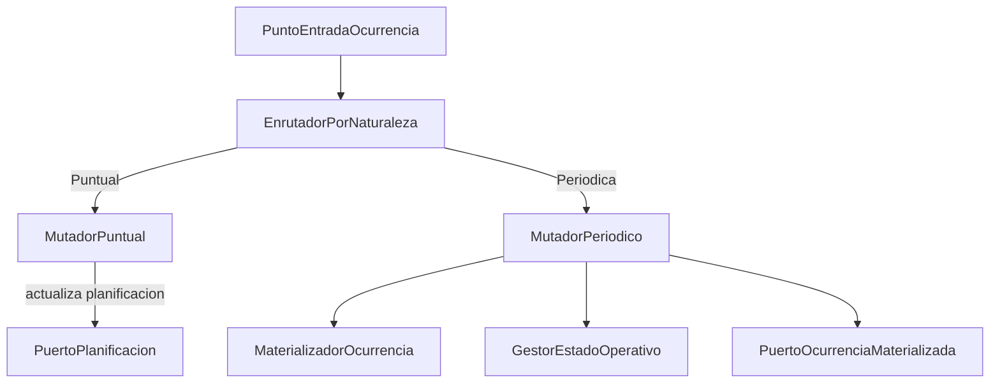

# ZC-2: Materializacion y mutacion de ocurrencias

**Componente N3:** `Ocurrencia`  
**Prioridad:** Alta  
**Reglas:** `docs/entidades/ocurrencias.md` (RO-2, RO-4, RO-5, RO-6, RO-7)  
**Casos de uso:** UC-02.2, UC-02.3, UC-02.4

## Trazabilidad (FAQ-201)

| Caso de uso | Rol en esta zona |
|-------------|------------------|
| [UC-02.2](../../casos-uso/UC-02.2-gestion-individual-planificacion-puntual.md) | Puntual: mutacion directa sobre planificacion |
| [UC-02.3](../../casos-uso/UC-02.3-gestion-individual-ocurrencias-periodicas.md) | Materializacion y mutacion individual |
| [UC-02.4](../../casos-uso/UC-02.4-gestion-ocurrencias-por-planificacion.md) | Gestion masiva de fisicas por planificacion |

---

## Estructura logica



| Subcomponente | Responsabilidad |
|---------------|-----------------|
| `EnrutadorPorNaturaleza` | Desvia puntual (UC-02.2) vs periodico (UC-02.3) via `inferirNaturaleza` |
| `MutadorPuntual` | Actualiza planificacion base; sin materializacion (RN-2.2.2) |
| `MutadorPeriodico` | Modifica, elimina o restaura ocurrencia individual |
| `MaterializadorOcurrencia` | Crea/actualiza registro fisico bajo modificacion (RO-2) |
| `GestorEstadoOperativo` | Completar, reabrir (RO-7) |

---

## Pseudocodigo

### Punto de entrada

```
FUNCION mutarOcurrencia(planificacion_id, fecha_original, cambios):
  planificacion = puerto_planificacion.obtener(planificacion_id)

  SEGUN inferirNaturaleza(planificacion):
    PUNTUAL:
      RETORNAR mutador_puntual.aplicar(planificacion, cambios)
    PERIODICA:
      RETORNAR mutador_periodico.aplicar(planificacion, fecha_original, cambios)
    SIN_PLANIFICAR:
      LANZAR ErrorFuncional("TIPO_SIN_OCURRENCIAS")
```

### Puntual — actualizacion directa (UC-02.2)

```
FUNCION aplicar(planificacion, cambios):
  // RN-2.2.1, RN-2.2.2: no se materializa ocurrencia independiente
  SI cambios.contiene("fecha"):
    planificacion.fecha = cambios.fecha
  SI cambios.contiene("hora"):
    planificacion.hora = cambios.hora
  SI cambios.contiene("observaciones"):
    planificacion.observaciones = cambios.observaciones
  SI cambios.contiene("estado"):
    planificacion.estado = cambios.estado

  validador_planificacion.validarConfiguracion(planificacion)  // ZC-3
  puerto_planificacion.guardar(planificacion)
  RETORNAR confirmacion()
```

### Periodico — modificacion individual (UC-02.3)

```
FUNCION aplicar(planificacion, fecha_original, cambios):
  periodo_id = planificacion.planificacion_id   // PlanificacionPeriodo.PK = planificacion_id
  registro_existente = puerto_ocurrencia.buscarPorFechaOriginal(periodo_id, fecha_original)

  SI registro_existente ES NULL:
    registro = materializador.crearDesdeNatural(planificacion, fecha_original)  // RO-2
  SINO:
    registro = registro_existente

  SI cambios.contiene("fecha") Y cambios.fecha != fecha_original:
    SI cambios.fecha NO ESTA EN [planificacion.fecha_inicio, planificacion.fecha_fin]:
      LANZAR ErrorFuncional("OCURRENCIA_FECHA_FUERA_DE_RANGO")   // RO-8
    registro.fecha_original = fecha_original      // RO-5: preservar vinculo
    registro.fecha_efectiva = cambios.fecha
  SI cambios.contiene("hora"):
    registro.hora = cambios.hora                  // RO-6: fecha/hora separados
  SI cambios.contiene("observaciones"):
    registro.observaciones = cambios.observaciones
  SI cambios.contiene("estado"):
    registro.estado_registrado = cambios.estado   // RO-7

  registro.es_eliminada = FALSO
  registro.tipo_registro = MODIFICADA

  puerto_ocurrencia.guardar(registro)
  RETORNAR confirmacion()
```

### Eliminacion virtual (RO-4, UC-02.3 / UC-02.4)

```
FUNCION eliminarIndividual(planificacion, fecha_original):
  registro = puerto_ocurrencia.buscarPorFechaOriginal(planificacion.planificacion_id, fecha_original)

  SI registro ES NULL:
    registro = materializador.crearDesdeNatural(planificacion, fecha_original)

  registro.es_eliminada = VERDADERO
  registro.tipo_registro = ELIMINADA
  puerto_ocurrencia.guardar(registro)
```

### Restaurar eliminada (UC-02.4, RN-2.4.3)

```
FUNCION restaurar(planificacion_id, fecha_original):
  registro = puerto_ocurrencia.buscarPorFechaOriginal(planificacion_id, fecha_original)

  SI registro ES NULL O NOT registro.es_eliminada:
    LANZAR ErrorFuncional("OCURRENCIA_NO_ELIMINADA")

  puerto_ocurrencia.eliminar(registro.ocurrencia_id)   // RN-2.4.4: vuelve a ser dinamica
```

### Anular modificacion (UC-02.4)

```
FUNCION anularModificacion(planificacion_id, fecha_original):
  registro = puerto_ocurrencia.buscarPorFechaOriginal(planificacion_id, fecha_original)

  SI registro ES NULL O registro.es_eliminada:
    LANZAR ErrorFuncional("OCURRENCIA_NO_MODIFICADA")

  puerto_ocurrencia.eliminar(registro.ocurrencia_id)
```

### Transiciones de estado operativo

```
FUNCION completar(planificacion, fecha_original_opcional):
  SI inferirNaturaleza(planificacion) == PUNTUAL:
    planificacion.estado = COMPLETADA
    puerto_planificacion.guardar(planificacion)
  SINO:
    mutarOcurrencia(planificacion.planificacion_id, fecha_original_opcional, { estado: COMPLETADA })

FUNCION reabrir(planificacion, fecha_original_opcional):
  // Simetrico: estado -> PENDIENTE
```

### Materializador

```
FUNCION crearDesdeNatural(planificacion, fecha_original):
  natural = motor_calculo.obtenerNatural(planificacion, fecha_original)  // ZC-1
  RETORNAR RegistroOcurrencia {
    planificacion_id: planificacion.planificacion_id,
    fecha_original: fecha_original,
    fecha_efectiva: natural.fecha_efectiva,
    hora: natural.hora,
    observaciones: natural.observaciones,
    estado_registrado: NULL,
    es_eliminada: FALSO,
    tipo_registro: MODIFICADA
  }
```

---

## Contratos de puerto (escritura)

```
INTERFAZ PuertoOcurrenciaMaterializada:
  buscarPorFechaOriginal(planificacion_id, fecha_original) -> RegistroOcurrencia | NULL
  guardar(registro) -> RegistroOcurrencia
  eliminar(ocurrencia_id) -> VOID
```

Detalle de persistencia en [zc-5-persistencia.md](../implementacion/persistencia/typescript/zc-5-persistencia.md). Back-End: [nestjs-typescript/zc-2-materializacion-ocurrencias.md](../implementacion/back-end/nestjs-typescript/zc-2-materializacion-ocurrencias.md).
