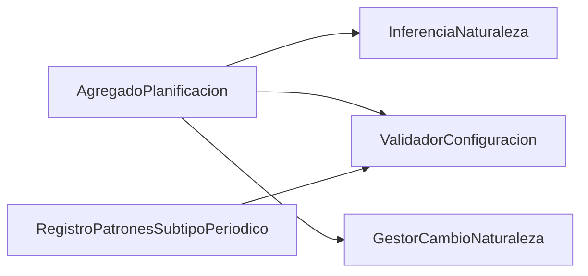

# ZC-3: Definicion temporal y ciclo de vida de planificaciones

**Componente N3:** `Planificacion`  
**Prioridad:** Alta  
**Reglas:** `docs/entidades/planificaciones.md` (RC-*, RT-*)  
**Casos de uso:** UC-01.4, UC-01.5 (validacion), UC-03

## Trazabilidad (FAQ-201)

| Caso de uso | Rol en esta zona |
|-------------|------------------|
| [UC-01.4](../../casos-uso/UC-01.4-gestion-planificacion.md) | Crear/editar planificacion; cambios de naturaleza (RT-*) |
| [UC-01.5](../../casos-uso/UC-01.5-captura-datos-planificacion.md) | Validacion de captura sin persistir |
| [UC-03](../../casos-uso/UC-03-listar-sin-planificar.md) | Listado `Planificaciones` con fechas NULL |

---

## Estructura logica



| Subcomponente | Responsabilidad |
|---------------|-----------------|
| `AgregadoPlanificacion` | Fila `Planificaciones` + `PlanificacionPeriodo` opcional |
| `InferenciaNaturaleza` | Sin planificar / Puntual / Periódica desde datos (FAQ-305) |
| `CatalogoTipoPeriodo` | Visibilidad de campos de patron desde tabla `TipoPeriodo` (FAQ-306) |
| `ValidadorConfiguracion` | RC-1, RC-2, RC-3 |
| `GestorCambioNaturaleza` | RT-1 a RT-5 |

---

## Inferencia de clase concreta

Jerarquia: [modelo-clases-planificacion.md](../../../entidades/modelo-clases-planificacion.md).

```
FUNCION inferirClase(planificacion):
  SI planificacion.fecha_inicio ES NULL Y planificacion.fecha_fin ES NULL:
    RETORNAR PlanificacionSinPlanificar
  SI planificacion.periodo ES NULL:
    RETORNAR PlanificacionPuntual
  SEGUN planificacion.periodo.tipo_periodo.codigo:
    "Diario":   RETORNAR PlanificacionDiaria
    "Semanal":  RETORNAR PlanificacionSemanal
    "Mensual":  RETORNAR PlanificacionMensual

FUNCION inferirNaturaleza(planificacion):
  clase = inferirClase(planificacion)
  SI clase ES PlanificacionSinPlanificar: RETORNAR SIN_PLANIFICAR
  SI clase ES PlanificacionPuntual: RETORNAR PUNTUAL
  RETORNAR PERIODICA   // PlanificacionDiaria | Semanal | Mensual
```

---

## Pseudocodigo

### Validacion de configuracion (RC-1, RC-2, RC-3)

```
FUNCION validarConfiguracion(planificacion):
  naturaleza = inferirNaturaleza(planificacion)

  validarCamposComunes(planificacion, naturaleza)

  SI naturaleza == SIN_PLANIFICAR:
    validarSinPlanificar(planificacion)
    RETORNAR OK

  SI naturaleza == PUNTUAL:
    SI planificacion.fecha_inicio != planificacion.fecha_fin:
      LANZAR ErrorFuncional("PUNTUAL_FECHAS_DEBEN_COINCIDIR")
    SI planificacion.estado ES NULL:
      LANZAR ErrorFuncional("ESTADO_OBLIGATORIO")
    SI NOT existeAlMenosUnaOcurrenciaEnRango(planificacion):
      LANZAR ErrorFuncional("CONFIGURACION_SIN_OCURRENCIAS")
    RETORNAR OK

  // PERIODICA
  SI planificacion.fecha_fin <= planificacion.fecha_inicio:
    LANZAR ErrorFuncional("RANGO_TEMPORAL_INVALIDO")
  SI planificacion.periodo ES NULL:
    LANZAR ErrorFuncional("PERIODO_OBLIGATORIO")
  tipo_periodo = catalogo_tipo_periodo.obtener(planificacion.periodo.tipo_periodo_id)
  validarCamposVisiblesDelPeriodo(planificacion.periodo, tipo_periodo)
  SI NOT existeAlMenosUnaOcurrenciaEnRango(planificacion):
    LANZAR ErrorFuncional("CONFIGURACION_SIN_OCURRENCIAS")
  RETORNAR OK
```

```
FUNCION validarSinPlanificar(planificacion):
  SI planificacion.observaciones ES NULL O vacio:
    LANZAR ErrorFuncional("PLANIFICACION_CONFIGURACION_INVALIDA")
  SI puerto_planificacion.existeSinPlanificarConObservaciones(
      planificacion.item_id, planificacion.observaciones, excluir = planificacion.planificacion_id):
    LANZAR ErrorFuncional("PLANIFICACION_SIN_PLANIFICAR_OBSERVACIONES_DUPLICADAS")
```

```
FUNCION validarCamposVisiblesDelPeriodo(periodo, tipo_periodo):
  SI tipo_periodo.visibilidad_variante_diaria:
    validarObligatorio(periodo.variante_diaria, "variante_diaria")
  SI tipo_periodo.visibilidad_dias_semana:
    validarDiasSemana(periodo.dias_semana)   // LMXJVSD, >=1 letra
  SI tipo_periodo.visibilidad_dia_mes:
    validarRango(periodo.dia_mes, 1, 31)
  SI tipo_periodo.visibilidad_comportamiento_mes_corto Y periodo.dia_mes > 28:
    validarObligatorio(periodo.comportamiento_mes_corto, "comportamiento_mes_corto")
```

### Crear y editar (UC-01.4)

```
FUNCION crear(item_id, configuracion_capturada):
  planificacion = nuevaPlanificacionDesde(configuracion_capturada)
  planificacion.item_id = item_id
  validarConfiguracion(planificacion)
  puerto_planificacion.guardar(planificacion)   // Planificaciones + Periodo si aplica
  RETORNAR planificacion

FUNCION editar(planificacion_id, configuracion_capturada):
  actual = puerto_planificacion.obtener(planificacion_id)
  destino = nuevaPlanificacionDesde(configuracion_capturada)
  SI inferirNaturaleza(actual) != inferirNaturaleza(destino):
    gestor_cambio_naturaleza.validarTransicion(actual, destino)
  actual = aplicarCambios(actual, destino)
  validarConfiguracion(actual)
  puerto_planificacion.guardar(actual)
  RETORNAR actual
```

### Cambio de naturaleza (RT-1 a RT-5)

```
FUNCION validarTransicion(actual, destino):
  origen = inferirNaturaleza(actual)
  destino_n = inferirNaturaleza(destino)
  SI origen == destino_n: RETORNAR OK

  SI (origen == PUNTUAL Y destino_n == PERIODICA) O (origen == PERIODICA Y destino_n == PUNTUAL):
    LANZAR ErrorFuncional("CAMBIO_TIPO_PUNTUAL_PERIODICA_NO_PERMITIDO")

  // RT-5: Diario <-> Semanal <-> Mensual solo via Sin planificar (RT-3 + RT-1)
  SI origen == PERIODICA Y destino_n == PERIODICA:
    SI actual.periodo.tipo_periodo_id != destino.periodo.tipo_periodo_id:
      LANZAR ErrorFuncional("CAMBIO_TIPO_PERIODO_NO_PERMITIDO")   // mismo criterio que RT-4

  SI origen == PUNTUAL Y destino_n == SIN_PLANIFICAR:
    SI actual.estado != PENDIENTE:
      LANZAR ErrorFuncional("PUNTUAL_COMPLETADA_NO_PUEDE_A_SIN_PLANIFICAR")

  SI origen == PERIODICA Y destino_n == SIN_PLANIFICAR:
    SI actual.estado != PENDIENTE:
      LANZAR ErrorFuncional("PERIODICA_COMPLETADA_NO_PUEDE_A_SIN_PLANIFICAR")
    SI puerto_ocurrencia.contarPorPlanificacion(actual.planificacion_id) > 0:
      LANZAR ErrorFuncional("PERIODICA_CON_OCURRENCIAS_FISICAS_NO_PUEDE_A_SIN_PLANIFICAR")
```

```
FUNCION aplicarCambioNaturaleza(actual, destino):
  origen = inferirNaturaleza(actual)
  destino_n = inferirNaturaleza(destino)

  // Sin planificar <-> Puntual: misma fila Planificaciones
  SI (origen == SIN_PLANIFICAR Y destino_n == PUNTUAL) O (origen == PUNTUAL Y destino_n == SIN_PLANIFICAR):
    RETORNAR puerto_planificacion.actualizar(actual.planificacion_id, destino)

  SI origen == SIN_PLANIFICAR Y destino_n == PERIODICA:
    RETORNAR puerto_planificacion.actualizarYCrearPeriodo(actual.planificacion_id, destino)

  SI origen == PERIODICA Y destino_n == SIN_PLANIFICAR:
    RETORNAR puerto_planificacion.eliminarPeriodoYActualizar(actual.planificacion_id, destino)
```

### Lectura Sin planificar (UC-03)

```
FUNCION listarSinPlanificar(filtros):
  RETORNAR puerto_planificacion.buscarSinPlanificar(filtros)
  // WHERE fecha_inicio IS NULL AND fecha_fin IS NULL
```

---

## Notas

- UC-01.5 delega validacion a `ValidadorConfiguracion`; no persiste (RC-4).
- RT-3 consulta ocurrencias via `planificacion_id` (ZC-5; FK = PK de `PlanificacionPeriodo`).

Proyeccion: [back-end/nestjs-typescript/zc-3-planificacion-temporal.md](../implementacion/back-end/nestjs-typescript/zc-3-planificacion-temporal.md).
