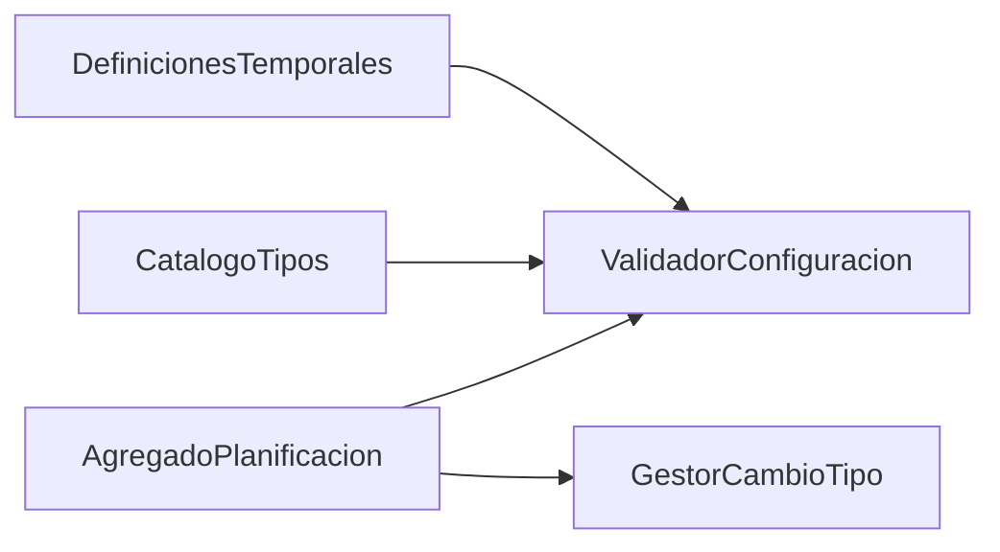

# ZC-3: Definicion temporal y ciclo de vida de planificaciones

**Componente N3:** `Planificacion`  
**Prioridad:** Alta  
**Reglas:** `docs/entidades/planificaciones.md` (RC-*, RT-*)  
**Casos de uso:** UC-01.4, UC-01.5 (validacion), UC-03

## Trazabilidad (FAQ-104)

| Caso de uso | Rol en esta zona |
|-------------|------------------|
| [UC-01.4](../../casos-uso/UC-01.4-gestion-planificacion.md) | Crear/editar planificacion; cambios de tipo (RT-*) |
| [UC-01.5](../../casos-uso/UC-01.5-captura-datos-planificacion.md) | Validacion de captura sin persistir |
| [UC-03](../../casos-uso/UC-03-listar-sin-planificar.md) | Listado `PlanificacionesPuntuales` con `sin_planificar = true` |

---

## Estructura logica



| Subcomponente | Responsabilidad |
|---------------|-----------------|
| `AgregadoPlanificacion` | Entidad raiz; estado Pendiente/Completada |
| `CatalogoTipos` | Puntual, Periodica (Diaria/Semanal/Mensual), Sin planificar |
| `DefinicionesTemporales` | Value objects por variante |
| `ValidadorConfiguracion` | RC-1, RC-2, RC-3 |
| `GestorCambioTipo` | RT-1 a RT-5 |

---

## Value objects logicos

```
TIPO DefinicionPuntual =
  fecha, hora, observaciones?

TIPO DefinicionPeriodicaBase =
  fecha_inicio, fecha_fin, hora, observaciones?

TIPO DefinicionDiaria = DefinicionPeriodicaBase + variante: TODOS | LUN_VIE | FIN_SEMANA

TIPO DefinicionSemanal = DefinicionPeriodicaBase + dias_semana: Conjunto<DiaSemana>

TIPO DefinicionMensual = DefinicionPeriodicaBase +
  dia_mes: Entero(1..31) +
  comportamiento_mes_corto: ULTIMO_DIA_MES | DIA_1_MES_SIGUIENTE | OMITIR

TIPO DefinicionSinPlanificar =
  observaciones?
```

---

## Pseudocodigo

### Validacion de configuracion (RC-1, RC-2, RC-3)

```
FUNCION validarConfiguracion(planificacion):
  SEGUN planificacion.tipo:
    PUNTUAL:
      validarPuntual(planificacion.definicion)
    PERIODICA:
      validarPeriodica(planificacion.definicion, planificacion.subtipo)
    SIN_PLANIFICAR:
      validarSinPlanificar(planificacion.definicion)
    OTRO:
      LANZAR ErrorFuncional("TIPO_DESCONOCIDO")
```

```
FUNCION validarPuntual(def):
  SI def.fecha ES NULL O def.hora ES NULL:
    LANZAR ErrorFuncional("CAMPOS_OBLIGATORIOS_PUNTUAL")
  // RC-3: al menos una ocurrencia implicita (la fecha puntual)
  RETORNAR OK
```

```
FUNCION validarPeriodica(def, subtipo):
  SI def.fecha_inicio ES NULL O def.fecha_fin ES NULL O def.hora ES NULL:
    LANZAR ErrorFuncional("CAMPOS_OBLIGATORIOS_PERIODICA")

  SI def.fecha_fin <= def.fecha_inicio:
    LANZAR ErrorFuncional("RANGO_TEMPORAL_INVALIDO")   // RC-2

  SEGUN subtipo:
    DIARIA:
      SI def.variante_diaria ES NULL:
        LANZAR ErrorFuncional("VARIANTE_DIARIA_REQUERIDA")
    SEMANAL:
      SI def.dias_semana.estaVacio():
        LANZAR ErrorFuncional("DIAS_SEMANA_REQUERIDOS")
    MENSUAL:
      SI def.dia_mes < 1 O def.dia_mes > 31:
        LANZAR ErrorFuncional("DIA_MES_INVALIDO")
      SI def.dia_mes > 28 Y def.comportamiento_mes_corto ES NULL:
        LANZAR ErrorFuncional("COMPORTAMIENTO_MES_CORTO_REQUERIDO")

  SI NOT existeAlMenosUnaOcurrenciaEnRango(def, subtipo):   // RC-3
    LANZAR ErrorFuncional("CONFIGURACION_SIN_OCURRENCIAS")

  RETORNAR OK
```

```
FUNCION existeAlMenosUnaOcurrenciaEnRango(def, subtipo):
  // Reutiliza logica de motor de calculo (ZC-1) sobre [fecha_inicio, fecha_fin]
  // Reutiliza generarNaturalesPendientes (ZC-1) sobre [fecha_inicio, fecha_fin] sin fechas_ocupadas
  naturales = motor_calculo.generarNaturalesPendientes(
    planificacion_temporal(def, subtipo), def.fecha_inicio, def.fecha_fin, conjunto_vacio()
  )
  RETORNAR naturales.noEstaVacia()
```

```
FUNCION validarSinPlanificar(def):
  // Solo observaciones opcionales; sin fechas
  RETORNAR OK
```

### Crear planificacion (UC-01.4)

```
FUNCION crear(item_id, configuracion_capturada):
  planificacion = nuevaPlanificacionDesde(configuracion_capturada)
  planificacion.item_id = item_id
  planificacion.estado = PENDIENTE
  validarConfiguracion(planificacion)
  puerto_planificacion.guardar(planificacion)
  // RC-4: no gestiona ocurrencias individuales
  RETORNAR planificacion
```

### Editar planificacion con posible cambio de tipo

```
FUNCION editar(planificacion_id, configuracion_capturada):
  actual = puerto_planificacion.obtener(planificacion_id)
  destino = nuevaPlanificacionDesde(configuracion_capturada)

  SI actual.tipo != destino.tipo:
    gestor_cambio_tipo.validarTransicion(actual, destino.tipo)

  actual = aplicarCambios(actual, destino)
  validarConfiguracion(actual)
  puerto_planificacion.guardar(actual)
  RETORNAR actual
```

### Cambio de tipo (RT-1 a RT-5)

```
FUNCION validarTransicion(actual, tipo_destino):
  origen = actual.tipo

  SI origen == tipo_destino:
    RETORNAR OK

  // RT-4: Puntual <-> Periodica prohibido
  SI (origen == PUNTUAL Y tipo_destino == PERIODICA) O (origen == PERIODICA Y tipo_destino == PUNTUAL):
    LANZAR ErrorFuncional("CAMBIO_TIPO_PUNTUAL_PERIODICA_NO_PERMITIDO")

  // RT-5: subtipo periodico inmutable (se valida aparte al editar subtipo)
  SI origen == PERIODICA Y tipo_destino == PERIODICA Y actual.subtipo != destino.subtipo:
    LANZAR ErrorFuncional("CAMBIO_SUBTIPO_PERIODICO_NO_PERMITIDO")

  // RT-1: Sin planificar -> Puntual | Periodica
  SI origen == SIN_PLANIFICAR:
    RETORNAR OK   // parametros destino validados en validarConfiguracion

  // RT-2: Puntual -> Sin planificar solo si Pendiente
  SI origen == PUNTUAL Y tipo_destino == SIN_PLANIFICAR:
    SI actual.estado != PENDIENTE:
      LANZAR ErrorFuncional("PUNTUAL_COMPLETADA_NO_PUEDE_A_SIN_PLANIFICAR")
    RETORNAR OK

  // RT-3: Periodica -> Sin planificar
  SI origen == PERIODICA Y tipo_destino == SIN_PLANIFICAR:
    SI actual.estado != PENDIENTE:
      LANZAR ErrorFuncional("PERIODICA_COMPLETADA_NO_PUEDE_A_SIN_PLANIFICAR")
    fisicas = puerto_ocurrencia.buscarTodasMaterializadas(actual.id)
    SI fisicas.contieneModificacion() O fisicas.contieneEliminacion():
      LANZAR ErrorFuncional("PERIODICA_CON_OCURRENCIAS_FISICAS_NO_PUEDE_A_SIN_PLANIFICAR")
    RETORNAR OK

  LANZAR ErrorFuncional("CAMBIO_TIPO_NO_PERMITIDO")
```

### Lectura Sin planificar (UC-03)

```
FUNCION listarSinPlanificar(filtros):
  RETORNAR puerto_planificacion.buscarPuntuales(sin_planificar=true, filtros)
```

### Persistencia en cambio de tipo (FAQ-105)

```
FUNCION aplicarCambioTipo(actual, destino):
  origen = actual.tipo
  tipo_destino = destino.tipo

  // Sin planificar <-> Puntual: misma tabla PlanificacionesPuntuales
  SI (origen == SIN_PLANIFICAR Y tipo_destino == PUNTUAL) O (origen == PUNTUAL Y tipo_destino == SIN_PLANIFICAR):
    RETORNAR puerto_planificacion.actualizarPuntual(actual.id, destino)

  // Sin planificar -> Periodica: anular puntual; crear periodica (sin impacto en ocurrencias)
  SI origen == SIN_PLANIFICAR Y tipo_destino ES PERIODICA:
    puerto_planificacion.anularPuntual(actual.id)
    RETORNAR puerto_planificacion.crearPeriodica(desde(destino))

  // Periodica -> Sin planificar: precondiciones RT-3; anular periodica; crear puntual sin_planificar
  SI origen == PERIODICA Y tipo_destino == SIN_PLANIFICAR:
    puerto_planificacion.anularPeriodica(actual.id)
    RETORNAR puerto_planificacion.crearPuntual(sin_planificar=true, desde(destino))
```

---

## Notas

- UC-01.5 delega la validacion de captura a `ValidadorConfiguracion`; no persiste (RC-4).
- La comprobacion RT-3 consulta ocurrencias fisicas via puerto de ZC-5.

Proyeccion al stack en [implementacion/](../implementacion/).
