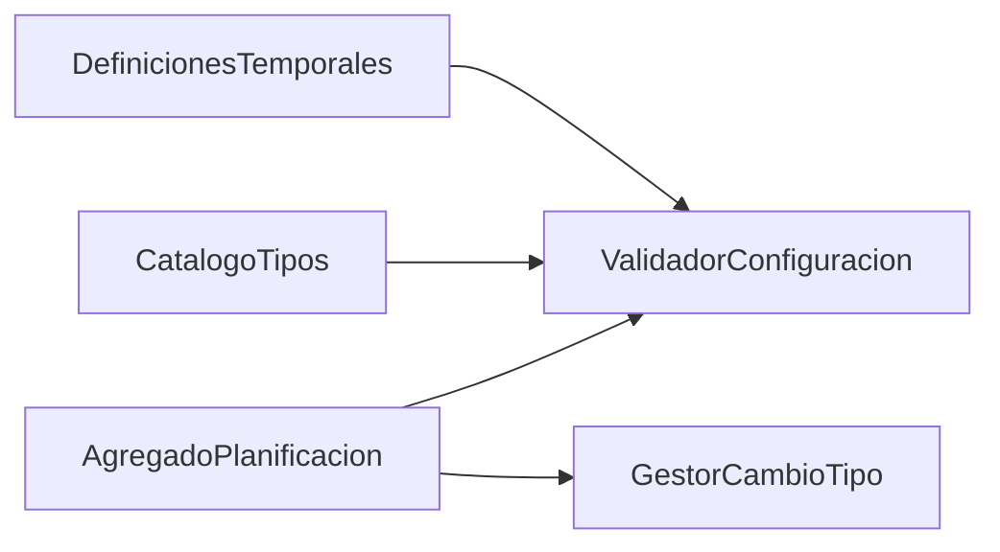

# ZC-3: Definicion temporal y ciclo de vida de planificaciones

**Componente N3:** `Planificacion`  
**Prioridad:** Alta  
**Reglas:** `docs/entidades/planificaciones.md` (RC-*, RT-*)  
**Casos de uso:** UC-01.4, UC-01.5 (validacion), UC-03

## Trazabilidad (FAQ-104)

| Caso de uso | Rol en esta zona |
|-------------|------------------|
| [UC-01.4](../../casos-uso/UC-01.4-gestion-planificacion.md) | Crear/editar planificacion; cambios de tipo (RT-*) |
| [UC-01.5](../../casos-uso/UC-01.5-captura-datos-planificacion.md) | Validacion de captura sin persistir |
| [UC-03](../../casos-uso/UC-03-listar-sin-planificar.md) | Listado `PlanificacionesPuntuales` con `sin_planificar = true` |

---

## Estructura logica



| Subcomponente | Responsabilidad |
|---------------|-----------------|
| `AgregadoPlanificacion` | Entidad raiz; estado Pendiente/Completada |
| `RegistroPatronesTipoPlanificacion` | Metadato `CampoPatron` por `TipoPlanificacion.codigo` — fuente: [planificaciones.md](../../../entidades/planificaciones.md) |
| `ValidadorConfiguracion` | RC-1, RC-2, RC-3 iterando campos del registro |
| `GestorCambioTipo` | RT-1 a RT-5 |

---

## Registro de patrones (metadata)

Definicion declarativa en entidad Planificaciones. En implementacion: mapa cargado al arranque o tabla de metadatos (Step 11).

```
TIPO CampoPatron:
  id, persistencia, tipo_dato, obligatorio, restricciones, roles

INTERFAZ RegistroPatronesTipoPlanificacion:
  patronesDe(codigo: TipoPlanificacion.codigo) -> Lista<CampoPatron>
  camposConRol(codigo, rol) -> Lista<CampoPatron>
  estrategiaMotor(codigo) -> EstrategiaMotorOcurrencias | NULL
```

Los tipos actuales del catalogo y sus campos patrón estan tabulados en `planificaciones.md` (seccion «Campos de patrón por TipoPlanificacion»). El codigo **no** duplica esa tabla como `SEGUN Diario / Semanal / …`; la consume el registro.

---

## Pseudocodigo

### Validacion de configuracion (RC-1, RC-2, RC-3)

```
FUNCION validarConfiguracion(planificacion):
  codigo = planificacion.tipo_planificacion.codigo
  campos = registro_patrones.patronesDe(codigo)

  PARA CADA campo EN campos DONDE "validacion" EN campo.roles:
    valor = planificacion.valorDe(campo.id)
    validarCampoPatron(campo, valor, planificacion)

  // RC-8 y reglas sin planificar (no son CampoPatron temporal)
  SI codigo == "SinPlanificar":
    validarSinPlanificar(planificacion)

  // RC-2: rango si el tipo declara fecha_inicio y fecha_fin
  SI planificacion.tiene("fecha_inicio") Y planificacion.tiene("fecha_fin"):
    SI planificacion.fecha_fin <= planificacion.fecha_inicio:
      LANZAR ErrorFuncional("RANGO_TEMPORAL_INVALIDO")

  // RC-3: al menos una ocurrencia si el tipo genera ocurrencias
  SI registro_patrones.estrategiaMotor(codigo) NO ES NULL:
    SI NOT existeAlMenosUnaOcurrenciaEnRango(planificacion):
      LANZAR ErrorFuncional("CONFIGURACION_SIN_OCURRENCIAS")

  RETORNAR OK

FUNCION validarCampoPatron(campo, valor, planificacion):
  SI campo.obligatorio Y valorEsVacio(valor):
    LANZAR ErrorFuncional("CAMPO_PATRON_OBLIGATORIO", param = campo.id)
  aplicarRestricciones(campo.restricciones, valor, planificacion)
  // restricciones: enums, rangos, condicionales (ej. comportamiento_mes_corto si dia_mes > 28)
```

```
FUNCION existeAlMenosUnaOcurrenciaEnRango(planificacion):
  estrategia = registro_patrones.estrategiaMotor(planificacion.tipo_planificacion.codigo)
  naturales = estrategia.generarNaturalesPendientes(planificacion, rangoCompleto(planificacion), conjunto_vacio())
  RETORNAR naturales.noEstaVacia()
```

```
FUNCION validarSinPlanificar(planificacion):
  SI planificacion.observaciones ES NULL O vacio:
    LANZAR ErrorFuncional("PLANIFICACION_CONFIGURACION_INVALIDA")   // RC-8: obligatorias
  SI puerto_planificacion.existeSinPlanificarConObservaciones(
      planificacion.item_id, planificacion.observaciones, excluir = planificacion.id):
    LANZAR ErrorFuncional("PLANIFICACION_SIN_PLANIFICAR_OBSERVACIONES_DUPLICADAS")   // RC-8
  RETORNAR OK
```

### Crear planificacion (UC-01.4)

```
FUNCION crear(item_id, configuracion_capturada):
  planificacion = nuevaPlanificacionDesde(configuracion_capturada)
  planificacion.item_id = item_id
  planificacion.estado = PENDIENTE
  validarConfiguracion(planificacion)
  puerto_planificacion.guardar(planificacion)
  // RC-4: no gestiona ocurrencias individuales
  RETORNAR planificacion
```

### Editar planificacion con posible cambio de tipo

```
FUNCION editar(planificacion_id, configuracion_capturada):
  actual = puerto_planificacion.obtener(planificacion_id)
  destino = nuevaPlanificacionDesde(configuracion_capturada)

  SI actual.tipo != destino.tipo:
    gestor_cambio_tipo.validarTransicion(actual, destino.tipo)

  actual = aplicarCambios(actual, destino)
  validarConfiguracion(actual)
  puerto_planificacion.guardar(actual)
  RETORNAR actual
```

### Cambio de tipo (RT-1 a RT-5)

```
FUNCION validarTransicion(actual, tipo_destino):
  origen = actual.tipo

  SI origen == tipo_destino:
    RETORNAR OK

  // RT-4: Puntual <-> Periodica prohibido
  SI (origen == PUNTUAL Y tipo_destino == PERIODICA) O (origen == PERIODICA Y tipo_destino == PUNTUAL):
    LANZAR ErrorFuncional("CAMBIO_TIPO_PUNTUAL_PERIODICA_NO_PERMITIDO")

  // RT-5: tipo_planificacion_id inmutable en filas periodicas
  SI origen == PERIODICA Y tipo_destino == PERIODICA Y actual.tipo_planificacion_id != destino.tipo_planificacion_id:
    LANZAR ErrorFuncional("CAMBIO_TIPO_PERIODICO_NO_PERMITIDO")

  // RT-1: Sin planificar -> Puntual | Periodica
  SI origen == SIN_PLANIFICAR:
    RETORNAR OK   // parametros destino validados en validarConfiguracion

  // RT-2: Puntual -> Sin planificar solo si Pendiente
  SI origen == PUNTUAL Y tipo_destino == SIN_PLANIFICAR:
    SI actual.estado != PENDIENTE:
      LANZAR ErrorFuncional("PUNTUAL_COMPLETADA_NO_PUEDE_A_SIN_PLANIFICAR")
    RETORNAR OK

  // RT-3: Periodica -> Sin planificar
  SI origen == PERIODICA Y tipo_destino == SIN_PLANIFICAR:
    SI actual.estado != PENDIENTE:
      LANZAR ErrorFuncional("PERIODICA_COMPLETADA_NO_PUEDE_A_SIN_PLANIFICAR")
    fisicas = puerto_ocurrencia.buscarTodasMaterializadas(actual.id)
    SI fisicas.contieneModificacion() O fisicas.contieneEliminacion():
      LANZAR ErrorFuncional("PERIODICA_CON_OCURRENCIAS_FISICAS_NO_PUEDE_A_SIN_PLANIFICAR")
    RETORNAR OK

  LANZAR ErrorFuncional("CAMBIO_TIPO_NO_PERMITIDO")
```

### Lectura Sin planificar (UC-03)

```
FUNCION listarSinPlanificar(filtros):
  RETORNAR puerto_planificacion.buscarPuntuales(sin_planificar=true, filtros)
```

### Persistencia en cambio de tipo (FAQ-105)

```
FUNCION aplicarCambioTipo(actual, destino):
  origen = actual.tipo
  tipo_destino = destino.tipo

  // Sin planificar <-> Puntual: misma tabla PlanificacionesPuntuales
  SI (origen == SIN_PLANIFICAR Y tipo_destino == PUNTUAL) O (origen == PUNTUAL Y tipo_destino == SIN_PLANIFICAR):
    RETORNAR puerto_planificacion.actualizarPuntual(actual.id, destino)

  // Sin planificar -> Periodica: anular puntual; crear periodica (sin impacto en ocurrencias)
  SI origen == SIN_PLANIFICAR Y tipo_destino ES PERIODICA:
    puerto_planificacion.anularPuntual(actual.id)
    RETORNAR puerto_planificacion.crearPeriodica(desde(destino))

  // Periodica -> Sin planificar: precondiciones RT-3; anular periodica; crear puntual sin_planificar
  SI origen == PERIODICA Y tipo_destino == SIN_PLANIFICAR:
    puerto_planificacion.anularPeriodica(actual.id)
    RETORNAR puerto_planificacion.crearPuntual(sin_planificar=true, desde(destino))
```

---

## Notas

- UC-01.5 delega la validacion de captura a `ValidadorConfiguracion`; no persiste (RC-4).
- La comprobacion RT-3 consulta ocurrencias fisicas via puerto de ZC-5.

Proyeccion al stack en [implementacion/](../implementacion/).
