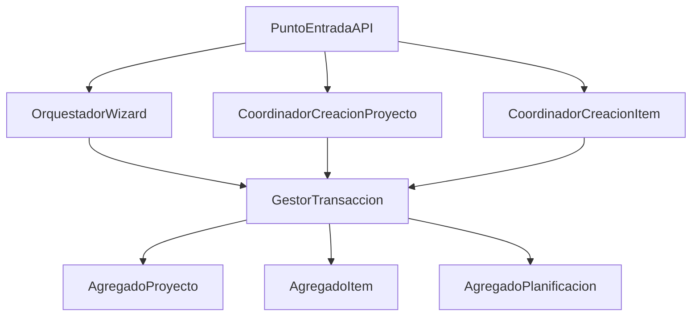

# ZC-4: Orquestacion multi-agregado (aplicacion)

**Componente N3:** `API REST` + coordinadores  
**Prioridad:** Media-alta  
**Casos de uso:** UC-01.1, UC-01.2, UC-01.3

## Trazabilidad (FAQ-104)

| Caso de uso | Rol en esta zona |
|-------------|------------------|
| [UC-01.1](../../casos-uso/UC-01.1-wizard-creacion-proyecto.md) | Wizard atomico: confirmar o cancelar sin persistir |
| [UC-01.2](../../casos-uso/UC-01.2-gestion-proyecto.md) | Creacion proyecto + item + planificacion Sin planificar |
| [UC-01.3](../../casos-uso/UC-01.3-gestion-item.md) | Creacion item + planificacion Sin planificar |

---

## Estructura logica



| Subcomponente | Responsabilidad |
|---------------|-----------------|
| `OrquestadorWizard` | Sesion UC-01.1; acumula datos; confirma o descarta |
| `CoordinadorCreacionProyecto` | UC-01.2: proyecto + item + planificacion automatica |
| `CoordinadorCreacionItem` | UC-01.3: item + planificacion automatica |
| `GestorTransaccion` | Unidad atomica; commit o rollback |

Los agregados `Proyecto` e `Item` no tienen N4 propio; su logica CRUD se invoca desde estos coordinadores.

---

## Pseudocodigo

### Wizard creacion proyecto (UC-01.1)

```
TIPO SesionWizard =
  paso_actual
  datos_proyecto        // nombre, descripcion
  datos_item            // nombre, descripcion
  config_planificacion  // null hasta confirmar UC-01.5

FUNCION iniciarWizard():
  RETORNAR nueva SesionWizard(paso_actual = PROYECTO)

FUNCION avanzarPaso(sesion, datos_paso):
  validarPaso(sesion.paso_actual, datos_paso)
  actualizarSesion(sesion, datos_paso)
  sesion.paso_actual = siguientePaso(sesion.paso_actual)
  RETORNAR sesion

FUNCION capturarPlanificacion(sesion):
  resultado = invocar_uc_01_5(datos_previos = NULL)
  SI resultado.es_cancelacion:
    RETORNAR sesion_sin_cambios
  sesion.config_planificacion = resultado.configuracion
  sesion.paso_actual = RESUMEN
  RETORNAR sesion

FUNCION confirmarWizard(sesion):
  validarSesionCompleta(sesion)

  INICIAR transaccion:
    proyecto = agregado_proyecto.crear(sesion.datos_proyecto)
    item = agregado_item.crear(proyecto.id, sesion.datos_item)
    planificacion = agregado_planificacion.crear(item.id, sesion.config_planificacion)
  CONFIRMAR transaccion

  RETORNAR { proyecto, item, planificacion }

FUNCION cancelarWizard(sesion):
  descartar(sesion)   // sin persistencia
```

```
FUNCION validarPaso(paso, datos):
  SI paso == PROYECTO:
    SI NOT agregado_proyecto.nombreDisponible(datos.nombre):
      LANZAR ErrorFuncional("PROYECTO_NOMBRE_DUPLICADO")
  // Item: unicidad verificada al confirmar dentro del proyecto recien creado
```

### Creacion proyecto con acoplamiento automatico (UC-01.2)

```
FUNCION crearProyectoConAcoplamiento(datos_proyecto):
  INICIAR transaccion:
    proyecto = agregado_proyecto.crear(datos_proyecto)

    item = agregado_item.crear(proyecto.id, {
      nombre: datos_proyecto.nombre,    // item automatico mismo nombre
      descripcion: datos_proyecto.descripcion
    })

    planificacion = agregado_planificacion.crear(item.id,
      definicionSinPlanificarPorDefecto()
    )
  CONFIRMAR transaccion

  RETORNAR { proyecto, item, planificacion }
```

### Creacion item con planificacion automatica (UC-01.3)

```
FUNCION crearItemConPlanificacion(proyecto_id, datos_item):
  SI NOT agregado_item.nombreDisponibleEnProyecto(proyecto_id, datos_item.nombre):
    LANZAR ErrorFuncional("ITEM_NOMBRE_DUPLICADO_EN_PROYECTO")

  INICIAR transaccion:
    item = agregado_item.crear(proyecto_id, datos_item)
    planificacion = agregado_planificacion.crear(item.id,
      definicionSinPlanificarPorDefecto()
    )
  CONFIRMAR transaccion

  RETORNAR { item, planificacion }
```

### Eliminacion con cascada (UC-01.2, UC-01.3)

```
FUNCION eliminarProyecto(proyecto_id):
  INICIAR transaccion:
    agregado_proyecto.eliminarEnCascada(proyecto_id)
    // items, planificaciones y ocurrencias materializadas via ZC-5
  CONFIRMAR transaccion

FUNCION eliminarItem(proyecto_id, item_id):
  SI agregado_item.esUltimoDelProyecto(proyecto_id):
    LANZAR ErrorFuncional("ITEM_ULTIMO_NO_ELIMINABLE")

  INICIAR transaccion:
    agregado_item.eliminarEnCascada(item_id)
  CONFIRMAR transaccion
```

### Gestor de transaccion

```
INTERFAZ GestorTransaccion:
  iniciar() -> UnidadTransaccional
  confirmar(unidad) -> VOID
  revertir(unidad) -> VOID

FUNCION ejecutarAtomico(bloque):
  unidad = gestor_transaccion.iniciar()
  INTENTAR:
    resultado = bloque()
    gestor_transaccion.confirmar(unidad)
    RETORNAR resultado
  CAPTURAR error:
    gestor_transaccion.revertir(unidad)
    RELANZAR mapearError(error)   // ver ZC-5
```

### Planificacion por defecto

```
FUNCION definicionSinPlanificarPorDefecto():
  RETORNAR { tipo: SIN_PLANIFICAR, definicion: { observaciones: NULL } }
```

---

## Delimitacion de responsabilidades

| Operacion | Coordinador | Agregados involucrados |
|-----------|-------------|----------------------|
| Wizard completo | `OrquestadorWizard` | Proyecto, Item, Planificacion |
| Crear proyecto manual | `CoordinadorCreacionProyecto` | Proyecto, Item, Planificacion |
| Crear item manual | `CoordinadorCreacionItem` | Item, Planificacion |
| CRUD planificacion solo | UC-01.4 directo a `AgregadoPlanificacion` | Planificacion |

La persistencia transaccional concreta se implementa en [zc-5-persistencia.md](zc-5-persistencia.md). Proyeccion al stack en [implementacion/](../implementacion/).
