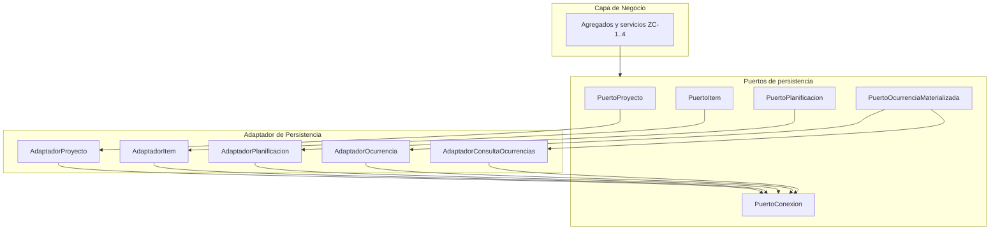

# ZC-5: Persistencia y adaptadores

**Componente N3:** `Puerto de Persistencia`, `Adaptador de Persistencia`, `Puerto de Conexion a BBDD`  
**Prioridad:** Media-alta  
**Casos de uso:** todos UC-01.* y UC-02.* (lectura y escritura)

## Trazabilidad (FAQ-104)

| Caso de uso | Rol en esta zona |
|-------------|------------------|
| UC-01.* | Repositorios Proyecto, Item, Planificacion (puntual/periodica) |
| UC-02.* | Repositorio Ocurrencia; consulta en rango (ZC-1) |
| [UC-03](../../casos-uso/UC-03-listar-sin-planificar.md) | Query puntuales `sin_planificar = true` |

---

## Estructura logica



| Subcomponente | Responsabilidad |
|---------------|-----------------|
| Puertos por agregado | Contrato que consume la capa de negocio |
| `AdaptadorConsultaOcurrencias` | Lecturas complejas para ZC-1 |
| `PuertoConexion` | Transacciones; independiente del motor SQL |
| `MapeadorErroresTecnicos` | Traduce fallos de infraestructura |

El `Adaptador Motor SQL` (N3) queda fuera del canonico; se documenta en N4-implementacion.

---

## Contratos de puerto

```
INTERFAZ PuertoProyecto:
  crear(datos) -> Proyecto
  obtener(id) -> Proyecto
  nombreDisponible(nombre) -> Booleano
  guardar(proyecto) -> Proyecto
  eliminarEnCascada(proyecto_id) -> VOID

INTERFAZ PuertoItem:
  crear(proyecto_id, datos) -> Item
  obtener(id) -> Item
  nombreDisponibleEnProyecto(proyecto_id, nombre) -> Booleano
  esUltimoDelProyecto(proyecto_id) -> Booleano
  guardar(item) -> Item
  eliminarEnCascada(item_id) -> VOID

INTERFAZ PuertoPlanificacion:
  crear(item_id, configuracion) -> Planificacion
  obtener(id) -> Planificacion
  guardar(planificacion) -> Planificacion
  eliminar(planificacion_id) -> VOID
  buscarPlanificadasEnRango(desde, hasta, filtros) -> Lista<Planificacion>
  buscarPorTipo(tipo, filtros) -> Lista<Planificacion>

INTERFAZ PuertoOcurrenciaMaterializada:
  buscarPorPlanificacionEnRango(planificacion_id, desde, hasta) -> Lista<RegistroOcurrencia>
  buscarTodasMaterializadas(planificacion_id) -> Lista<RegistroOcurrencia>
  buscarPorFechaOriginal(planificacion_id, fecha_original) -> RegistroOcurrencia | NULL
  guardar(registro) -> RegistroOcurrencia
  eliminar(registro_id) -> VOID

INTERFAZ PuertoConexion:
  iniciarTransaccion() -> Transaccion
  confirmar(transaccion) -> VOID
  revertir(transaccion) -> VOID
```

---

## Pseudocodigo — adaptadores

### Adaptador generico

```
CLASE AdaptadorBase:
  conexion: PuertoConexion

  FUNCION ejecutarEnTransaccion(bloque, transaccion_externa = NULL):
    tx = transaccion_externa O conexion.iniciarTransaccion()
    INTENTAR:
      resultado = bloque(tx)
      SI transaccion_externa ES NULL:
        conexion.confirmar(tx)
      RETORNAR resultado
    CAPTURAR error_tecnico:
      SI transaccion_externa ES NULL:
        conexion.revertir(tx)
      LANZAR mapeador_errores.desdeTecnico(error_tecnico)
```

### Consulta ocurrencias en rango (soporte ZC-1)

```
FUNCION buscarPorPlanificacionEnRango(planificacion_id, desde, hasta):
  // Logica de consulta: registros cuya fecha_efectiva o fecha_original intersecta el rango
  RETORNAR almacen.buscar(
    tabla = ocurrencias_materializadas,
    filtro = planificacion_id Y rangoIntersecta(desde, hasta)
  ).map(mapearARegistroOcurrencia)
```

### Cascada eliminacion proyecto

```
FUNCION eliminarEnCascada(proyecto_id):
  items = adaptador_item.listarPorProyecto(proyecto_id)
  PARA CADA item EN items:
    adaptador_item.eliminarEnCascada(item.id)   // planificaciones + ocurrencias

  almacen.eliminar(tabla = proyectos, id = proyecto_id)
```

```
FUNCION eliminarEnCascada(item_id):
  planificaciones = adaptador_planificacion.listarPorItem(item_id)
  PARA CADA planificacion EN planificaciones:
    adaptador_ocurrencia.eliminarPorPlanificacion(planificacion.id)
    adaptador_planificacion.eliminar(planificacion.id)

  almacen.eliminar(tabla = items, id = item_id)
```

---

## Mapeo de errores tecnicos

```
FUNCION desdeTecnico(error_tecnico):
  SEGUN error_tecnico.tipo:
    VIOLACION_UNICIDAD:
      SI error_tecnico.restriccion == "proyecto_nombre":
        RETORNAR ErrorFuncional("PROYECTO_NOMBRE_DUPLICADO")
      SI error_tecnico.restriccion == "item_nombre_proyecto":
        RETORNAR ErrorFuncional("ITEM_NOMBRE_DUPLICADO_EN_PROYECTO")
    CONEXION_NO_DISPONIBLE:
      RETORNAR ErrorTecnico("PERSISTENCIA_NO_DISPONIBLE")
    OTRO:
      RETORNAR ErrorTecnico("ERROR_PERSISTENCIA_INTERNO")
```

La capa de negocio solo recibe `ErrorFuncional` (con `codigo`) o `ErrorTecnico`; nunca detalles del motor SQL.

---

## Notas para N4-implementacion

Al definir el stack, esta zona concentra:

- Libreria ORM / driver SQL concreto
- Esquema de tablas e indices
- Consultas SQL optimizadas para rango de ocurrencias
- Implementacion real de `PuertoConexion`

Deriva de este documento; ver [implementacion/](../implementacion/).
