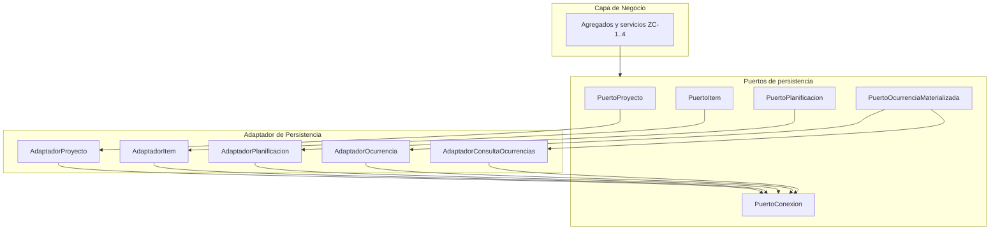

# ZC-5: Persistencia y adaptadores

**Componente N3:** `Puerto de Persistencia`, `Adaptador de Persistencia`, `Puerto de Conexion a BBDD`  
**Prioridad:** Media-alta  
**Casos de uso:** todos UC-01.* y UC-02.* (lectura y escritura)

## Trazabilidad (FAQ-104)

| Caso de uso | Rol en esta zona |
|-------------|------------------|
| UC-01.* | Repositorios Proyecto, Item, Planificacion, PlanificacionPeriodo |
| UC-02.* | Repositorio Ocurrencia; consulta en rango (ZC-1) |
| [UC-03](../../casos-uso/UC-03-listar-sin-planificar.md) | Query `Planificaciones` con fechas NULL |

---

## Estructura logica



| Subcomponente | Responsabilidad |
|---------------|-----------------|
| Puertos por agregado | Contrato que consume la capa de negocio |
| `AdaptadorConsultaOcurrencias` | Lecturas complejas para ZC-1 |
| `PuertoConexion` | Transacciones; independiente del motor SQL |
| `MapeadorErroresTecnicos` | Traduce fallos de infraestructura |

El `Adaptador Motor SQL` (N3) queda fuera del canonico; se documenta en N4-implementacion.

---

## Contratos de puerto

```
INTERFAZ PuertoProyecto:
  crear(datos) -> Proyecto
  obtener(id) -> Proyecto
  nombreDisponible(nombre) -> Booleano
  guardar(proyecto) -> Proyecto
  eliminarEnCascada(proyecto_id) -> VOID

INTERFAZ PuertoItem:
  crear(proyecto_id, datos) -> Item
  obtener(id) -> Item
  nombreDisponibleEnProyecto(proyecto_id, nombre) -> Booleano
  esUltimoDelProyecto(proyecto_id) -> Booleano
  guardar(item) -> Item
  eliminarEnCascada(item_id) -> VOID

INTERFAZ PuertoPlanificacion:
  crear(item_id, configuracion) -> Planificacion
  obtener(id) -> Planificacion
  guardar(planificacion) -> Planificacion
  eliminarDirecta(planificacion_id) -> VOID          // UC-01.4; valida RE-3, RE-4, RN-4.2
  contarPorItem(item_id) -> Entero
  listarPorItem(item_id) -> Lista<Planificacion>
  listarBloqueosEliminacionProyecto(proyecto_id) -> Lista<BloqueoEliminacionPlanificacion>
  listarBloqueosEliminacionItem(item_id) -> Lista<BloqueoEliminacionPlanificacion>
  buscarPlanificadasEnRango(desde, hasta, filtros) -> Lista<Planificacion>
  buscarPorTipo(tipo, filtros) -> Lista<Planificacion>

INTERFAZ PuertoOcurrenciaMaterializada:
  buscarPorPlanificacionEnRango(planificacion_id, desde, hasta, rango_planificacion) -> Lista<RegistroOcurrencia>
  buscarTodasMaterializadasPorPlanificacion(planificacion_id) -> Lista<RegistroOcurrencia>
  contarPorPlanificacion(planificacion_id) -> Entero   // RE-4; solo periódicas
  buscarPorFechaOriginal(planificacion_id, fecha_original) -> RegistroOcurrencia | NULL
  guardar(registro) -> RegistroOcurrencia
  eliminar(ocurrencia_id) -> VOID

INTERFAZ PuertoConexion:
  iniciarTransaccion() -> Transaccion
  confirmar(transaccion) -> VOID
  revertir(transaccion) -> VOID
```

---

## Pseudocodigo — adaptadores

### Adaptador generico

```
CLASE AdaptadorBase:
  conexion: PuertoConexion

  FUNCION ejecutarEnTransaccion(bloque, transaccion_externa = NULL):
    tx = transaccion_externa O conexion.iniciarTransaccion()
    INTENTAR:
      resultado = bloque(tx)
      SI transaccion_externa ES NULL:
        conexion.confirmar(tx)
      RETORNAR resultado
    CAPTURAR error_tecnico:
      SI transaccion_externa ES NULL:
        conexion.revertir(tx)
      LANZAR mapeador_errores.desdeTecnico(error_tecnico)
```

### Consulta ocurrencias en rango (soporte ZC-1)

```
FUNCION buscarPorPlanificacionEnRango(planificacion_id, desde, hasta, rango_planificacion):
  // RO-9, RO-10; orden fisico (planificacion_id, fecha_original, hora, ocurrencia_id)
  RETORNAR almacen.buscar(
    tabla = ocurrencias_materializadas,
    filtro = planificacion_id Y esVisibleEnConsulta(desde, hasta, rango_planificacion)
  ).map(mapearARegistroOcurrencia)
```

### Deteccion de bloqueos (RE-3, RE-4, RE-5)

Reglas: [modelo-entidad-relacion.md](../../../entidades/modelo-entidad-relacion.md). Payload: [errores-validaciones-capas.md](../../../arquitectura/errores-validaciones-capas.md).

```
FUNCION bloqueosDePlanificacion(planificacion):
  motivos = []
  SI planificacion.estado == Completada:
    motivos.agregar(COMPLETADA)
  cantidad = 0
  SI planificacion.periodo NO ES NULL:
    cantidad = adaptador_ocurrencia.contarPorPlanificacion(planificacion.planificacion_id)
  SI cantidad > 0:
    motivos.agregar(OCURRENCIAS_MATERIALIZADAS)
  SI motivos.estaVacio():
    RETORNAR NULL
  item = adaptador_item.obtener(planificacion.item_id)
  proyecto = adaptador_proyecto.obtener(item.proyecto_id)
  RETORNAR BloqueoEliminacionPlanificacion(
    planificacion_id = planificacion.planificacion_id,
    identificable_por_usuario = construirIdentificablePorUsuario(planificacion, proyecto, item),
    motivos = motivos,
    cantidad_ocurrencias_materializadas = cantidad SI cantidad > 0 SINO NULL
  )

FUNCION construirIdentificablePorUsuario(planificacion, proyecto, item):
  naturaleza = inferirNaturaleza(planificacion)
  etiqueta = naturaleza == PERIODICA ? planificacion.periodo.tipo_periodo.codigo : naturaleza
  RETORNAR {
    proyecto_nombre: proyecto.nombre,
    item_nombre: item.nombre,
    naturaleza: etiqueta,
    observaciones: planificacion.observaciones,
    fecha_inicio: planificacion.fecha_inicio,
    fecha_fin: planificacion.fecha_fin,
    hora: planificacion.hora
  }
  // Plantillas: planificaciones.md — IdentificablePorUsuario
```

```
FUNCION listarBloqueosEliminacionItem(item_id):
  bloqueos = []
  PARA CADA planificacion EN listarPorItem(item_id):
    b = bloqueosDePlanificacion(planificacion)
    SI b NO ES NULL: bloqueos.agregar(b)
  RETORNAR bloqueos

FUNCION listarBloqueosEliminacionProyecto(proyecto_id):
  bloqueos = []
  PARA CADA item EN adaptador_item.listarPorProyecto(proyecto_id):
    bloqueos.agregarTodos(listarBloqueosEliminacionItem(item.item_id))
  RETORNAR bloqueos
```

UC-01.2 y UC-01.3 invocan estas funciones **antes** de la transaccion. Si `bloqueos` no esta vacio, lanzar `ELIMINACION_PROYECTO_BLOQUEADA` o `ELIMINACION_ITEM_BLOQUEADA` con el array completo (RE-5: sin omitir entradas).

### Eliminacion de planificacion (RE-3, RE-4, RN-4.2)

```
FUNCION validarEliminacionPlanificacion(planificacion_id, es_cascada_desde_item_o_proyecto = false):
  planificacion = obtener(planificacion_id)

  SI NO es_cascada_desde_item_o_proyecto:
    SI adaptador_planificacion.contarPorItem(planificacion.item_id) <= 1:
      LANZAR ErrorFuncional("PLANIFICACION_ULTIMA_NO_ELIMINABLE")   // RN-4.2; solo UC-01.4

  SI planificacion.estado == Completada:
    LANZAR ErrorFuncional("PLANIFICACION_COMPLETADA_NO_ELIMINABLE")   // RE-3

  periodo = adaptador_planificacion.obtenerPeriodo(planificacion_id)
  SI periodo NO ES NULL:
    SI adaptador_ocurrencia.contarPorPlanificacion(planificacion_id) > 0:
      LANZAR ErrorFuncional("PLANIFICACION_CON_OCURRENCIAS_NO_ELIMINABLE")   // RE-4
```

RE-3 y RE-4 evitan borrados masivos accidentales: bloquean la eliminacion de cada planificacion (incluida la cascada) y, por tanto, **bloquean** UC-01.2 y UC-01.3 hasta que el usuario revierta con UC-01.4 (estado Pendiente) y UC-02.4 (sin ocurrencias materializadas).

```
FUNCION eliminarDirecta(planificacion_id):
  ejecutarEnTransaccion(tx):
    validarEliminacionPlanificacion(planificacion_id, es_cascada = false)
    almacen.eliminar(tabla = planificaciones, id = planificacion_id, tx)
    // FK CASCADE: planificacion_periodo, ocurrencias si RE-4 cumplida
```

### Cascada eliminacion proyecto e item (UC-01.2, UC-01.3)

```
FUNCION eliminarPlanificacionEnCascada(planificacion_id, tx):
  validarEliminacionPlanificacion(planificacion_id, es_cascada = true)
  almacen.eliminar(tabla = planificacion_de(planificacion_id), id = planificacion_id, tx)
  // FK CASCADE: dias semana; ocurrencias solo si RE-4 ya cumplida (conteo = 0)
```

```
FUNCION eliminarEnCascadaItem(item_id, tx):
  planificaciones = adaptador_planificacion.listarPorItem(item_id)
  PARA CADA planificacion EN planificaciones:
    eliminarPlanificacionEnCascada(planificacion.planificacion_id, tx)

  almacen.eliminar(tabla = items, id = item_id, tx)
```

```
FUNCION eliminarEnCascada(proyecto_id):
  ejecutarEnTransaccion(tx):
    items = adaptador_item.listarPorProyecto(proyecto_id)
    PARA CADA item EN items:
      eliminarEnCascadaItem(item.item_id, tx)

    almacen.eliminar(tabla = proyectos, id = proyecto_id, tx)
```

```
FUNCION eliminarEnCascada(item_id):
  ejecutarEnTransaccion(tx):
    eliminarEnCascadaItem(item_id, tx)
```

La validacion en cascada reutiliza `bloqueosDePlanificacion`; el aviso al usuario en UC-01.2/UC-01.3 usa el listado agregado (RE-5), no errores sueltos por planificacion.

---

## Mapeo de errores tecnicos

```
FUNCION desdeTecnico(error_tecnico):
  SEGUN error_tecnico.tipo:
    VIOLACION_UNICIDAD:
      SI error_tecnico.restriccion == "proyecto_nombre":
        RETORNAR ErrorFuncional("PROYECTO_NOMBRE_DUPLICADO")
      SI error_tecnico.restriccion == "item_nombre_proyecto":
        RETORNAR ErrorFuncional("ITEM_NOMBRE_DUPLICADO_EN_PROYECTO")
    CONEXION_NO_DISPONIBLE:
      RETORNAR ErrorTecnico("PERSISTENCIA_NO_DISPONIBLE")
    OTRO:
      RETORNAR ErrorTecnico("ERROR_PERSISTENCIA_INTERNO")
```

La capa de negocio solo recibe `ErrorFuncional` (con `codigo`) o `ErrorTecnico`; nunca detalles del motor SQL.

---

## Notas para N4-implementacion

Al definir el stack, esta zona concentra:

- Libreria ORM / driver SQL concreto
- Esquema: `Planificaciones`, `PlanificacionPeriodo`, `TipoPeriodo`, `OcurrenciasMaterializadas`
- Consultas SQL optimizadas para rango de ocurrencias (RO-9, RO-10)
- Implementacion real de `PuertoConexion`

Deriva de este documento; ver [implementacion/](../implementacion/).
