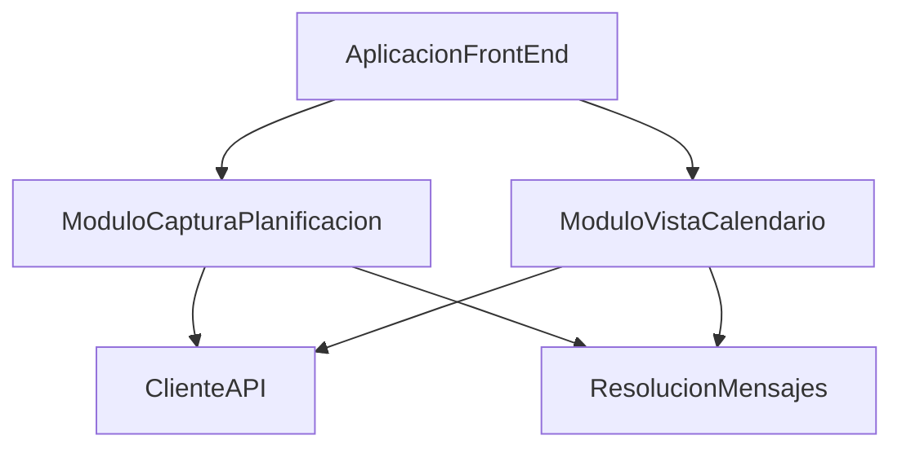

# ZC-6: Presentacion — captura y calendario

**Componente N3:** `Front-End` (ver [N3 Front-End](../../c4-nivel-3/c4-nivel-3-componentes-frontend.mmd))  
**Prioridad:** Media (opcional en primera iteracion)  
**Casos de uso:** UC-01.1, UC-01.4 (via UC-01.5), UC-02.1

## Trazabilidad (FAQ-104)

| Caso de uso | Rol en esta zona |
|-------------|------------------|
| [UC-01.1](../../casos-uso/UC-01.1-wizard-creacion-proyecto.md) | Formulario wizard integrado |
| [UC-01.5](../../casos-uso/UC-01.5-captura-datos-planificacion.md) | Componente captura reutilizable |
| [UC-02.1](../../casos-uso/UC-02.1-visualizacion-ocurrencias.md) | Vista calendario y filtros de rango |

---

## Estructura logica



| Subcomponente | Responsabilidad |
|---------------|-----------------|
| `ModuloCapturaPlanificacion` | UC-01.5: formulario reutilizable por tipo/subtipo |
| `ModuloVistaCalendario` | UC-02.1: rango, listado, acceso a gestion individual |
| `ClienteAPI` | Invoca endpoints del Back-End |
| `ResolucionMensajes` | Traduce `codigo` de error a texto para el usuario |

---

## Pseudocodigo — captura de planificacion (UC-01.5)

```
ESTADO CapturaPlanificacion:
  paso: SELECCION_TIPO | CONFIGURACION | VALIDACION
  naturaleza_seleccionada: SIN_PLANIFICAR | PUNTUAL | PERIODICA | NULL
  tipo_periodo_seleccionado: TipoPeriodo | NULL   // solo si PERIODICA
  datos_formulario: Mapa<Campo, Valor>
  datos_previos: Configuracion | NULL   // modo edicion

FUNCION iniciar(datos_previos = NULL):
  estado = nuevo CapturaPlanificacion(datos_previos = datos_previos)
  SI datos_previos:
    estado.naturaleza_seleccionada = datos_previos.naturaleza
    estado.tipo_periodo_seleccionado = datos_previos.periodo?.tipo_periodo
    estado.datos_formulario = prellenar(datos_previos)
  RETORNAR estado

FUNCION seleccionarNaturaleza(estado, naturaleza):
  estado.naturaleza_seleccionada = naturaleza
  estado.tipo_periodo_seleccionado = NULL
  estado.datos_formulario = camposComunesPorNaturaleza(naturaleza)
  estado.paso = CONFIGURACION

FUNCION seleccionarTipoPeriodo(estado, tipo_periodo):
  // Tras elegir PERIODICA: campos de patron segun visibilidades de TipoPeriodo (FAQ-111)
  estado.tipo_periodo_seleccionado = tipo_periodo
  estado.datos_formulario.agregarTodos(camposVisiblesDelPeriodo(tipo_periodo))

FUNCION confirmar(estado):
  config = construirConfiguracion(estado.naturaleza_seleccionada, estado.tipo_periodo_seleccionado, estado.datos_formulario)
  // Validacion local previa (UX); validacion definitiva en Back-End ZC-3
  errores = validarLocal(config)
  SI errores.noEstaVacio():
    estado.paso = VALIDACION
    RETORNAR ResultadoError(errores)

  RETORNAR ResultadoOk(config)   // invocador persiste o acumula en wizard

FUNCION cancelar(estado):
  RETORNAR ResultadoCancelacion()
```

```
FUNCION camposVisiblesDelPeriodo(tipo_periodo):
  campos = []
  SI tipo_periodo.visibilidad_variante_diaria: campos.agregar(descriptor("variante_diaria"))
  SI tipo_periodo.visibilidad_dias_semana: campos.agregar(descriptor("dias_semana"))
  SI tipo_periodo.visibilidad_dia_mes: campos.agregar(descriptor("dia_mes"))
  SI tipo_periodo.visibilidad_comportamiento_mes_corto: campos.agregar(descriptor("comportamiento_mes_corto"))
  RETORNAR campos   // etiquetas i18n por id de columna
```

```
FUNCION validarLocal(config):
  // Espejo simplificado de RC-2, RC-3 para feedback inmediato
  errores = LISTA_VACIA
  SI config.tipo == PERIODICA Y config.fecha_fin <= config.fecha_inicio:
    errores.agregar(codigo = "RANGO_TEMPORAL_INVALIDO")
  RETORNAR errores
```

---

## Pseudocodigo — vista calendario (UC-02.1)

```
ESTADO VistaCalendario:
  fecha_desde: Fecha
  fecha_hasta: Fecha
  ocurrencias: Lista<OcurrenciaVista>
  cargando: Booleano

FUNCION establecerRango(estado, desde, hasta):
  SI NOT validarRango(desde, hasta):
    mostrarError("RANGO_FECHAS_INVALIDO")
    RETORNAR

  estado.cargando = VERDADERO
  estado.fecha_desde = desde
  estado.fecha_hasta = hasta
  estado.ocurrencias = cliente_api.obtenerOcurrenciasEnRango(desde, hasta)
  estado.cargando = FALSO

FUNCION seleccionarOcurrencia(estado, ocurrencia):
  planificacion = cliente_api.obtenerPlanificacion(ocurrencia.planificacion_id)
  SEGUN planificacion.tipo:
    PUNTUAL:
      navegarA(gestionPuntual, ocurrencia)      // UC-02.2
    PERIODICA:
      navegarA(gestionPeriodica, ocurrencia)   // UC-02.3
```

```
FUNCION renderizarOcurrencia(ocurrencia):
  estado_mostrado = ocurrencia.estado_efectivo   // incluye EXPIRADO_CALCULADO
  estilo = estiloPorEstado(estado_mostrado)
  RETORNAR componenteVisual(ocurrencia, estilo)
```

---

## Resolucion de mensajes

```
FUNCION mostrarError(codigo, parametros = {}):
  texto = mensajes.resolver(codigo, parametros, idioma_actual)
  // mensajes: catalogo clave codigo -> plantilla (i18n en implementacion)
  ui.mostrarNotificacion(texto)

FUNCION manejarRespuestaApi(respuesta):
  SI respuesta.es_error_funcional:
    SI respuesta.codigo EN ("ELIMINACION_PROYECTO_BLOQUEADA", "ELIMINACION_ITEM_BLOQUEADA"):
      mostrarBloqueosEliminacion(respuesta.codigo, respuesta.bloqueos)   // RE-5
    SINO:
      mostrarError(respuesta.codigo, respuesta.parametros)
  SI respuesta.es_error_tecnico:
    mostrarError("ERROR_GENERICO")

FUNCION mostrarBloqueosEliminacion(codigo, bloqueos):
  // RE-5: listar TODAS las planificaciones impeditivas via IdentificablePorUsuario
  encabezado = mensajes.resolver(codigo + ".titulo", idioma_actual)
  lineas = []
  PARA CADA b EN bloqueos:
    id_texto = formatearIdentificablePorUsuario(b.identificable_por_usuario)
    motivo_texto = unirMotivos(b.motivos, b.cantidad_ocurrencias_materializadas)
    lineas.agregar(id_texto + " — " + motivo_texto)
  ui.mostrarDialogoLista(encabezado, lineas)

FUNCION formatearIdentificablePorUsuario(id):
  // planificaciones.md — IdentificablePorUsuario
  etiqueta_tipo = mensajes.resolverTipoPeriodo(id.tipo_periodo, idioma_actual)   // periódica; i18n desde TipoPeriodo.codigo
  SEGUN id.naturaleza:
    PERIODICA:
      RETORNAR proyecto + item + etiqueta_tipo + observaciones + rango_fechas + hora (locale)
    PUNTUAL:
      RETORNAR proyecto + item + etiqueta_tipo + observaciones + fecha + hora (locale)
    SIN_PLANIFICAR:
      RETORNAR proyecto + item + etiqueta_tipo + observaciones
```

---

## Integracion con invocadores

| Invocador | Uso de captura | Persistencia |
|-----------|----------------|--------------|
| UC-01.1 Wizard | Acumula config; confirma al final | Orquestador ZC-4 |
| UC-01.4 Gestion | Devuelve config al caso de uso | Agregado ZC-3 |

La captura **no persiste**; solo devuelve `ResultadoOk`, `ResultadoError` o `ResultadoCancelacion`.

---

## Notas para N4-implementacion

Al definir el stack de Front-End, esta zona documentara:

- Framework UI y componentes concretos
- Catalogo i18n de mensajes
- Cliente HTTP y modelos de vista tipados

Deriva de este documento; ver [front-end/react-typescript/zc-6-presentacion.md](../implementacion/front-end/react-typescript/zc-6-presentacion.md).
