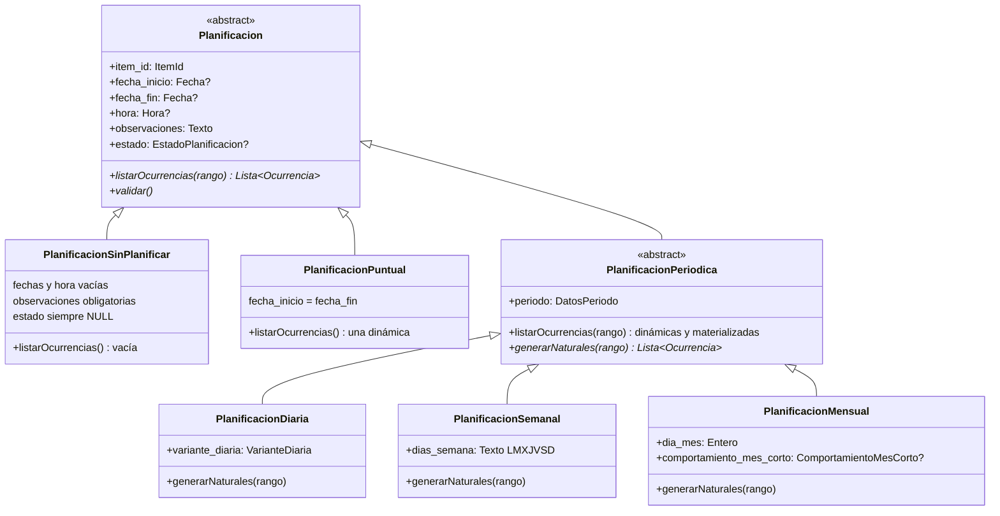

# Modelo de clases — Planificación

**Última actualización:** 2026-06-12  
**Fuente canónica de la jerarquía de dominio.** Complementa [planificaciones.md](planificaciones.md) (reglas) y [modelo-entidad-relacion.md](modelo-entidad-relacion.md) (persistencia).

---

## Diagrama de clases

Fuente: [modelo-clases-planificacion.mmd](modelo-clases-planificacion.mmd)



---

## Jerarquía (referencia rápida)

```
Planificacion (abstracta)
├── PlanificacionSinPlanificar
├── PlanificacionPuntual
└── PlanificacionPeriodica (abstracta)
    ├── PlanificacionDiaria
    ├── PlanificacionSemanal
    └── PlanificacionMensual
```

| Clase | Etiqueta funcional (UI) | `TipoPeriodo` |
|-------|-------------------------|---------------|
| `PlanificacionSinPlanificar` | Sin planificar | — |
| `PlanificacionPuntual` | Puntual | — |
| `PlanificacionDiaria` | Periódica diaria | `Diario` |
| `PlanificacionSemanal` | Periódica semanal | `Semanal` |
| `PlanificacionMensual` | Periódica mensual | `Mensual` |

---

## Inferencia: persistencia → clase

No hay columna discriminadora en BD. La factory `Planificacion.desdePersistencia(fila, periodo?)` resuelve la clase concreta:

| Condición en persistencia | Clase instanciada |
|---------------------------|-------------------|
| `fecha_inicio` y `fecha_fin` NULL | `PlanificacionSinPlanificar` |
| Sin fila `PlanificacionPeriodo` y `fecha_inicio = fecha_fin` | `PlanificacionPuntual` |
| Con periodo y `TipoPeriodo.codigo = Diario` | `PlanificacionDiaria` |
| Con periodo y `TipoPeriodo.codigo = Semanal` | `PlanificacionSemanal` |
| Con periodo y `TipoPeriodo.codigo = Mensual` | `PlanificacionMensual` |

Pseudocódigo (ZC-3): `inferirClase(planificacion)` — equivalente a `inferirNaturaleza` + subtipo periódico.

---

## Mapeo clase ↔ tablas ER

| Clase | `Planificaciones` | `PlanificacionPeriodo` | Campos de patrón |
|-------|-------------------|------------------------|------------------|
| `PlanificacionSinPlanificar` | sí (fechas NULL) | no | — |
| `PlanificacionPuntual` | sí | no | — |
| `PlanificacionDiaria` | sí | sí | `variante_diaria` |
| `PlanificacionSemanal` | sí | sí | `dias_semana` |
| `PlanificacionMensual` | sí | sí | `dia_mes`, `comportamiento_mes_corto` |

Visibilidad de campos de patrón: catálogo `TipoPeriodo` (FAQ-111).

---

## Comportamiento por clase (ocurrencias)

| Clase | `listarOcurrencias` |
|-------|---------------------|
| `PlanificacionSinPlanificar` | `[]` |
| `PlanificacionPuntual` | `[ ocurrenciaDinamicaDesde(this) ]` |
| `PlanificacionPeriodica` * | dinámicas (`generarNaturales`) ∪ materializadas |
| `PlanificacionDiaria` / `Semanal` / `Mensual` | algoritmo propio en `generarNaturales` (ZC-1) |

\* Clase abstracta: no se instancia; solo las tres concretas.

---

## Referencias cruzadas

- Reglas RC-*, RT-*: [planificaciones.md](planificaciones.md)
- ER: [modelo-entidad-relacion.md](modelo-entidad-relacion.md)
- Ocurrencias: [ocurrencias.md](ocurrencias.md)
- Validación / factory: [zc-3-planificacion-temporal.md](../diagramas-c4/c4-nivel-4/pseudocodigo/zc-3-planificacion-temporal.md)
- Motor natural: [zc-1-consulta-ocurrencias.md](../diagramas-c4/c4-nivel-4/pseudocodigo/zc-1-consulta-ocurrencias.md)
