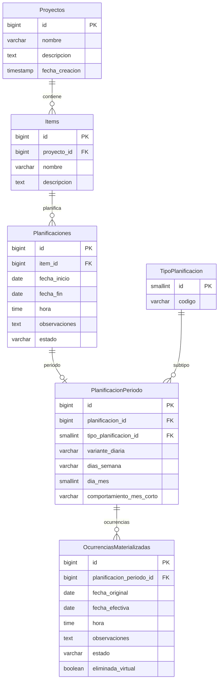

# Modelo entidad-relación (ER)

**Última actualización:** 2026-06-12 (tabla única `Planificaciones`, `PlanificacionPeriodo` 1:1)  
**Step:** 10

Modelo lógico de persistencia para Planificacion 2.0. Decisiones de origen: [dudas-y-resoluciones.md](../planificacion/dudas-y-resoluciones.md) (FAQ-002, 004, 105, 106, 107, 110) y entidades en esta carpeta.

**Notas transversales:**

- Fechas y horas en **UTC** (FAQ-002). El formateo a locale es responsabilidad de la capa de presentación.
- Tipos físicos concretos (`TIMESTAMPTZ`, etc.) se fijan en Step 11 al elegir motor de BBDD.
- La **naturaleza** de una planificación (Sin planificar, Puntual, Periódica) se **infiere** de los datos; no hay flags ni columnas discriminadoras.

---

## Diagrama ER

Fuente: [modelo-entidad-relacion.mmd](modelo-entidad-relacion.mmd)



Semántica (UNIQUE, CHECK, UTC, CASCADE): ver restricciones más abajo.

---

## Relaciones

```
Proyectos 1──N Items
Items 1──N Planificaciones                              (RE-2)
Planificaciones 1──0..1 PlanificacionPeriodo            (solo periódicas)
TipoPlanificacion 1──N PlanificacionPeriodo             (subtipos Diario / Semanal / Mensual)
PlanificacionPeriodo 1──N OcurrenciasMaterializadas     (opcional; solo materializadas)
```

---

## Tabla `Planificaciones` (datos comunes)

Una fila por planificación del item. Campos comunes a todas las especializaciones de dominio:

| Columna | Obligatorio | Notas |
|---------|-------------|-------|
| `id` | PK | |
| `item_id` | FK → Items | Pertenece a un item |
| `fecha_inicio` | Condicional | `NULL` en Sin planificar |
| `fecha_fin` | Condicional | `NULL` en Sin planificar |
| `hora` | Condicional | `NULL` en Sin planificar; obligatoria en Puntual y Periódica |
| `observaciones` | Condicional | Obligatorias en Sin planificar (RC-8); opcionales en el resto |
| `estado` | Condicional | `Pendiente` \| `Completada`; **siempre `NULL` en Sin planificar** |

### Naturaleza inferida (sin flags)

| Naturaleza | Condición en persistencia |
|------------|---------------------------|
| **Sin planificar** | `fecha_inicio` y `fecha_fin` son `NULL` |
| **Puntual** | `fecha_inicio` tiene valor, **no** existe fila en `PlanificacionPeriodo`, `fecha_inicio = fecha_fin` |
| **Periódica** | Existe fila en `PlanificacionPeriodo`, `fecha_fin > fecha_inicio` |

El **subtipo** usable de una periódica (`Diario`, `Semanal`, `Mensual`) viene de `PlanificacionPeriodo.tipo_planificacion_id`, no de la tabla común.

---

## Tabla `PlanificacionPeriodo` (definición del patrón)

Relación **1:1** con `Planificaciones`. Solo existe cuando la planificación es **periódica** (lado opcional: una planificación puntual o sin planificar no tiene periodo).

| Columna | Obligatorio | Notas |
|---------|-------------|-------|
| `id` | PK | |
| `planificacion_id` | FK UNIQUE → Planificaciones | Una planificación tiene como máximo un periodo |
| `tipo_planificacion_id` | FK → TipoPlanificacion | `Diario`, `Semanal` o `Mensual` |
| `variante_diaria` | Si Diario | FAQ-001: `TODOS`, `LUN_VIE`, `FIN_SEMANA` |
| `dias_semana` | Si Semanal | Letras **LMXJVSD** (Lunes → Domingo); p. ej. `MX`, `LMXJVSD` |
| `dia_mes` | Si Mensual | 1–31 |
| `comportamiento_mes_corto` | Condicional | Si `dia_mes > 28` y Mensual |

Sustituye la dispersión de campos de patrón en tablas separadas y la antigua tabla auxiliar de días de semana numéricos.

---

## Catálogo `TipoPlanificacion` (FAQ-106, FAQ-110)

Tabla de referencia **solo para subtipos periódicos**:

| `codigo` | Uso |
|----------|-----|
| `Diario` | Patrón diario en `PlanificacionPeriodo` |
| `Semanal` | Patrón semanal (`dias_semana`) |
| `Mensual` | Patrón mensual (`dia_mes`, etc.) |

`Puntual` y `SinPlanificar` **no** son filas de catálogo: su naturaleza se deduce de `Planificaciones` (fechas y presencia/ausencia de periodo).

---

## Ocurrencias

Comportamiento por naturaleza — detalle en [ocurrencias.md](ocurrencias.md):

| Naturaleza | Listado de ocurrencias |
|------------|------------------------|
| **Sin planificar** | Lista vacía |
| **Puntual** | Una ocurrencia **dinámica** que refleja los datos de `Planificaciones` |
| **Periódica** | Una o varias ocurrencias **dinámicas** y/o **materializadas** en `OcurrenciasMaterializadas` |

Solo las **periódicas** persisten filas en `OcurrenciasMaterializadas` (FK `planificacion_periodo_id`). Las puntuales no materializan: UC-02.2 actualiza `Planificaciones`. RE-4 aplica solo a periódicas con registros materializados.

### Restricciones periódicas (visibilidad y rango)

1. La definición del periodo debe garantizar **al menos una ocurrencia dinámica** en el rango (RC-3).
2. No se puede modificar la fecha de una ocurrencia si la **fecha efectiva** queda fuera de `[fecha_inicio, fecha_fin]` de la planificación (RO-8).
3. Si se modifican las fechas de la planificación, pueden quedar ocurrencias materializadas **fuera de rango** en BD; **no son visibles ni recuperables** en consulta. Debe seguir existiendo **al menos una ocurrencia visible** (dinámica o materializada, contando eliminaciones virtuales registradas) (RO-9).
4. Si una ocurrencia materializada tiene `fecha_original` fuera de rango pero `fecha_efectiva` dentro, se considera **válida y visible** (RO-10).

---

## Reglas de eliminación

### RE-3 y RE-4 — guardas

| Regla | Bloquea si… | Reversión |
|-------|-------------|-----------|
| **RE-3** | `estado = 'Completada'` | UC-01.4 → Pendiente |
| **RE-4** | ≥1 fila en `OcurrenciasMaterializadas` del `PlanificacionPeriodo` de esa planificación | UC-02.4 |

RE-4 **no** aplica a Sin planificar ni Puntual.

### RE-1, RE-2 — cascada

| Origen | Destino |
|--------|---------|
| `Proyectos` | `Items` (RE-1) |
| `Items` | `Planificaciones` (RE-2) |
| `Planificaciones` | `PlanificacionPeriodo` (ON DELETE CASCADE) |
| `PlanificacionPeriodo` | `OcurrenciasMaterializadas` (solo si RE-4 cumplida) |

### RE-5 — aviso al bloquear borrado

Listar cada planificación bloqueante con **`IdentificablePorUsuario`** — ver [planificaciones.md](planificaciones.md) y [errores-validaciones-capas.md](../arquitectura/errores-validaciones-capas.md).

---

## Restricciones e índices

### `Proyectos`

| Restricción | Regla |
|-------------|-------|
| `UNIQUE (nombre)` | RP-1 |

### `Items`

| Restricción | Regla |
|-------------|-------|
| `UNIQUE (proyecto_id, nombre)` | RI-1 |
| `FK proyecto_id → Proyectos ON DELETE CASCADE` | RE-1, RI-6 |

### `Planificaciones`

| Restricción | Regla |
|-------------|-------|
| `FK item_id → Items ON DELETE CASCADE` | RE-2 |
| Sin planificar | `fecha_inicio IS NULL AND fecha_fin IS NULL AND hora IS NULL AND estado IS NULL` |
| Sin planificar | `observaciones IS NOT NULL` (RC-8) |
| Puntual | `fecha_inicio IS NOT NULL AND fecha_inicio = fecha_fin AND hora IS NOT NULL AND estado IS NOT NULL` |
| Puntual | No existe fila en `PlanificacionPeriodo` para ese `id` |
| Periódica | `fecha_fin > fecha_inicio AND hora IS NOT NULL AND estado IS NOT NULL` |
| Periódica | Existe exactamente una fila en `PlanificacionPeriodo` |
| `UNIQUE (item_id, observaciones)` parcial | RC-8: `WHERE fecha_inicio IS NULL` |
| Eliminación | RE-3; RE-4 solo si tiene periodo con ocurrencias materializadas |

### `PlanificacionPeriodo`

| Restricción | Regla |
|-------------|-------|
| `UNIQUE (planificacion_id)` | 1:1 |
| `FK planificacion_id → Planificaciones ON DELETE CASCADE` | |
| `FK tipo_planificacion_id` | Solo `Diario`, `Semanal`, `Mensual` |
| `CHECK variante_diaria` | Obligatorio si `codigo = Diario` |
| `CHECK dias_semana` | Obligatorio si `codigo = Semanal`; solo `LMXJVSD`, ≥1 letra |
| `CHECK dia_mes` | Obligatorio si `codigo = Mensual`; 1–31 |
| `CHECK comportamiento_mes_corto` | Si `dia_mes > 28` y Mensual |

### `OcurrenciasMaterializadas` (FAQ-004)

| Restricción | Regla |
|-------------|-------|
| `FK planificacion_periodo_id NOT NULL` | Solo periódicas |
| `UNIQUE (planificacion_periodo_id, fecha_original)` | RO-3, RO-5 |
| `observaciones`, `estado` NULL | Herencia FAQ-004 |
| `eliminada_virtual` | RO-4; cuenta para RE-4 |

---

## Referencias

- [planificaciones.md](planificaciones.md), [proyectos.md](proyectos.md), [items.md](items.md), [ocurrencias.md](ocurrencias.md)
- [internacionalizacion.md](../politicas-transversales/internacionalizacion.md)
