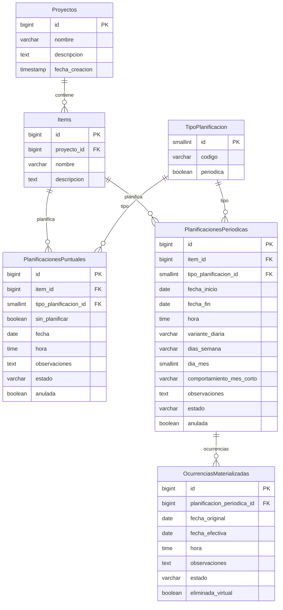

# Modelo entidad-relación (ER)

**Última actualización:** 2026-06-12 (vista unificada, días semana LMXJVSD, ocurrencias solo periódicas)  
**Step:** 10

Modelo lógico de persistencia para Planificacion 2.0. Decisiones de origen: [dudas-y-resoluciones.md](../planificacion/dudas-y-resoluciones.md) (FAQ-002, 004, 105, 106, 108, 109) y entidades en esta carpeta.

**Notas transversales:**

- Fechas y horas en **UTC** (FAQ-002). El formateo a locale es responsabilidad de la capa de presentación.
- Tipos físicos concretos (`TIMESTAMPTZ`, etc.) se fijan en Step 11 al elegir motor de BBDD.
- Registros **anulados** (`anulada = true`) conservan historial al cambiar de tabla en transiciones RT-1 / RT-3.

---

## Diagrama ER (tablas físicas)

Fuente: [modelo-entidad-relacion.mmd](modelo-entidad-relacion.mmd)



Semántica (UNIQUE, CHECK, UTC, CASCADE): ver restricciones más abajo.

---

## Item → Planificación (vista lógica)

Físicamente el **item** referencia planificaciones en `PlanificacionesPuntuales` y/o `PlanificacionesPeriodicas` (`item_id` FK). Para consultas, listados y capa de dominio unificada se expone la **vista** `V_Planificacion`:

```
Item 1 ──N  V_Planificacion  (lectura unificada)
              │
              ├── filas de PlanificacionesPuntuales
              └── filas de PlanificacionesPeriodicas
```

No sustituye las tablas físicas (FAQ-105); unifica lo que el usuario percibe como «una planificación del item».

### `V_Planificacion` (VIEW)

| Columna | Origen | Notas |
|---------|--------|-------|
| `id` | PK de la fila en tabla origen | |
| `item_id` | FK item | relación directa Item → Planificación |
| `codigo` | `TipoPlanificacion.codigo` | join por `tipo_planificacion_id` |
| `periodica` | `TipoPlanificacion.periodica` | `false`, `true` o `NULL` (Sin planificar) |
| `observaciones` | columna común | |
| `hora` | columna común | UTC; `NULL` en Sin planificar |
| `estado` | columna común | Pendiente \| Completada |
| `anulada` | columna común | |
| `fechas` | **varchar** calculado | Ver abajo |
| `origen_tabla` | discriminador | `Puntual` \| `Periodica` (implementación) |

**Columna `fechas` (texto):**

| Naturaleza | Formato en `fechas` | Columnas físicas |
|------------|---------------------|------------------|
| Puntual | Una fecha ISO (`YYYY-MM-DD`) | `PlanificacionesPuntuales.fecha` |
| Sin planificar | `NULL` | sin fechas |
| Periódica | Rango `YYYY-MM-DD..YYYY-MM-DD` | `fecha_inicio` + `fecha_fin` |

La vista **no** persiste; las tablas hijas siguen siendo la fuente de escritura (UC-01.4).

### `TipoPlanificacion` (catálogo)

Tabla **pequeña de referencia** (FAQ-106): `id`, `codigo`, `periodica`. **No** almacena instancias ni campos comunes de negocio (`observaciones`, `hora`, etc.); esos viven en las tablas hijas y aparecen unificados en `V_Planificacion`.

---

## Catálogo `TipoPlanificacion` (FAQ-106)

| `codigo` | `periodica` | Tabla instancia |
|----------|-------------|-----------------|
| `Puntual` | `false` | `PlanificacionesPuntuales` (`sin_planificar = false`) |
| `SinPlanificar` | `NULL` | `PlanificacionesPuntuales` (`sin_planificar = true`) |
| `Diario` | `true` | `PlanificacionesPeriodicas` |
| `Semanal` | `true` | `PlanificacionesPeriodicas` |
| `Mensual` | `true` | `PlanificacionesPeriodicas` |

---

## Campo `dias_semana` (tipo Semanal)

Sustituye la antigua tabla `PlanificacionesPeriodicasDiasSemana`.

| Aspecto | Regla |
|---------|-------|
| Persistencia | `PlanificacionesPeriodicas.dias_semana` (varchar) |
| Alfabeto | Letras **L M X J V S D** = Lunes, Martes, Miércoles, Jueves, Viernes, Sábado, Domingo |
| Formato | Subconjunto ordenado **LMXJVSD** (p. ej. `MX` = martes y miércoles; `LMXJVSD` = todos) |
| Obligatorio | Sí si `codigo = Semanal`; `NULL` si no es Semanal |
| Validación | Solo caracteres del alfabeto; al menos una letra si Semanal |

Evita ambigüedad de números 0/1 o inicio de semana en lunes vs domingo.

---

## Ocurrencias materializadas

Solo **planificaciones periódicas** tienen filas en `OcurrenciasMaterializadas`.

| Tipo | Comportamiento |
|------|----------------|
| **Periódica** | Ocurrencias naturales calculadas; modificaciones individuales → `OcurrenciasMaterializadas` |
| **Puntual** | Una sola ocurrencia = la planificación; UC-02.2 **actualiza la fila puntual**, no materializa |
| **Sin planificar** | Sin ocurrencias |

Por tanto **no** existe FK `planificacion_puntual_id` en `OcurrenciasMaterializadas`. RE-4 solo aplica a planificaciones periódicas con filas materializadas; en puntuales RE-4 se considera satisfecha por definición.

---

## Reglas de eliminación

### Propósito de RE-3 y RE-4

Evitar **borrados masivos accidentales** de datos que deben persistir: planificación **Completada**, o historial de ocurrencias periódicas gestionadas individualmente.

**Consecuencia:** UC-01.2 / UC-01.3 bloqueados mientras alguna planificación del ámbito incumpla RE-3 o RE-4. Reversión manual: UC-01.4 y UC-02.4.

### RE-3 y RE-4 — guardas

| Regla | Bloquea si… | Reversión |
|-------|-------------|-----------|
| **RE-3** | `estado = 'Completada'` | UC-01.4 → Pendiente |
| **RE-4** | ≥1 fila en `OcurrenciasMaterializadas` para esa planificación **periódica** | UC-02.4 |

RE-4 **no** aplica a `PlanificacionesPuntuales` (puntual / sin planificar).

### RE-1 y RE-2 — cascada

Cuando RE-3 y RE-4 se cumplen en todo el ámbito:

| Origen | Destino |
|--------|---------|
| `Proyectos` | `Items` (RE-1) |
| `Items` | `PlanificacionesPuntuales`, `PlanificacionesPeriodicas` (RE-2) |
| `PlanificacionesPeriodicas` | `OcurrenciasMaterializadas` (solo si RE-4 cumplida) |

### RE-5 — aviso al bloquear borrado

Listar cada planificación bloqueante con **`IdentificablePorUsuario`** — ver [planificaciones.md](planificaciones.md) y [errores-validaciones-capas.md](../arquitectura/errores-validaciones-capas.md).

---

## Restricciones e índices

### `Proyectos`

| Restricción | Regla |
|-------------|-------|
| `UNIQUE (nombre)` | RP-1 |

### `Items`

| Restricción | Regla |
|-------------|-------|
| `UNIQUE (proyecto_id, nombre)` | RI-1 |
| `FK proyecto_id → Proyectos ON DELETE CASCADE` | RE-1, RI-6 |

### `PlanificacionesPuntuales`

| Restricción | Regla |
|-------------|-------|
| `FK item_id → Items ON DELETE CASCADE` | RE-2 |
| `CHECK (sin_planificar = true OR (fecha IS NOT NULL AND hora IS NOT NULL))` | Puntual exige fecha/hora |
| `CHECK (sin_planificar = false OR (fecha IS NULL AND hora IS NULL))` | Sin planificar sin fechas |
| `CHECK (sin_planificar = false OR observaciones IS NOT NULL)` | RC-8 |
| `UNIQUE (item_id, observaciones)` parcial | RC-8: `WHERE sin_planificar = true` |
| `FK tipo_planificacion_id` | Solo `Puntual` o `SinPlanificar` |
| Eliminación | RE-3 (RE-4 N/A) |

### `PlanificacionesPeriodicas`

| Restricción | Regla |
|-------------|-------|
| `FK item_id → Items ON DELETE CASCADE` | RE-2 |
| `CHECK (fecha_fin > fecha_inicio)` | RC-2 |
| `FK tipo_planificacion_id` | Solo tipos con `periodica = true` |
| `CHECK variante_diaria` | Obligatorio si `codigo = Diario` |
| `CHECK dias_semana` | Obligatorio si `codigo = Semanal`; solo `LMXJVSD`, ≥1 letra |
| `CHECK dia_mes` | Obligatorio si `codigo = Mensual`; 1–31 |
| `CHECK comportamiento_mes_corto` | Si `dia_mes > 28` y Mensual |
| Eliminación | RE-3, RE-4 |

### `OcurrenciasMaterializadas` (FAQ-004)

| Restricción | Regla |
|-------------|-------|
| `FK planificacion_periodica_id NOT NULL` | Solo periódicas |
| `UNIQUE (planificacion_periodica_id, fecha_original)` | RO-3, RO-5 |
| `observaciones`, `estado` NULL | Herencia FAQ-004 |
| `eliminada_virtual` | RO-4; cuenta para RE-4 |

---

## Relaciones resumidas

```
Proyectos 1──N Items
Items 1──N PlanificacionesPuntuales | PlanificacionesPeriodicas   (RE-2)
Items 1──N V_Planificacion                                         (vista lectura)
TipoPlanificacion 1──N PlanificacionesPuntuales | Periodicas       (catálogo)
PlanificacionesPeriodicas 1──N OcurrenciasMaterializadas           (solo periódicas; RE-4)
```

---

## Referencias

- [planificaciones.md](planificaciones.md), [proyectos.md](proyectos.md), [items.md](items.md), [ocurrencias.md](ocurrencias.md)
- [internacionalizacion.md](../politicas-transversales/internacionalizacion.md)
