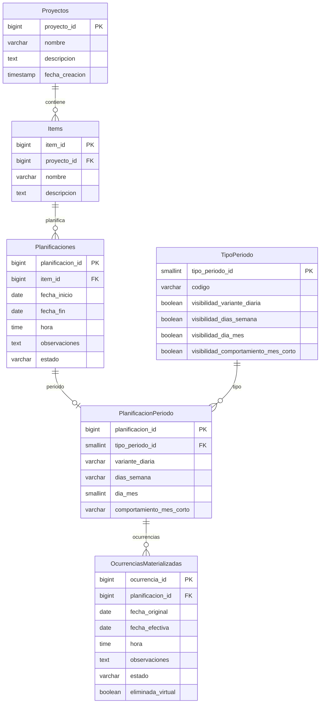

# Modelo entidad-relación (ER)

**Última actualización:** 2026-06-12 (`TipoPeriodo` catálogo de visibilidad de campos)  
**Step:** 10

Modelo lógico de persistencia para Planificacion 2.0. **Jerarquía de clases de dominio:** [modelo-clases-planificacion.md](modelo-clases-planificacion.md). Decisiones de origen: [dudas-y-resoluciones.md](../planificacion/dudas-y-resoluciones.md) (FAQ-001, 003, 300–311) y entidades en esta carpeta.

**Convención PK (FAQ-310):** la clave primaria de cada tabla se nombra **`{entidad}_id`** (`proyecto_id`, `item_id`, `planificacion_id`, `tipo_periodo_id`, `ocurrencia_id`). **Excepción:** `PlanificacionPeriodo` no tiene PK propia; usa **`planificacion_id`** heredada de `Planificaciones` (FAQ-309).

**Notas transversales:**

- Fechas y horas en **UTC** (FAQ-001). El formateo a locale es responsabilidad de la capa de presentación.
- Tipos físicos concretos (`TIMESTAMPTZ`, etc.) se fijan en Step 11 al elegir motor de BBDD.
- La **clase concreta** de dominio (`PlanificacionSinPlanificar`, `PlanificacionPuntual`, `PlanificacionDiaria`, …) se **infiere** de los datos; no hay flags ni columnas discriminadoras en BD.

---

## Diagrama ER

Fuente: [modelo-entidad-relacion.mmd](modelo-entidad-relacion.mmd)



**Entidades del bloque periódico (todas en el diagrama):**

| Entidad en el diagrama | Rol |
|------------------------|-----|
| `PlanificacionPeriodo` | Valores del patrón — **PK = `planificacion_id`** (1:1, sin `id` propio) |
| `TipoPeriodo` | Catálogo: `codigo` + columnas `visibilidad_*` |
| `OcurrenciasMaterializadas` | FK **`planificacion_id`** (misma clave que el periodo); PK fila **`ocurrencia_id`** |

No existe `TipoPlanificacion` (supersedido por FAQ-306). La relación `TipoPeriodo → PlanificacionPeriodo` enlaza metadatos de visibilidad con la fila de patrón concreta vía `tipo_periodo_id`.

Semántica (UNIQUE, CHECK, UTC, CASCADE): ver restricciones más abajo.

---

## Relaciones

```
Proyectos 1──N Items
Items 1──N Planificaciones                              (RE-2)
Planificaciones 1──0..1 PlanificacionPeriodo            (solo periódicas)
TipoPeriodo 1──N PlanificacionPeriodo                   (catálogo + visibilidad de campos)
PlanificacionPeriodo 1──N OcurrenciasMaterializadas     (opcional; solo materializadas)
```

---

## Tabla `Planificaciones` (datos comunes)

Una fila por planificación del item. Campos comunes a todas las especializaciones de dominio:

| Columna | Obligatorio | Notas |
|---------|-------------|-------|
| `planificacion_id` | PK | FAQ-310 |
| `item_id` | FK → `Items.item_id` | Pertenece a un item |
| `fecha_inicio` | Condicional | `NULL` en Sin planificar |
| `fecha_fin` | Condicional | `NULL` en Sin planificar |
| `hora` | Condicional | `NULL` en Sin planificar; obligatoria en Puntual y Periódica |
| `observaciones` | Condicional | Obligatorias en Sin planificar (RC-8); opcionales en el resto |
| `estado` | Condicional | `Pendiente` \| `Completada`; **siempre `NULL` en Sin planificar** |

### Clase de dominio inferida (sin flags)

| Clase concreta | Condición en persistencia |
|----------------|---------------------------|
| `PlanificacionSinPlanificar` | `fecha_inicio` y `fecha_fin` son `NULL` |
| `PlanificacionPuntual` | `fecha_inicio` tiene valor, **no** existe `PlanificacionPeriodo`, `fecha_inicio = fecha_fin` |
| `PlanificacionDiaria` / `Semanal` / `Mensual` | Existe `PlanificacionPeriodo`, `fecha_fin > fecha_inicio`; subclase según `TipoPeriodo.codigo` |

Detalle y diagrama: [modelo-clases-planificacion.md](modelo-clases-planificacion.md).

---

## Tabla `PlanificacionPeriodo` (definición del patrón)

Relación **1:1** con `Planificaciones`. **PK = `planificacion_id`** (FK → `Planificaciones.planificacion_id`); no tiene PK propia (FAQ-309, FAQ-310).

| Columna | Obligatorio | Notas |
|---------|-------------|-------|
| `planificacion_id` | PK, FK | Identidad de la fila = identidad de la planificación periódica |
| `tipo_periodo_id` | FK → TipoPeriodo | Referencia al catálogo |
| `variante_diaria` | Si visible en catálogo | FAQ-000: `TODOS`, `LUN_VIE`, `FIN_SEMANA` |
| `dias_semana` | Si visible en catálogo | Letras **LMXJVSD**; p. ej. `MX`, `LMXJVSD` |
| `dia_mes` | Si visible en catálogo | 1–31 |
| `comportamiento_mes_corto` | Si visible en catálogo | Obligatorio si `dia_mes > 28` y Mensual |

Los valores concretos del patrón viven en esta fila; **qué columnas aplican** lo define `TipoPeriodo` (FAQ-306).

---

## Catálogo `TipoPeriodo` (FAQ-306)

Tabla de referencia para **tipos de periodo** periódicos. No sustituye almacenar el patrón en `PlanificacionPeriodo` (ahí van los valores). Su rol es declarar **qué campos de patrón son visibles y exigibles** según el tipo, para captura (UC-01.5), validación (ZC-3) y motor de ocurrencias (ZC-1).

| Columna | Uso |
|---------|-----|
| `tipo_periodo_id` | PK | FAQ-310 |
| `codigo` | Clave estable e i18n: `Diario`, `Semanal`, `Mensual` |
| `visibilidad_variante_diaria` | Muestra / valida `variante_diaria` |
| `visibilidad_dias_semana` | Muestra / valida `dias_semana` |
| `visibilidad_dia_mes` | Muestra / valida `dia_mes` |
| `visibilidad_comportamiento_mes_corto` | Muestra / valida `comportamiento_mes_corto` |

**Datos semilla:**

| `codigo` | `vis_var_diaria` | `vis_dias_sem` | `vis_dia_mes` | `vis_comp_mes` |
|----------|------------------|----------------|---------------|----------------|
| `Diario` | sí | no | no | no |
| `Semanal` | no | sí | no | no |
| `Mensual` | no | no | sí | sí |

`Puntual` y `Sin planificar` **no** son filas de `TipoPeriodo`: su naturaleza se infiere de `Planificaciones` sin periodo.

---

## Ocurrencias

Comportamiento por naturaleza — detalle en [ocurrencias.md](ocurrencias.md):

| Naturaleza | Listado de ocurrencias |
|------------|------------------------|
| **Sin planificar** | Lista vacía |
| **Puntual** | Una ocurrencia **dinámica** que refleja los datos de `Planificaciones` |
| **Periódica** | Una o varias ocurrencias **dinámicas** y/o **materializadas** en `OcurrenciasMaterializadas` |

Solo las **periódicas** persisten filas en `OcurrenciasMaterializadas` (FK **`planificacion_id`** → `PlanificacionPeriodo`). Las puntuales no materializan: UC-02.2 actualiza `Planificaciones`. RE-4 aplica solo a periódicas con registros materializados.

### Restricciones periódicas (visibilidad y rango)

1. La definición del periodo debe garantizar **al menos una ocurrencia dinámica** en el rango (RC-3).
2. No se puede modificar la fecha de una ocurrencia si la **fecha efectiva** queda fuera de `[fecha_inicio, fecha_fin]` de la planificación (RO-8).
3. Si se modifican las fechas de la planificación, pueden quedar ocurrencias materializadas **fuera de rango** en BD; **no son visibles ni recuperables** en consulta. Debe seguir existiendo **al menos una ocurrencia visible** (dinámica o materializada, contando eliminaciones virtuales registradas) (RO-9).
4. Si una ocurrencia materializada tiene `fecha_original` fuera de rango pero `fecha_efectiva` dentro, se considera **válida y visible** (RO-10).

---

## Reglas de eliminación

### RE-3 y RE-4 — guardas

| Regla | Bloquea si… | Reversión |
|-------|-------------|-----------|
| **RE-3** | `estado = 'Completada'` | UC-01.4 → Pendiente |
| **RE-4** | ≥1 fila en `OcurrenciasMaterializadas` del `PlanificacionPeriodo` de esa planificación | UC-02.4 |

RE-4 **no** aplica a Sin planificar ni Puntual.

**Borrado masivo para vaciar RE-4 (feature futura):** si se implementa vaciado en bloque de `OcurrenciasMaterializadas` desde UC-02.4, debe acotarse a **un solo `planificacion_id` por operación** (`DELETE … WHERE planificacion_id = ?`). Evitar `DELETE … WHERE planificacion_id IN (…)` o vaciado de item/proyecto en una sola transacción: en READ COMMITTED con locking (p. ej. SQL Server sin RCSI) puede bloquear lecturas concurrentes sobre otras planificaciones del mismo índice. Ver [FAQ-311](../planificacion/dudas-y-resoluciones.md).

### RE-1, RE-2 — cascada

| Origen | Destino |
|--------|---------|
| `Proyectos` | `Items` (RE-1) |
| `Items` | `Planificaciones` (RE-2) |
| `Planificaciones` | `PlanificacionPeriodo` (ON DELETE CASCADE) |
| `PlanificacionPeriodo` | `OcurrenciasMaterializadas` (solo si RE-4 cumplida) |

### RE-5 — aviso al bloquear borrado

Listar cada planificación bloqueante con **`IdentificablePorUsuario`** — ver [planificaciones.md](planificaciones.md) y [errores-validaciones-capas.md](../arquitectura/errores-validaciones-capas.md).

---

## Orden físico e índices de acceso (FAQ-308)

La **PK** (`{tabla}_id`) identifica filas y enlaza FK; **no define por sí sola** el orden físico (FAQ-308). Sintaxis concreta en Step 11.

### Principio

| Concepto | Uso |
|----------|-----|
| `{tabla}_id` (PK) | Identidad estable, FK, ORM (FAQ-310) |
| **Excepción** | `PlanificacionPeriodo`: PK = `planificacion_id` heredada (FAQ-309) |
| **Orden físico** | Localidad de lecturas habituales (listados por proyecto, item, rango de fechas) |
| **Índices adicionales** | Unicidad de negocio y búsquedas por nombre |

### `Proyectos`

| Aspecto | Definición |
|---------|------------|
| Orden físico | Por `proyecto_id` |
| Índice adicional | `UNIQUE (nombre)` — RP-1; búsqueda y validación por nombre |

### `Items`

| Aspecto | Definición |
|---------|------------|
| Orden físico | `(proyecto_id, item_id)` |
| Índice adicional | `UNIQUE (proyecto_id, nombre)` — RI-1 |

### `Planificaciones`

| Aspecto | Definición |
|---------|------------|
| Orden físico | `(item_id, fecha_inicio, hora, planificacion_id)` — ver efectos abajo |
| Índice adicional | `UNIQUE (item_id, observaciones)` parcial — RC-8: `WHERE fecha_inicio IS NULL` |

**Efectos del orden `(item_id, fecha_inicio, hora, planificacion_id)`:**

1. **Por item:** todas las planificaciones de un mismo item quedan juntas (alineado con RE-2 y listados UC-01.4).
2. **Sin planificar:** comparten `fecha_inicio IS NULL` y `hora IS NULL` → quedan **agrupadas** al inicio (o al final, según política `NULLS` del motor) del bloque del item, sin mezclarse con fechas concretas.
3. **Puntuales y periódicas:** el subtipo (puntual vs periódica, Diario/Semanal/Mensual) **no** interviene en el orden físico; lo relevante es **`fecha_inicio`** (cronológico dentro del item). Las puntuales usan una sola fecha (`fecha_inicio = fecha_fin`); las periódicas ordenan por inicio del rango.
4. **`hora`:** orden cronológico dentro del mismo item y `fecha_inicio` (p. ej. varias puntuales el mismo día a distinta hora).
5. **`planificacion_id` final:** desempate estable cuando comparten item, `fecha_inicio` y `hora` (p. ej. varias Sin planificar con distintas observaciones).

### Tablas satélite (FAQ-309)

Las tablas satélite **no comparten** el orden físico de `Planificaciones` (ordenadas por `item_id`, `fecha_inicio`, `hora`). Sí comparten criterio entre sí vía `planificacion_id`.

#### `PlanificacionPeriodo`

| Aspecto | Definición |
|---------|------------|
| PK | **`planificacion_id`** (sin `id` propio; 1:1 con `Planificaciones`) |
| Orden físico | **`planificacion_id`** |
| Alineación | Coincide con el criterio de `OcurrenciasMaterializadas`; **no** con el orden por item/fecha de `Planificaciones` |

#### `OcurrenciasMaterializadas`

| Aspecto | Definición |
|---------|------------|
| PK fila | **`ocurrencia_id`** (identidad de la fila materializada) |
| FK | **`planificacion_id`** → `PlanificacionPeriodo` (semánticamente: planificación periódica) |
| Orden físico | **`(planificacion_id, fecha_original, hora, ocurrencia_id)`** |
| Alineación | Por `planificacion_id` con `PlanificacionPeriodo`; **no** con el orden `(item_id, fecha_inicio, …)` de `Planificaciones` |

**Notas:**

- `fecha_original` + `hora` ordenan ocurrencias de una misma planificación; `ocurrencia_id` desempata.
- `UNIQUE (planificacion_id, fecha_original)` (RO-3, RO-5) coexiste con el orden físico ampliado por `hora` y `ocurrencia_id`.

---

## Restricciones e índices

### `Proyectos`

| Restricción | Regla |
|-------------|-------|
| `PK proyecto_id` | FAQ-310 |
| `UNIQUE (nombre)` | RP-1 |
| Orden físico | FAQ-308: por `proyecto_id` |

### `Items`

| Restricción | Regla |
|-------------|-------|
| `PK item_id` | FAQ-310 |
| `UNIQUE (proyecto_id, nombre)` | RI-1 |
| `FK proyecto_id → Proyectos.proyecto_id ON DELETE CASCADE` | RE-1, RI-6 |
| Orden físico | FAQ-308: `(proyecto_id, item_id)` |

### `Planificaciones`

| Restricción | Regla |
|-------------|-------|
| `PK planificacion_id` | FAQ-310 |
| `FK item_id → Items.item_id ON DELETE CASCADE` | RE-2 |
| Orden físico | FAQ-308: `(item_id, fecha_inicio, hora, planificacion_id)` |
| Sin planificar | `fecha_inicio IS NULL AND fecha_fin IS NULL AND hora IS NULL AND estado IS NULL` |
| Sin planificar | `observaciones IS NOT NULL` (RC-8) |
| Puntual | `fecha_inicio IS NOT NULL AND fecha_inicio = fecha_fin AND hora IS NOT NULL AND estado IS NOT NULL` |
| Puntual | No existe fila en `PlanificacionPeriodo` para ese `planificacion_id` |
| Periódica | `fecha_fin > fecha_inicio AND hora IS NOT NULL AND estado IS NOT NULL` |
| Periódica | Existe exactamente una fila en `PlanificacionPeriodo` |
| `UNIQUE (item_id, observaciones)` parcial | RC-8: `WHERE fecha_inicio IS NULL` |
| Eliminación | RE-3; RE-4 solo si tiene periodo con ocurrencias materializadas |

### `PlanificacionPeriodo`

| Restricción | Regla |
|-------------|-------|
| `PK planificacion_id` | 1:1 con `Planificaciones`; FAQ-309 |
| `FK planificacion_id → Planificaciones.planificacion_id ON DELETE CASCADE` | |
| Orden físico | FAQ-309: `planificacion_id` |
| `FK tipo_periodo_id` | → `TipoPeriodo` |
| `CHECK variante_diaria` | Obligatorio si `TipoPeriodo.visibilidad_variante_diaria` |
| `CHECK dias_semana` | Obligatorio si `visibilidad_dias_semana`; solo `LMXJVSD`, ≥1 letra |
| `CHECK dia_mes` | Obligatorio si `visibilidad_dia_mes`; 1–31 |
| `CHECK comportamiento_mes_corto` | Si `visibilidad_comportamiento_mes_corto` y `dia_mes > 28` |

### `TipoPeriodo`

| Restricción | Regla |
|-------------|-------|
| `PK tipo_periodo_id` | FAQ-310 |
| `UNIQUE (codigo)` | Catálogo cerrado en v1 |
| Visibilidades | Al menos una `true` por fila |
| `Diario` / `Semanal` / `Mensual` | Filas semilla según tabla anterior |

### `OcurrenciasMaterializadas` (FAQ-003, FAQ-309)

| Restricción | Regla |
|-------------|-------|
| `PK ocurrencia_id` | Identidad de fila |
| `FK planificacion_id NOT NULL` | → `PlanificacionPeriodo`; solo periódicas |
| Orden físico | FAQ-309: `(planificacion_id, fecha_original, hora, ocurrencia_id)` |
| `UNIQUE (planificacion_id, fecha_original)` | RO-3, RO-5 |
| `observaciones`, `estado` NULL | Herencia FAQ-003 |
| `eliminada_virtual` | RO-4; cuenta para RE-4 |

---

## Referencias

- [modelo-clases-planificacion.md](modelo-clases-planificacion.md), [planificaciones.md](planificaciones.md), [proyectos.md](proyectos.md), [items.md](items.md), [ocurrencias.md](ocurrencias.md)
- [internacionalizacion.md](../politicas-transversales/internacionalizacion.md)
