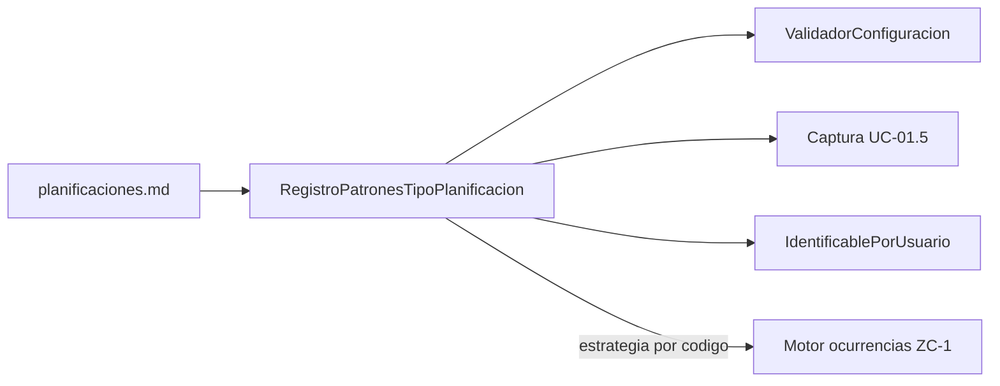

# Entidad: Planificaciones

**Última actualización:** 2026-06-12

---

## Propósito

Este documento define la entidad abstracta **Planificación**, sus especializaciones de dominio, el modelo de persistencia (ER) y las reglas de configuración. Cualquier caso de uso que capture, valide o persista planificaciones debe referenciar este documento como fuente única.

Decisiones de modelo: [dudas-y-resoluciones.md](../planificacion/dudas-y-resoluciones.md) (FAQ-105, FAQ-106, FAQ-107, FAQ-110).

---

## Entidad abstracta `Planificacion`

Lo que define a toda planificación:

| Atributo | Descripción |
|----------|-------------|
| Pertenencia | Un **item** concreto (`item_id`) |
| `fecha_inicio`, `fecha_fin` | Rango temporal; vacías en Sin planificar |
| `hora` | Hora de la planificación (UTC) |
| `observaciones` | Texto libre; obligatorias en Sin planificar |
| `estado` | `Pendiente` \| `Completada`; vacío en Sin planificar |

La clase de dominio es **abstracta**. La naturaleza concreta se deduce de los datos persistidos (sin flags).

---

## Especializaciones de dominio

### `PlanificacionSinPlanificar`

| Característica | Regla |
|----------------|-------|
| Fechas | `fecha_inicio` y `fecha_fin` vacías (`NULL`) |
| `hora` | Vacía |
| `observaciones` | **Obligatorias** (RC-8) |
| `estado` | Siempre vacío (`NULL`) |
| Ocurrencias | Lista vacía |

### `PlanificacionPuntual`

| Característica | Regla |
|----------------|-------|
| Fechas | `fecha_inicio = fecha_fin` |
| `hora` | Obligatoria |
| `estado` | Obligatorio (`Pendiente` \| `Completada`) |
| Periodo | **No** existe fila en `PlanificacionPeriodo` |
| Ocurrencias | Una sola ocurrencia **dinámica** que refleja los datos de la planificación |

### `PlanificacionPeriodica` (abstracta en dominio)

| Característica | Regla |
|----------------|-------|
| Fechas | `fecha_fin > fecha_inicio` |
| `hora` | Obligatoria |
| `estado` | Obligatorio |
| Periodo | Existe fila **1:1** en `PlanificacionPeriodo` |
| Ocurrencias | Una o varias, dinámicas y/o materializadas |

Segunda especialización por **subtipo** (algoritmo de ocurrencias naturales):

| Subtipo (`TipoPlanificacion.codigo`) | Configuración en `PlanificacionPeriodo` |
|--------------------------------------|----------------------------------------|
| **Diario** | `variante_diaria`: Todos los días \| Lunes a Viernes \| Fin de semana (FAQ-001) |
| **Semanal** | `dias_semana`: letras **L M X J V S D** (p. ej. `MX`, `LMXJVSD`) |
| **Mensual** | `dia_mes` (1–31); `comportamiento_mes_corto` si `dia_mes > 28` |

---

## Modelo de persistencia (ER)

Definición canónica: [modelo-entidad-relacion.md](modelo-entidad-relacion.md).

```
Items 1──N Planificaciones
Planificaciones 1──0..1 PlanificacionPeriodo
PlanificacionPeriodo 1──N OcurrenciasMaterializadas (solo materializadas)
```

### Tabla `Planificaciones`

Almacena **Sin planificar**, **Puntual** y los datos comunes de **Periódica**. Sin columnas discriminadoras: la naturaleza se infiere.

### Tabla `PlanificacionPeriodo`

Solo para periódicas. Relación **1:1** (`planificacion_id` UNIQUE). El subtipo (`Diario` / `Semanal` / `Mensual`) vive aquí vía `tipo_planificacion_id`.

### Catálogo `TipoPlanificacion`

Solo subtipos periódicos (`Diario`, `Semanal`, `Mensual`). Puntual y Sin planificar no son filas de catálogo.

---

## Campos de patrón por subtipo periódico

La configuración se describe de forma **declarativa** en un **registro de patrones** (ZC-3 `RegistroPatronesTipoPlanificacion`). Los campos comunes de `Planificaciones` no se repiten por subtipo.

### Campos comunes (`Planificaciones`)

| `id` | `persistencia` | `tipo_dato` | Obligatorio según naturaleza | `roles` |
|------|----------------|-------------|------------------------------|---------|
| `fecha_inicio` | `fecha_inicio` | fecha | Puntual, Periódica | captura, validacion, identificable_usuario, motor_ocurrencias |
| `fecha_fin` | `fecha_fin` | fecha | Puntual (= inicio), Periódica | captura, validacion, identificable_usuario, motor_ocurrencias |
| `hora` | `hora` | hora | Puntual, Periódica | captura, validacion, identificable_usuario, motor_ocurrencias |
| `observaciones` | `observaciones` | texto | Sin planificar (sí); resto opcional | captura, validacion, identificable_usuario |
| `estado` | `estado` | enum | Puntual, Periódica | persistencia (UC-01.4) |

### Campos patrón en `PlanificacionPeriodo`

| `TipoPlanificacion.codigo` | `id` | `persistencia` | `tipo_dato` | `obligatorio` | `roles` |
|----------------------------|------|----------------|-------------|---------------|---------|
| `Diario` | `variante_diaria` | `variante_diaria` | enum | sí | captura, validacion, motor_ocurrencias |
| `Semanal` | `dias_semana` | `dias_semana` | texto | sí (≥1 letra) | captura, validacion, motor_ocurrencias |
| `Mensual` | `dia_mes` | `dia_mes` | entero | sí | captura, validacion, motor_ocurrencias |
| `Mensual` | `comportamiento_mes_corto` | `comportamiento_mes_corto` | enum | condicional | captura, validacion, motor_ocurrencias |

Al añadir un subtipo periódico (RC-5): fila en `TipoPlanificacion`, campos patrón aquí, actualizar ER y estrategia en ZC-1.

### Cómo se implementa sin enums cerrados en código



1. **Naturaleza:** `inferirNaturaleza(planificacion)` desde fechas y presencia de `PlanificacionPeriodo`.
2. **Validación:** campos comunes + patrones del subtipo si es periódica.
3. **Captura:** UC-01.5 elige naturaleza primero; luego campos del registro.
4. **Motor:** estrategia por `PlanificacionPeriodo.tipo_planificacion.codigo`.

---

## Modelo de dominio (código)

| Clase | Persistencia |
|-------|--------------|
| `PlanificacionSinPlanificar` | `Planificaciones` (fechas NULL, sin periodo) |
| `PlanificacionPuntual` | `Planificaciones` (inicio = fin, sin periodo) |
| `PlanificacionPeriodicaDiaria` | `Planificaciones` + `PlanificacionPeriodo` |
| `PlanificacionPeriodicaSemanal` | `Planificaciones` + `PlanificacionPeriodo` |
| `PlanificacionPeriodicaMensual` | `Planificaciones` + `PlanificacionPeriodo` |

Factory / mapper: `Planificacion.desdePersistencia(fila, periodo_opcional)`.

---

## Estado de Planificación

- **Pendiente** / **Completada** — solo Puntual y Periódica.
- **Sin planificar:** `estado` siempre `NULL`.

El estado puede heredarse en ocurrencias sin estado propio (FAQ-003, FAQ-004).

---

## IdentificablePorUsuario

Siempre incluye **proyecto** e **item** (nombre visible).

| Naturaleza | Campos |
|------------|--------|
| **Periódica** | proyecto + item + subtipo (`Diario`/`Semanal`/`Mensual`) + observaciones + fecha_inicio + fecha_fin + hora |
| **Puntual** | proyecto + item + «Puntual» + observaciones + fecha_inicio + hora |
| **Sin planificar** | proyecto + item + «Sin planificar» + observaciones |

Plantillas orientativas:

- Periódica: `Proyecto «{proyecto}» · Item «{item}» · {subtipo} · «{observaciones}» · {fecha_inicio}–{fecha_fin} · {hora}`
- Puntual: `Proyecto «{proyecto}» · Item «{item}» · Puntual · «{observaciones}» · {fecha_inicio} · {hora}`
- Sin planificar: `Proyecto «{proyecto}» · Item «{item}» · Sin planificar · «{observaciones}»`

---

## Reglas Comunes de Configuración

### RC-1: Aplicación de reglas por naturaleza y subtipo

Validación y captura iteran campos comunes + patrones del subtipo periódico cuando aplique.

### RC-2: Validación de rango temporal

- **Puntual:** `fecha_inicio = fecha_fin`.
- **Periódica:** `fecha_fin > fecha_inicio`.

### RC-3: Al menos una ocurrencia

Tipos que generan ocurrencias (Puntual y Periódica) deben permitir al menos una ocurrencia en su rango según la configuración.

### RC-4: Mantenimiento planificaciones

UC-01.4 persiste configuración base; no gestiona ocurrencias individuales salvo edición de `estado`.

### RC-5: Evolución del catálogo

Nuevo subtipo periódico: `TipoPlanificacion`, campos patrón, ER, registro y estrategia ZC-1.

### RC-6: Eliminación restringida (RE-3, RE-4)

No eliminar si `estado = Completada` o si la planificación **periódica** tiene ocurrencias materializadas.

### RC-7: Aviso RE-5

Listar todas las planificaciones bloqueantes con `IdentificablePorUsuario`.

### RC-8: Unicidad Sin planificar

`UNIQUE (item_id, observaciones)` donde `fecha_inicio IS NULL`. Código: `PLANIFICACION_SIN_PLANIFICAR_OBSERVACIONES_DUPLICADAS`.

---

## Reglas de Cambio de Naturaleza (RT-*)

Todas las transiciones operan sobre **una fila** en `Planificaciones` (y opcionalmente `PlanificacionPeriodo`); no hay cambio de tabla.

### RT-1: Sin planificar → Puntual o Periódica

- **→ Puntual:** completar `fecha_inicio = fecha_fin`, `hora`, `estado = Pendiente`.
- **→ Periódica:** completar fechas (`fin > inicio`), `hora`, `estado`; **crear** `PlanificacionPeriodo`.

### RT-2: Puntual → Sin planificar

Solo si `estado = Pendiente`. Vaciar fechas, `hora` y `estado`.

### RT-3: Periódica → Sin planificar

Precondiciones: `estado = Pendiente`; sin ocurrencias materializadas. **Eliminar** `PlanificacionPeriodo`; vaciar fechas, `hora` y `estado`.

### RT-4: Puntual ↔ Periódica

No permitido directamente (solo vía Sin planificar).

### RT-5: Cambio de subtipo periódico

No se permite modificar `tipo_planificacion_id` de un `PlanificacionPeriodo` existente.

---

## Uso por Casos de Uso

- UC-01.5: captura y validación desde este documento.
- UC-01.4: persistencia en `Planificaciones` / `PlanificacionPeriodo`.
- UC-03: planificaciones con `fecha_inicio IS NULL` (Sin planificar).
- UC-01.2 / UC-01.3: RE-3, RE-4, RE-5.

---

## Trazabilidad C4

| Zona | Rol |
|------|-----|
| [ZC-3](../diagramas-c4/c4-nivel-4/pseudocodigo/zc-3-planificacion-temporal.md) | Validación, RT-*, inferencia de naturaleza |
| [ZC-1](../diagramas-c4/c4-nivel-4/pseudocodigo/zc-1-consulta-ocurrencias.md) | Motor por subtipo periódico |
| [ZC-5](../diagramas-c4/c4-nivel-4/pseudocodigo/zc-5-persistencia.md) | `Planificaciones`, `PlanificacionPeriodo` |
| [ZC-6](../diagramas-c4/c4-nivel-4/pseudocodigo/zc-6-presentacion.md) | Formulario UC-01.5 |
