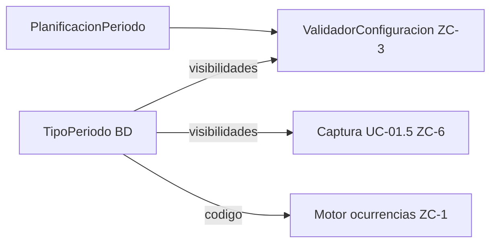

# Entidad: Planificaciones

**Última actualización:** 2026-06-12

---

## Propósito

Este documento define la entidad abstracta **Planificación**, sus especializaciones de dominio, el modelo de persistencia (ER) y las reglas de configuración. Cualquier caso de uso que capture, valide o persista planificaciones debe referenciar este documento como fuente única.

**Jerarquía de clases (dominio):** [modelo-clases-planificacion.md](modelo-clases-planificacion.md) — diagrama y mapeo persistencia ↔ clase.

Decisiones de modelo: [dudas-y-resoluciones.md](../planificacion/dudas-y-resoluciones.md) (FAQ-105, FAQ-106, FAQ-107, FAQ-110, FAQ-111, FAQ-112).

---

## Entidad abstracta `Planificacion`

Lo que define a toda planificación:

| Atributo | Descripción |
|----------|-------------|
| Pertenencia | Un **item** concreto (`item_id`) |
| `fecha_inicio`, `fecha_fin` | Rango temporal; vacías en Sin planificar |
| `hora` | Hora de la planificación (UTC) |
| `observaciones` | Texto libre; obligatorias en Sin planificar |
| `estado` | `Pendiente` \| `Completada`; vacío en Sin planificar |

La clase de dominio es **abstracta**. La clase concreta se instancia vía factory desde persistencia (sin flags en BD) — ver [modelo-clases-planificacion.md](modelo-clases-planificacion.md).

```text
Planificacion (abstracta)
├── PlanificacionSinPlanificar
├── PlanificacionPuntual
└── PlanificacionPeriodica (abstracta)
    ├── PlanificacionDiaria
    ├── PlanificacionSemanal
    └── PlanificacionMensual
```

---

## Especializaciones de dominio

### `PlanificacionSinPlanificar`

| Característica | Regla |
|----------------|-------|
| Fechas | `fecha_inicio` y `fecha_fin` vacías (`NULL`) |
| `hora` | Vacía |
| `observaciones` | **Obligatorias** (RC-8) |
| `estado` | Siempre vacío (`NULL`) |
| Ocurrencias | Lista vacía |

### `PlanificacionPuntual`

| Característica | Regla |
|----------------|-------|
| Fechas | `fecha_inicio = fecha_fin` |
| `hora` | Obligatoria |
| `estado` | Obligatorio (`Pendiente` \| `Completada`) |
| Periodo | **No** existe fila en `PlanificacionPeriodo` |
| Ocurrencias | Una sola ocurrencia **dinámica** que refleja los datos de la planificación |

### `PlanificacionPeriodica` (abstracta)

| Característica | Regla |
|----------------|-------|
| Fechas | `fecha_fin > fecha_inicio` |
| `hora` | Obligatoria |
| `estado` | Obligatorio |
| Periodo | Existe fila **1:1** en `PlanificacionPeriodo` |
| Ocurrencias | Una o varias, dinámicas y/o materializadas |

No se instancia directamente. Segunda especialización por clase concreta (cada una con su `generarNaturales` en ZC-1):

#### `PlanificacionDiaria` (`TipoPeriodo.codigo = Diario`)

| Campo de patrón | Regla |
|-----------------|-------|
| `variante_diaria` | FAQ-001: Todos los días \| Lunes a Viernes \| Fin de semana |

#### `PlanificacionSemanal` (`TipoPeriodo.codigo = Semanal`)

| Campo de patrón | Regla |
|-----------------|-------|
| `dias_semana` | Letras **L M X J V S D** (p. ej. `MX`, `LMXJVSD`) |

#### `PlanificacionMensual` (`TipoPeriodo.codigo = Mensual`)

| Campo de patrón | Regla |
|-----------------|-------|
| `dia_mes` | 1–31 |
| `comportamiento_mes_corto` | Obligatorio si `dia_mes > 28` |

---

## Modelo de persistencia (ER)

Definición canónica: [modelo-entidad-relacion.md](modelo-entidad-relacion.md). Orden físico de filas por item y `fecha_inicio`: FAQ-113.

```
Items 1──N Planificaciones
Planificaciones 1──0..1 PlanificacionPeriodo
PlanificacionPeriodo 1──N OcurrenciasMaterializadas (solo materializadas)
```

### Tabla `Planificaciones`

Almacena **Sin planificar**, **Puntual** y los datos comunes de **Periódica**. Sin columnas discriminadoras: la naturaleza se infiere.

### Tabla `PlanificacionPeriodo`

Solo para periódicas. Relación **1:1** con `Planificaciones`: **PK = `planificacion_id`** (sin `id` propio; FAQ-114). Tipo de periodo vía `tipo_periodo_id` (FK → `TipoPeriodo`).

### Catálogo `TipoPeriodo` (FAQ-111)

No es un mero duplicado del `codigo` en el periodo: registra **qué campos de patrón son visibles y exigibles** por tipo (`visibilidad_variante_diaria`, `visibilidad_dias_semana`, `visibilidad_dia_mes`, `visibilidad_comportamiento_mes_corto`). Los **valores** del patrón siguen en `PlanificacionPeriodo`.

| `codigo` | Campos visibles |
|----------|-----------------|
| `Diario` | `variante_diaria` |
| `Semanal` | `dias_semana` |
| `Mensual` | `dia_mes`, `comportamiento_mes_corto` (este último obligatorio si `dia_mes > 28`) |

Puntual y Sin planificar no tienen fila en `TipoPeriodo`.

---

## Metadatos de captura y validación

### Campos comunes (`Planificaciones`)

Definidos en este documento y validados por naturaleza inferida (ZC-3):

| Campo | Puntual / Periódica | Sin planificar |
|-------|---------------------|----------------|
| `fecha_inicio`, `fecha_fin` | sí | no (NULL) |
| `hora` | sí | no |
| `observaciones` | opcional | obligatorias (RC-8) |
| `estado` | obligatorio | NULL |

### Campos de patrón (`PlanificacionPeriodo`)

Visibilidad y obligatoriedad según fila de **`TipoPeriodo`** enlazada por `tipo_periodo_id`:

| Campo en periodo | Columna de visibilidad en `TipoPeriodo` |
|------------------|----------------------------------------|
| `variante_diaria` | `visibilidad_variante_diaria` |
| `dias_semana` | `visibilidad_dias_semana` |
| `dia_mes` | `visibilidad_dia_mes` |
| `comportamiento_mes_corto` | `visibilidad_comportamiento_mes_corto` |

Al añadir un tipo de periodo (RC-5): fila en `TipoPeriodo` con sus visibilidades, estrategia de motor en ZC-1, CHECK en ER.

### Flujo metadata-driven



1. **Clase concreta:** `inferirClase(planificacion)` — ver [modelo-clases-planificacion.md](modelo-clases-planificacion.md).
2. **Captura / validación periódica:** cargar `TipoPeriodo` por `tipo_periodo_id`; mostrar y validar solo columnas con visibilidad `true`.
3. **Motor:** polimorfismo en `PlanificacionDiaria` / `PlanificacionSemanal` / `PlanificacionMensual` (`generarNaturales`).

---

## Modelo de dominio (código)

Diagrama y factory: **[modelo-clases-planificacion.md](modelo-clases-planificacion.md)**.

| Clase concreta | Persistencia |
|----------------|--------------|
| `PlanificacionSinPlanificar` | `Planificaciones` (fechas NULL, sin periodo) |
| `PlanificacionPuntual` | `Planificaciones` (inicio = fin, sin periodo) |
| `PlanificacionDiaria` | `Planificaciones` + `PlanificacionPeriodo` (`Diario`) |
| `PlanificacionSemanal` | `Planificaciones` + `PlanificacionPeriodo` (`Semanal`) |
| `PlanificacionMensual` | `Planificaciones` + `PlanificacionPeriodo` (`Mensual`) |

`Planificacion` y `PlanificacionPeriodica` son **abstractas**; no se persisten como tipos distintos.

---

## Estado de Planificación

- **Pendiente** / **Completada** — solo Puntual y Periódica.
- **Sin planificar:** `estado` siempre `NULL`.

El estado puede heredarse en ocurrencias sin estado propio (FAQ-003, FAQ-004).

---

## IdentificablePorUsuario

Siempre incluye **proyecto** e **item** (nombre visible).

| Naturaleza | Campos |
|------------|--------|
| **Periódica** | proyecto + item + `tipo_periodo` (`TipoPeriodo.codigo`) + observaciones + fecha_inicio + fecha_fin + hora |
| **Puntual** | proyecto + item + «Puntual» + observaciones + fecha_inicio + hora |
| **Sin planificar** | proyecto + item + «Sin planificar» + observaciones |

Plantillas orientativas:

- Periódica: `Proyecto «{proyecto}» · Item «{item}» · {tipo_periodo} · «{observaciones}» · {fecha_inicio}–{fecha_fin} · {hora}`
- Puntual: `Proyecto «{proyecto}» · Item «{item}» · Puntual · «{observaciones}» · {fecha_inicio} · {hora}`
- Sin planificar: `Proyecto «{proyecto}» · Item «{item}» · Sin planificar · «{observaciones}»`

---

## Reglas Comunes de Configuración

### RC-1: Aplicación de reglas por naturaleza y subtipo

Validación y captura iteran campos comunes + patrones del subtipo periódico cuando aplique.

### RC-2: Validación de rango temporal

- **Puntual:** `fecha_inicio = fecha_fin`.
- **Periódica:** `fecha_fin > fecha_inicio`.

### RC-3: Al menos una ocurrencia

Tipos que generan ocurrencias (Puntual y Periódica) deben permitir al menos una ocurrencia en su rango según la configuración.

### RC-4: Mantenimiento planificaciones

UC-01.4 persiste configuración base; no gestiona ocurrencias individuales salvo edición de `estado`.

### RC-5: Evolución del catálogo

Nuevo tipo de periodo: fila en `TipoPeriodo`, nueva subclase de `PlanificacionPeriodica` (p. ej. `PlanificacionQuincenal`), columnas en ER, `generarNaturales` en ZC-1.

### RC-6: Eliminación restringida (RE-3, RE-4)

No eliminar si `estado = Completada` o si la planificación **periódica** tiene ocurrencias materializadas.

### RC-7: Aviso RE-5

Listar todas las planificaciones bloqueantes con `IdentificablePorUsuario`.

### RC-8: Unicidad Sin planificar

`UNIQUE (item_id, observaciones)` donde `fecha_inicio IS NULL`. Código: `PLANIFICACION_SIN_PLANIFICAR_OBSERVACIONES_DUPLICADAS`.

---

## Reglas de Cambio de Naturaleza (RT-*)

Todas las transiciones operan sobre **una fila** en `Planificaciones` (y opcionalmente `PlanificacionPeriodo`); no hay cambio de tabla.

### RT-1: Sin planificar → Puntual o Periódica

- **→ Puntual:** completar `fecha_inicio = fecha_fin`, `hora`, `estado = Pendiente`.
- **→ Periódica:** completar fechas (`fin > inicio`), `hora`, `estado`; **crear** `PlanificacionPeriodo`.

### RT-2: Puntual → Sin planificar

Solo si `estado = Pendiente`. Vaciar fechas, `hora` y `estado`.

### RT-3: Periódica → Sin planificar

Precondiciones: `estado = Pendiente`; sin ocurrencias materializadas. **Eliminar** `PlanificacionPeriodo`; vaciar fechas, `hora` y `estado`.

### RT-4: Puntual ↔ Periódica

No permitido directamente (solo vía Sin planificar).

### RT-5: Cambio entre tipos de periodo (Diario ↔ Semanal ↔ Mensual)

No permitido directamente (solo vía Sin planificar): la planificación periódica debe pasar primero por **RT-3** (→ Sin planificar, sin ocurrencias materializadas) y luego por **RT-1** (→ Periódica con el nuevo `tipo_periodo_id`). No se puede modificar `tipo_periodo_id` de un `PlanificacionPeriodo` existente in situ.

---

## Uso por Casos de Uso

- UC-01.5: captura y validación desde este documento.
- UC-01.4: persistencia en `Planificaciones` / `PlanificacionPeriodo`.
- UC-03: planificaciones con `fecha_inicio IS NULL` (Sin planificar).
- UC-01.2 / UC-01.3: RE-3, RE-4, RE-5.

---

## Trazabilidad C4

| Artefacto / zona | Rol |
|------------------|-----|
| [modelo-clases-planificacion.md](modelo-clases-planificacion.md) | Jerarquía de clases e `inferirClase` |
| [ZC-3](../diagramas-c4/c4-nivel-4/pseudocodigo/zc-3-planificacion-temporal.md) | Validación, RT-*, `inferirClase` |
| [ZC-1](../diagramas-c4/c4-nivel-4/pseudocodigo/zc-1-consulta-ocurrencias.md) | Motor por subtipo periódico |
| [ZC-5](../diagramas-c4/c4-nivel-4/pseudocodigo/zc-5-persistencia.md) | `Planificaciones`, `PlanificacionPeriodo` |
| [ZC-6](../diagramas-c4/c4-nivel-4/pseudocodigo/zc-6-presentacion.md) | Formulario UC-01.5 |
