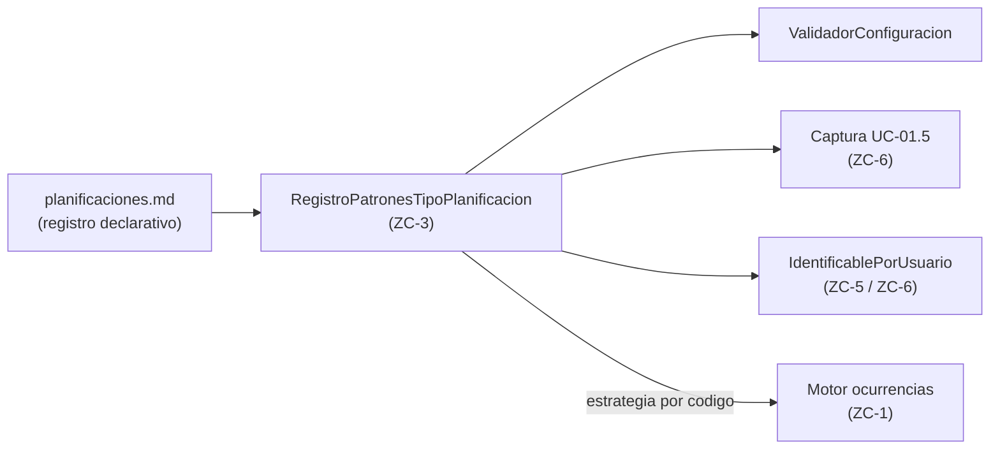

# Entidad: Planificaciones

**Última actualización:** 2026-06-12

---

## Propósito

Este documento define el catálogo común de tipos de planificación, sus reglas de configuración, el modelo de persistencia (ER) y las clases de dominio. Cualquier caso de uso que necesite capturar, validar o persistir planificaciones debe referenciar este documento como fuente única.

Decisiones de modelo físico y nomenclatura: [dudas-y-resoluciones.md](../planificacion/dudas-y-resoluciones.md) (FAQ-105, FAQ-106, FAQ-107, FAQ-109).

---

## Catálogo de Tipos de Planificación

### 1. Puntual

Planificación que ocurre una única vez en una fecha y hora específica.

**Configuración requerida:**

- Fecha
- Hora
- Observaciones (opcional)

---

### 2. Periódica

Planificación que se repite según un patrón temporal.

**Configuración base requerida:**

- Fecha inicio
- Fecha fin
- Hora
- Observaciones (opcional)

#### Variantes de planificación periódica

**a) Diaria**

Subtipo **prefijado (enum)**, no lista libre (FAQ-001):

- Todos los días
- Lunes a Viernes
- Fin de semana

**b) Semanal**

- **Días de la semana** como cadena de letras **L M X J V S D** (Lunes → Domingo), p. ej. `MX` (martes y miércoles) o `LMXJVSD` (todos). Persistencia: columna `dias_semana` en `PlanificacionesPeriodicas` — ver [modelo-entidad-relacion.md](modelo-entidad-relacion.md).

**c) Mensual**

- Día del mes (1-31)
- Para días mayores a 28, debe definirse uno de estos comportamientos cuando el mes no tenga ese día:
  - Usar el último día del mes
  - Mover al día 1 del mes siguiente
  - Omitir la ocurrencia de ese mes

---

### 3. Sin planificar

Planificación sin fecha ni hora asignada. En la UI y documentación funcional se denomina **«Sin planificar»** (FAQ-107).

**Configuración requerida:**

- Observaciones (**obligatorias**; únicas por item — RC-8)

No genera ocurrencias.

---

## Catálogo de tipos (persistencia)

Tabla de referencia **`TipoPlanificacion`** (FAQ-106): solo metadatos de tipo (`id`, `codigo`, `periodica`). **No** almacena instancias ni campos comunes de negocio.

Las **instancias** viven en `PlanificacionesPuntuales` o `PlanificacionesPeriodicas`. La **vista** `V_Planificacion` unifica lectura Item → Planificación (`id`, `item_id`, `codigo`, `periodica`, `observaciones`, `hora`, `estado`, `anulada`, `fechas` como texto). Ver [modelo-entidad-relacion.md](modelo-entidad-relacion.md).

| Tipo (`codigo`) | `periodica` | Tabla instancia |
|-----------------|-------------|---------------|
| `Puntual` | `false` | `PlanificacionesPuntuales` (`sin_planificar = false`) |
| `SinPlanificar` | `NULL` | `PlanificacionesPuntuales` (`sin_planificar = true`) |
| `Diario` | `true` | `PlanificacionesPeriodicas` |
| `Semanal` | `true` | `PlanificacionesPeriodicas` |
| `Mensual` | `true` | `PlanificacionesPeriodicas` |

Los subtipos diarios (`TODOS`, `LUN_VIE`, `FIN_SEMANA`) son configuración de la fila periódica con tipo `Diario`, no filas adicionales del catálogo.

---

## Campos de patrón por `TipoPlanificacion`

La configuración de cada planificación se describe de forma **declarativa**: el código de `TipoPlanificacion` determina qué campos aplican (patrón), dónde se persisten y cómo se validan. La fuente canónica de esa definición es **este documento**; la implementación la carga en un **registro de patrones** (ZC-3 `RegistroPatronesTipoPlanificacion`) sin hardcodear listas de tipos en validadores ni formularios.

### Campos comunes (todos los tipos)

Presentes en `PlanificacionesPuntuales` o `PlanificacionesPeriodicas` según tabla destino:

| Campo lógico | Persistencia | Rol |
|--------------|--------------|-----|
| `item_id` | FK item | persistencia |
| `tipo_planificacion_id` | FK `TipoPlanificacion` | captura, validación, `IdentificablePorUsuario` |
| `observaciones` | columna `observaciones` | captura, validación, `IdentificablePorUsuario` |
| `estado` | columna `estado` | persistencia (no patrón de captura UC-01.5 salvo edición UC-01.4) |
| `anulada` | columna `anulada` | persistencia |

### Metadato `CampoPatron`

Cada campo de patrón se documenta con:

| Atributo | Significado |
|----------|-------------|
| `id` | Identificador lógico estable (p. ej. `fecha_inicio`, `dias_semana`) |
| `persistencia` | Columna en tabla principal o tabla auxiliar del ER |
| `tipo_dato` | `fecha`, `hora`, `texto`, `entero`, `enum`, `conjunto` |
| `obligatorio` | Si exige valor al guardar |
| `restricciones` | Referencia a RC / CHECK del ER |
| `roles` | Subconjunto de: `captura`, `validacion`, `motor_ocurrencias`, `identificable_usuario` |

### Registro de campos patrón por tipo

**`Puntual`** — tabla `PlanificacionesPuntuales` (`sin_planificar = false`)

| `id` | `persistencia` | `tipo_dato` | `obligatorio` | `roles` |
|------|----------------|-------------|---------------|---------|
| `fecha` | `fecha` | fecha | sí | captura, validacion, identificable_usuario, motor_ocurrencias |
| `hora` | `hora` | hora | sí | captura, validacion, identificable_usuario, motor_ocurrencias |

**`SinPlanificar`** — tabla `PlanificacionesPuntuales` (`sin_planificar = true`)

| `id` | `persistencia` | `tipo_dato` | `obligatorio` | `roles` |
|------|----------------|-------------|---------------|---------|
| _(ningún campo temporal)_ | — | — | — | — |

Reglas adicionales: `observaciones` obligatorias y únicas por item (RC-8).

**Tipos con `periodica = true`** — tabla `PlanificacionesPeriodicas` + campos base:

| `id` | `persistencia` | `tipo_dato` | `obligatorio` | `roles` |
|------|----------------|-------------|---------------|---------|
| `fecha_inicio` | `fecha_inicio` | fecha | sí | captura, validacion, identificable_usuario, motor_ocurrencias |
| `fecha_fin` | `fecha_fin` | fecha | sí | captura, validacion, identificable_usuario, motor_ocurrencias |
| `hora` | `hora` | hora | sí | captura, validacion, identificable_usuario, motor_ocurrencias |

Campos patrón **específicos** por `codigo` (además de la base periódica):

| `TipoPlanificacion.codigo` | `id` | `persistencia` | `tipo_dato` | `obligatorio` | `restricciones` | `roles` |
|----------------------------|------|----------------|-------------|---------------|-----------------|---------|
| `Diario` | `variante_diaria` | `variante_diaria` | enum | sí | FAQ-001: `TODOS`, `LUN_VIE`, `FIN_SEMANA` | captura, validacion, motor_ocurrencias |
| `Semanal` | `dias_semana` | `dias_semana` | texto | sí (≥1 letra) | Alfabeto LMXJVSD; ver ER | captura, validacion, motor_ocurrencias |
| `Mensual` | `dia_mes` | `dia_mes` | entero | sí | 1–31 | captura, validacion, motor_ocurrencias |
| `Mensual` | `comportamiento_mes_corto` | `comportamiento_mes_corto` | enum | condicional | obligatorio si `dia_mes > 28` | captura, validacion, motor_ocurrencias |

Al añadir un **nuevo** `codigo` en `TipoPlanificacion` (RC-5): documentar aquí su fila de campos patrón, actualizar el ER si hace falta, registrar el metadato en código/BD y —solo si el cálculo de ocurrencias es nuevo— aportar una estrategia en ZC-1 (`MotorOcurrenciasPorTipo`).

### Cómo se implementa sin enums cerrados en código

1. **Carga del registro:** al arrancar (o desde tabla de metadatos en Step 11), se construye un mapa `codigo → Lista<CampoPatron>` a partir de esta sección.
2. **Validación (ZC-3):** `validarConfiguracion(planificacion)` obtiene `campos = registro.patronesDe(planificacion.tipo_planificacion.codigo)` y, para cada campo con rol `validacion`, comprueba presencia y restricciones. RC-2 y RC-3 se aplican sobre los campos temporales presentes en ese listado.
3. **Captura (ZC-6 / UC-01.5):** `camposPorTipo(codigo)` devuelve los `CampoPatron` con rol `captura`; el formulario se genera a partir del metadato (`tipo_dato`, obligatorio, etiqueta i18n por `id`).
4. **IdentificablePorUsuario:** se arman los campos con rol `identificable_usuario` más `tipo_planificacion` (etiqueta del catálogo) y contexto proyecto/item — sin duplicar lógica por tipo en mensajes de error.
5. **Motor de ocurrencias (ZC-1):** para cada `codigo` con `periodica = true` (o `Puntual`), se resuelve `registro.estrategiaMotor(codigo)`. La estrategia **lee** los valores de los campos con rol `motor_ocurrencias`; solo hace falta código nuevo si el algoritmo de repetición es distinto.

**Qué no va en el registro declarativo:** reglas transversales RT-* (cambio de tipo), RE-3/RE-4 (eliminación), RC-8 (unicidad Sin planificar). Siguen en reglas de negocio explícitas.

---

## Modelo de persistencia (ER)

Definición canónica: [modelo-entidad-relacion.md](modelo-entidad-relacion.md).

Dos tablas de instancia (FAQ-105) más catálogo y vista de lectura.

### Vista `V_Planificacion` (Item → Planificación)

Expone por fila: `id`, `item_id`, `codigo`, `periodica`, `observaciones`, `hora`, `estado`, `anulada`, `fechas` (varchar: una fecha si Puntual, rango `inicio..fin` si Periódica, `NULL` si Sin planificar). Escritura siempre en tablas hijas.

### Campos comunes en tablas de instancia

Presentes en **ambas** tablas hijas (y en la vista):

| Campo | Notas |
|-------|-------|
| `item_id` | FK → Item |
| `tipo_planificacion_id` | FK → catálogo |
| `observaciones` | RC-8 obligatorias en Sin planificar |
| `hora` | UTC; NULL en Sin planificar |
| `estado` | Pendiente \| Completada |
| `anulada` | Historial RT-1 / RT-3 |

### `PlanificacionesPuntuales`

| Campo | Obligatorio | Notas |
|-------|-------------|-------|
| `fecha` | Si `sin_planificar = false` | UTC (FAQ-002) |
| `hora` | Si `sin_planificar = false` | UTC |
| `sin_planificar` | Si | `true` = tipo Sin planificar; `false` = Puntual con fecha/hora |

Un mismo registro puntual puede pasar de **Sin planificar** a **Puntual** (y viceversa) **mutando el flag** y los campos fecha/hora en la misma fila, sin cambiar de tabla.

### `PlanificacionesPeriodicas`

| Campo | Obligatorio | Notas |
|-------|-------------|-------|
| `fecha_inicio`, `fecha_fin`, `hora` | Si | UTC |
| `variante_diaria` | Si tipo Diario | FAQ-001 |
| `dias_semana` | Si tipo Semanal | Letras LMXJVSD; p. ej. `LJ` = lunes y jueves |
| `dia_mes`, `comportamiento_mes_corto` | Si tipo Mensual | Según RC / ER |

Única tabla con **`OcurrenciasMaterializadas`** (RE-4). Puntual no materializa ocurrencias: UC-02.2 modifica la fila puntual.

ZC-1 opera sobre periódicas y puntuales con `sin_planificar = false`. UC-03 consulta puntuales con `sin_planificar = true`.

---

## Modelo de dominio (código)

En la capa de negocio existen clases especializadas que encapsulan la definición temporal; la persistencia usa las dos tablas anteriores:

| Clase de dominio | Persistencia | Notas |
|------------------|--------------|-------|
| `PlanificacionPuntual` | `PlanificacionesPuntuales` | `sin_planificar = false` |
| `PlanificacionSinPlanificar` | `PlanificacionesPuntuales` | `sin_planificar = true` |
| `PlanificacionPeriodica` | `PlanificacionesPeriodicas` | `tipo_planificacion_id` → catálogo con `periodica = true` |

`PlanificacionSinPlanificar` no implica una tercera tabla: es la representación de dominio del flag `sin_planificar` en la tabla puntual.

---

## Estado de Planificación

Las planificaciones tienen estado base de negocio:

- **Pendiente**
- **Completada**

Este estado puede ser utilizado por las ocurrencias cuando una ocurrencia no tenga estado propio registrado (FAQ-003, FAQ-004).

---

## IdentificablePorUsuario

Característica de la entidad Planificación: conjunto de atributos que permiten al usuario **distinguir sin ambigüedad** una planificación concreta dentro del proyecto. Se usa en listados, mensajes de error (RE-5), avisos de bloqueo al eliminar item/proyecto y cualquier UI que deba referirse a «cuál» planificación.

La identificación **siempre** incluye el **proyecto** y el **item** de pertenencia (resueltos a nombre visible en la capa de presentación).

| Naturaleza | Campos de `IdentificablePorUsuario` (origen en persistencia / catálogo) |
|------------|-----------------------------------------------------------------------------|
| **Periódica** | `proyecto` + `item` + `tipo_planificacion` + `observaciones` + `fecha_inicio` + `fecha_fin` + `hora` |
| **Puntual** | `proyecto` + `item` + `tipo_planificacion` + `observaciones` + `fecha` + `hora` |
| **Sin planificar** | `proyecto` + `item` + `tipo_planificacion` + `observaciones` |

Notas:

- `proyecto` e `item` se resuelven al **nombre visible** del proyecto y del item de pertenencia.
- `tipo_planificacion` es el **`codigo` de `TipoPlanificacion`** vinculado a la fila (`tipo_planificacion_id`). La etiqueta mostrada al usuario se obtiene del catálogo (i18n).
- El resto de campos visibles se obtienen del registro de patrones: todos los `CampoPatron` con rol `identificable_usuario` para ese `codigo` (ver [Campos de patrón](#campos-de-patrón-por-tipoplanificacion)).
- Fechas y hora se muestran en el **locale** del usuario; en persistencia están en UTC (FAQ-002).
- La capa de negocio expone `construirIdentificablePorUsuario(planificacion) -> IdentificablePorUsuario`; Presentación formatea el texto visible (ZC-6).

Plantilla de texto formateado (orientativo; `{…}` = valor resuelto del campo):

- Periódica: `Proyecto «{proyecto}» · Item «{item}» · {tipo_planificacion} · «{observaciones}» · {fecha_inicio}–{fecha_fin} · {hora}`
- Puntual: `Proyecto «{proyecto}» · Item «{item}» · {tipo_planificacion} · «{observaciones}» · {fecha} · {hora}`
- Sin planificar: `Proyecto «{proyecto}» · Item «{item}» · {tipo_planificacion} · «{observaciones}»`

---

## Reglas Comunes de Configuración

### RC-1: Aplicación de reglas por tipo

Cada `TipoPlanificacion.codigo` aplica únicamente los **campos patrón** declarados en su fila del registro. La validación y la captura iteran ese metadato; no se asume un enum cerrado de tipos en código de aplicación.

### RC-2: Validación de rango temporal

Cuando exista fecha inicio/fin, la fecha fin debe ser posterior a la fecha inicio.

### RC-3: Validación de consistencia

La configuración debe ser válida y permitir generar al menos una ocurrencia para los tipos que generan ocurrencias (Puntual y Periódica), según su configuración y rango cuando aplique.

### RC-4: Mantenimiento planificaciones

La creación/modificación de planificaciones no gestiona ocurrencias individuales; solo persiste la planificación base. **Excepción:** UC-01.4 permite editar el **estado** de la planificación (Pendiente ↔ Completada) como parte de la configuración.

### RC-5: Evolución del catálogo

Nuevos tipos deben: (1) añadir fila en `TipoPlanificacion`, (2) documentar **campos patrón** en esta entidad, (3) actualizar el ER si procede, (4) extender `RegistroPatronesTipoPlanificacion` y, solo si el patrón temporal es nuevo, registrar estrategia en ZC-1.

### RC-6: Eliminación de planificación restringida

**Propósito:** evitar borrados masivos accidentales de planificaciones Completadas o de historial de ocurrencias gestionadas. RE-3 y RE-4 bloquean **cualquier** borrado de planificación en esas condiciones, lo que a su vez **bloquea** la eliminación del item o proyecto que la contiene.

No se puede eliminar una planificación — ni en UC-01.4 ni como paso de cascada al eliminar item o proyecto — si:

1. **`estado = Completada`** (RE-3) — el usuario debe editarla manualmente en UC-01.4 y pasarla a Pendiente.
2. **Existen ocurrencias materializadas** vinculadas (RE-4) — **solo planificaciones periódicas**; el usuario debe anular o restaurar cada registro en UC-02.4 hasta vaciar la planificación.

Solo cuando todas las planificaciones del ámbito cumplen RE-3 y RE-4 puede completarse la eliminación del item (RI-5) o del proyecto (RP-4).

### RC-7: Aviso al bloquear borrado de item o proyecto (RE-5)

Si UC-01.2 o UC-01.3 rechazan el borrado, el sistema debe mostrar **todas** las planificaciones bloqueantes usando su **`IdentificablePorUsuario`** más el motivo de bloqueo. Códigos `ELIMINACION_PROYECTO_BLOQUEADA` / `ELIMINACION_ITEM_BLOQUEADA` — ver [errores-validaciones-capas.md](../arquitectura/errores-validaciones-capas.md).

### RC-8: Unicidad de observaciones en Sin planificar

Las **observaciones** de las planificaciones **Sin planificar** del mismo item deben ser **únicas** dentro de ese item (`UNIQUE (item_id, observaciones)` con `sin_planificar = true`).

- Aplica en creación y edición (UC-01.4 / UC-01.5).
- Las observaciones son obligatorias en Sin planificar para garantizar identificación y unicidad (la creación automática de item usa el nombre del item).
- Código de error orientativo: `PLANIFICACION_SIN_PLANIFICAR_OBSERVACIONES_DUPLICADAS`.

---

## Reglas de Cambio de Tipo de Planificación

### RT-1: Sin planificar hacia Puntual o Periódica

- **Sin planificar → Puntual:** misma tabla `PlanificacionesPuntuales`: `sin_planificar = false` y completar fecha/hora. Estado Pendiente.
- **Sin planificar → Periódica:** **anular** el registro en `PlanificacionesPuntuales` y **crear** registro en `PlanificacionesPeriodicas` con la configuración destino. **No afecta a ocurrencias** (no existían).

### RT-2: Puntual hacia Sin planificar

Solo si estado **Pendiente**. Misma tabla: `sin_planificar = true` y limpiar fecha/hora (o dejarlas ignoradas).

### RT-3: Periódica hacia Sin planificar

Precondiciones (sin cambio funcional):

- Estado **Pendiente**
- No existen ocurrencias materializadas de modificación ni eliminación

Operación: **anular** registro en `PlanificacionesPeriodicas` y **crear** registro en `PlanificacionesPuntuales` con `sin_planificar = true`.

### RT-4: Cambios no permitidos entre Puntual y Periódica

No se permite cambiar el tipo de planificación entre **Puntual** y **Periódica** en ningún sentido (salvo vía Sin planificar como estado intermedio implícito en RT-1 / RT-3).

### RT-5: Cambios no permitidos de tipo periódico

No se permite modificar el `tipo_planificacion_id` de una fila en `PlanificacionesPeriodicas` una vez creada (el `codigo` del catálogo queda fijado).

---

## Uso por Casos de Uso

- UC-01.5 debe usar este documento para captura y validación, sin redefinir tipos internamente.
- UC-01.4 debe persistir la configuración resultante sin redefinir el catálogo.
- UC-03 lista planificaciones con `sin_planificar = true` (tipo Sin planificar).
- UC-01.2 y UC-01.3 deben referenciar [proyectos.md](proyectos.md) e [items.md](items.md) para reglas de unicidad y efectos automáticos.
- Cualquier otro caso de uso que opere con planificaciones debe referenciar este catálogo común.

---

## Trazabilidad C4

| Zona crítica N4 | Rol |
|-----------------|-----|
| [ZC-3](../diagramas-c4/c4-nivel-4/pseudocodigo/zc-3-planificacion-temporal.md) | `RegistroPatronesTipoPlanificacion`, validación, cambios de tipo (RT-*) |
| [ZC-1](../diagramas-c4/c4-nivel-4/pseudocodigo/zc-1-consulta-ocurrencias.md) | `EstrategiaMotorOcurrencias` por `codigo` (lee campos patrón) |
| [ZC-5](../diagramas-c4/c4-nivel-4/pseudocodigo/zc-5-persistencia.md) | Persistencia en tablas puntuales / periódicas |
| [ZC-6](../diagramas-c4/c4-nivel-4/pseudocodigo/zc-6-presentacion.md) | Formulario UC-01.5 desde campos con rol `captura` |

Los casos de uso referencian zonas críticas en sus propios documentos (FAQ-104).
