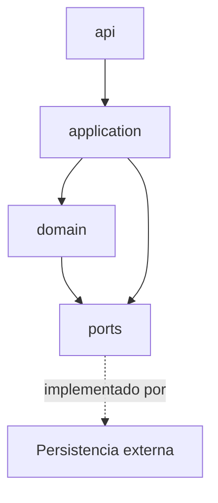

# Back-End — Guía de implementación

**Componente:** Back-End (API REST + dominio + aplicación)  
**Código:** [`implementacion/back-end/nestjs-typescript/`](../../../implementacion/back-end/nestjs-typescript/)

> **Desambiguación:** [`desambiguacion-implementacion.md`](../../politicas-transversales/desambiguacion-implementacion.md)  
> **Desacoplamiento por contratos:** [`desacoplamiento-componentes-contratos.md`](../../politicas-transversales/desacoplamiento-componentes-contratos.md) (restricciones transversales y de este componente)

---

## Propósito del componente

Punto de entrada HTTP/JSON, orquestación de casos de uso (ZC-4) y lógica de negocio en cuatro módulos: Proyecto → Item → Planificación → Ocurrencia. Consume **puertos** de persistencia; no ejecuta SQL directo en el dominio.

---

## Responsabilidades y límites

### Responsabilidades

- Exponer la **API REST** (entrada/salida JSON) al Front-End.
- Orquestar casos de uso multi-agregado en la capa de **aplicación** (wizard, cascadas, transacciones).
- Implementar **reglas de negocio** en la capa de **dominio** (Proyecto, Item, Planificación, Ocurrencia).
- Definir **puertos** (`*RepositoryPort`, servicios de dominio) que la persistencia implementará.
- Propagar hacia la API solo **`codigo`** de error estable (sin literales de negocio ni SQL).

### Sí hace / No hace

| Sí hace | No hace |
|---------|---------|
| Validar DTOs de entrada en API/aplicación | Ejecutar SQL ni conocer el motor de BBDD |
| Coordinar ZC-1 a ZC-4 (consulta, materialización, temporal, orquestación) | Renderizar UI ni resolver i18n de mensajes |
| Invocar puertos de persistencia dentro de unidades de trabajo | Duplicar restricciones del ER (CHECK, UNIQUE) que ya garantiza la BBDD |
| Traducir errores de infraestructura a `ERROR_INTERNO` | Importar adaptadores concretos de persistencia en dominio |

### Frontera con vecinos

| Vecino | Contrato externo | Rol del Back-End |
|--------|------------------|------------------|
| Front-End | API REST + DTOs ([`contratos-minimos.md`](../../arquitectura/contratos-minimos.md)) | Expone endpoints; consume requests validados |
| Persistencia | Puertos de repositorio y conexión | Define interfaces en dominio; inyecta implementación en aplicación |
| Shared | Tipos y códigos compartidos | Importa DTOs/`codigo`; no redefine contratos en silos |

Ver contratos externos en [`vista-general.md`](../../planificacion/vista-general.md) §3.1.

---

## Mapeo a casos de uso y zonas críticas

| UC / sub-UC | ZC | Rol en Back-End |
|-------------|-----|-----------------|
| UC-01.* (wizard, CRUD proyecto/item/planificación) | ZC-4 | Orquestación transaccional multi-agregado |
| UC-02.1 (visualización calendario) | ZC-1 | Consulta ocurrencias en rango |
| UC-02.2 / UC-02.3 (mutación ocurrencia) | ZC-2 | Materialización y estado individual |
| UC-02.4 (ocurrencias por planificación) | ZC-2, ZC-5 | Validación RE-4; borrado vía puerto |
| UC-03 (Sin planificar) | ZC-1 | Listado filtrado |
| Definición/edición planificación periódica | ZC-3 | Motor temporal e inferencia de naturaleza |

| ZC | Pseudocódigo | N4 Step 12a |
|----|--------------|-------------|
| ZC-1 | [`zc-1-consulta-ocurrencias.md`](../../diagramas-c4/c4-nivel-4/pseudocodigo/zc-1-consulta-ocurrencias.md) | [`nestjs-typescript/zc-1-consulta-ocurrencias.md`](../../diagramas-c4/c4-nivel-4/implementacion/back-end/nestjs-typescript/zc-1-consulta-ocurrencias.md) |
| ZC-2 | [`zc-2-materializacion-ocurrencias.md`](../../diagramas-c4/c4-nivel-4/pseudocodigo/zc-2-materializacion-ocurrencias.md) | [`zc-2-materializacion-ocurrencias.md`](../../diagramas-c4/c4-nivel-4/implementacion/back-end/nestjs-typescript/zc-2-materializacion-ocurrencias.md) |
| ZC-3 | [`zc-3-planificacion-temporal.md`](../../diagramas-c4/c4-nivel-4/pseudocodigo/zc-3-planificacion-temporal.md) | [`zc-3-planificacion-temporal.md`](../../diagramas-c4/c4-nivel-4/implementacion/back-end/nestjs-typescript/zc-3-planificacion-temporal.md) |
| ZC-4 | [`zc-4-orquestacion-aplicacion.md`](../../diagramas-c4/c4-nivel-4/pseudocodigo/zc-4-orquestacion-aplicacion.md) | [`zc-4-orquestacion-aplicacion.md`](../../diagramas-c4/c4-nivel-4/implementacion/back-end/nestjs-typescript/zc-4-orquestacion-aplicacion.md) |

Sub-UC y orquestación: [`granularidad-modulos-negocio.md`](../../arquitectura/granularidad-modulos-negocio.md).

---

## Reglas de dependencia

Política transversal: [`desacoplamiento-componentes-contratos.md`](../../politicas-transversales/desacoplamiento-componentes-contratos.md).

| Desde | Puede importar | No puede importar |
|-------|----------------|-------------------|
| `api/` | `application/`, DTOs `shared/` | `domain/` internals directos, SQL, adaptadores persistencia |
| `application/` | `domain/`, `ports/`, `shared/` | Framework HTTP en dominio, UI |
| `domain/` | otros módulos dominio vía contratos explícitos | `application/`, `api/`, persistencia concreta, framework |
| `ports/` | tipos de dominio | implementaciones de repositorio |

Orquestadores (ZC-4) viven en **`application/`**; no contienen reglas RT-* ([`granularidad-modulos-negocio.md`](../../arquitectura/granularidad-modulos-negocio.md)).

Mapeo a carpetas del stack: N4 [`back-end/nestjs-typescript/`](../../diagramas-c4/c4-nivel-4/implementacion/back-end/nestjs-typescript/).

---

## Referencias

- Arquitectura: [`docs/arquitectura/`](../../arquitectura/)
- Granularidad: [`granularidad-modulos-negocio.md`](../../arquitectura/granularidad-modulos-negocio.md)
- Transacciones: [`transacciones-consistencia.md`](../../arquitectura/transacciones-consistencia.md)
- Pseudocódigo: [`docs/diagramas-c4/c4-nivel-4/pseudocodigo/`](../../diagramas-c4/c4-nivel-4/pseudocodigo/)
