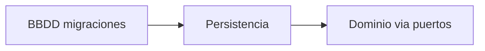

# BBDD — Guía de implementación

**Componente:** Base de datos (esquema y datos iniciales)  
**Código:** [`implementacion/bbdd/postgresql/`](../../../implementacion/bbdd/postgresql/)

> **Desambiguación:** [`desambiguacion-implementacion.md`](../../politicas-transversales/desambiguacion-implementacion.md)  
> **Desacoplamiento por contratos:** [`desacoplamiento-componentes-contratos.md`](../../politicas-transversales/desacoplamiento-componentes-contratos.md) (restricciones transversales y de este componente)

---

## Propósito del componente

Definir el esquema relacional, migraciones versionadas, seeds y scripts operativos del **motor externo**. Es el único componente cuya carpeta de código nombra la tecnología del motor (`postgresql`).

---

## Responsabilidades y límites

### Responsabilidades

- Materializar el **modelo ER** en tablas, índices y restricciones (CHECK, UNIQUE parcial, FK).
- Versionar **migraciones** y mantener historial reproducible (up/down en entornos de prueba).
- Proveer **seeds** de catálogo (`TipoPeriodo`) y datos de desarrollo opcionales.
- Documentar **disciplina de datos**: PK `{tabla}_id`, orden físico (FAQ-308/309), UTC (FAQ-001).

### Sí hace / No hace

| Sí hace | No hace |
|---------|---------|
| DDL y DML de esquema/seeds | Lógica de repositorios (Persistencia) |
| Restricciones de integridad referencial | Reglas de negocio RT/RO en triggers de aplicación |
| Scripts operativos de mantenimiento | Exponer API HTTP |

La capa de **Persistencia** consume este esquema vía SQL; ver [`persistencia/README.md`](../persistencia/README.md).

**Coexistencia de motores (excepción):** varios motores activos en paralelo — [historial-stack.md](../../stack-tecnologico/historial-stack.md), [cambio-tecnologia-componente.md § Excepciones](../../stack-tecnologico/cambio-tecnologia-componente.md#excepciones-coexistencia-de-dos-tecnologías-activas).

### Frontera con vecinos

| Vecino | Contrato externo | Rol de BBDD |
|--------|------------------|-------------|
| Persistencia | Esquema + migraciones aplicadas | Almacén físico; no invocado por dominio directo |
| Entidades / ER | [`modelo-entidad-relacion.md`](../../entidades/modelo-entidad-relacion.md) | Implementación relacional del modelo acordado |

Ver contratos externos en [`vista-general.md`](../../planificacion/vista-general.md) §3.1.

---

## Mapeo a casos de uso y zonas críticas

BBDD materializa el **contrato ER**; no mapea UC directamente. Las reglas RT/RI del ER habilitan los UC vía Back-End + Persistencia.

| Ámbito ER | Tablas / restricciones | ZC (esquema) |
|-----------|------------------------|--------------|
| Proyectos, Items | `Proyectos`, `Items`, UNIQUE nombre | ZC-5 |
| Planificaciones | `Planificaciones`, inferencia naturaleza | ZC-5 |
| Periódicas | `PlanificacionPeriodo`, `TipoPeriodo` | ZC-5 |
| Ocurrencias | `OcurrenciasMaterializadas`, orden físico FAQ-309 | ZC-5 |

| ZC | Pseudocódigo | N4 Step 12a |
|----|--------------|-------------|
| ZC-5 (esquema) | [`zc-5-persistencia.md`](../../diagramas-c4/c4-nivel-4/pseudocodigo/zc-5-persistencia.md) | [`postgresql/zc-5-persistencia-esquema.md`](../../diagramas-c4/c4-nivel-4/implementacion/bbdd/postgresql/zc-5-persistencia-esquema.md) |

---

## Reglas de dependencia

Política transversal: [`desacoplamiento-componentes-contratos.md`](../../politicas-transversales/desacoplamiento-componentes-contratos.md).

| Desde | Puede importar | No puede importar |
|-------|----------------|-------------------|
| Migraciones / seeds | SQL del motor, scripts propios | Código TypeScript de aplicación |
| Consumidor | Solo **Persistencia** (vía conexión SQL) | Dominio Back-End directo |

Mapeo stack: N4 [`bbdd/postgresql/`](../../diagramas-c4/c4-nivel-4/implementacion/bbdd/postgresql/).

---

## Convenciones de tests y errores

Taxonomía global: [`errores-validaciones-capas.md`](../../arquitectura/errores-validaciones-capas.md). Los errores funcionales los traduce Persistencia/Back-End; BBDD expone fallos de constraint.

### Tests

| Tipo | Alcance |
|------|---------|
| Migraciones | up/down en BD limpia; idempotencia en re-ejecución |
| Constraints | UNIQUE parcial Sin planificar, CHECK, FK CASCADE |
| Seeds | Catálogo `TipoPeriodo` mínimo para UC-01.4 |
| UTC | Columnas fecha/hora según FAQ-001 |

**No testear aquí:** reglas RT-* de aplicación, API HTTP, componentes UI.

### Errores

| Situación | Comportamiento |
|-----------|----------------|
| Violación UNIQUE/CHECK | Error SQL capturado en Persistencia |
| Migración fallida | Rollback de versión; no arrancar app en estado inconsistente |

---

## Referencias

- Modelo ER: [`modelo-entidad-relacion.md`](../../entidades/modelo-entidad-relacion.md)
- Stack motor: FAQ-100 en [`analisis-inicial.md`](../../stack-tecnologico/analisis-inicial.md); activo en [`historial-stack.md`](../../stack-tecnologico/historial-stack.md)
- Migraciones en código: `implementacion/bbdd/postgresql/migrations/`
