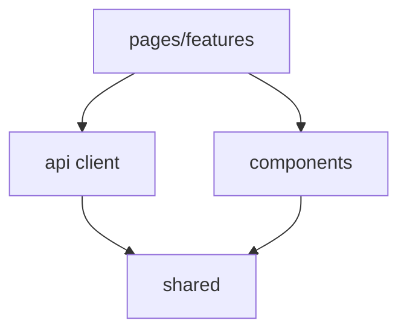

# Front-End — Guía de implementación

**Componente:** Front-End (SPA)  
**Código:** [`implementacion/front-end/react-typescript/`](../../../implementacion/front-end/react-typescript/)

> **Desambiguación:** [`desambiguacion-implementacion.md`](../../politicas-transversales/desambiguacion-implementacion.md)  
> **Desacoplamiento por contratos:** [`desacoplamiento-componentes-contratos.md`](../../politicas-transversales/desacoplamiento-componentes-contratos.md) (restricciones transversales y de este componente)

---

## Propósito del componente

Interfaz web en navegador: wizard y mantenimiento (UC-01), calendario y gestión de ocurrencias (UC-02), listado Sin planificar (UC-03). Consume la API REST del Back-End; no accede a la BBDD.

---

## Responsabilidades y límites

### Responsabilidades

- Renderizar la **interfaz web** (wizard, mantenimiento, calendario, listados).
- Invocar la **API REST** del Back-End mediante un cliente HTTP tipado.
- Validar **formato y completitud** de formularios antes de enviar datos (incl. UC-01.5).
- Resolver **i18n** a partir de `codigo` devuelto por la API ([`internacionalizacion.md`](../../politicas-transversales/internacionalizacion.md)).
- Mostrar fechas en **locale** del usuario manteniendo el modelo en UTC.

### Sí hace / No hace

| Sí hace | No hace |
|---------|---------|
| Navegación por flujos UC-01, UC-02, UC-03 | Acceder a BBDD ni ejecutar SQL |
| Mapear DTO ↔ estado de vista | Implementar reglas RT/RO/RP de negocio |
| Mostrar avisos RE-5 (bloqueos previos a borrado) | Reinterpretar errores de la API con lógica distinta |
| Formularios dinámicos según catálogo `TipoPeriodo` | Definir contratos API (viven en arquitectura/shared) |

### Frontera con vecinos

| Vecino | Contrato externo | Rol del Front-End |
|--------|------------------|-------------------|
| Back-End | API REST + DTOs | Cliente HTTP; solo consume endpoints documentados |
| Shared | Tipos y `codigo` de error | Importa shapes compartidos; no duplica DTOs |
| Usuario | i18n y UX | Presenta datos; no persiste directamente |

Ver contratos externos en [`vista-general.md`](../../planificacion/vista-general.md) §3.1.

---

## Mapeo a casos de uso y zonas críticas

| UC / sub-UC | ZC | Rol en Front-End |
|-------------|-----|------------------|
| UC-01.1 (wizard) | ZC-6 | Flujo guiado creación proyecto/item/planificación |
| UC-01.2–UC-01.4 (gestión) | ZC-6 | Formularios mantenimiento y edición |
| UC-01.5 (captura datos) | ZC-6 | Componente reutilizable; validación UI; sin persistir |
| UC-02.1 (calendario) | ZC-6 | Vista mensual/semanal; selección ocurrencia |
| UC-02.2 / UC-02.3 | ZC-6 | Acciones sobre ocurrencia puntual/periódica |
| UC-02.4 | ZC-6 | Gestión ocurrencias materializadas; avisos RE-5 |
| UC-03 (Sin planificar) | ZC-6 | Listado y acciones desde backlog |

| ZC | Pseudocódigo | N4 Step 12a |
|----|--------------|-------------|
| ZC-6 | [`zc-6-presentacion.md`](../../diagramas-c4/c4-nivel-4/pseudocodigo/zc-6-presentacion.md) | [`react-typescript/zc-6-presentacion.md`](../../diagramas-c4/c4-nivel-4/implementacion/front-end/react-typescript/zc-6-presentacion.md) |

Casos de uso: [`docs/casos-uso/`](../../casos-uso/).

---

## Reglas de dependencia

Política transversal: [`desacoplamiento-componentes-contratos.md`](../../politicas-transversales/desacoplamiento-componentes-contratos.md).

| Desde | Puede importar | No puede importar |
|-------|----------------|-------------------|
| `pages/`, `features/` | `components/`, hooks, `api client`, `shared/` | Dominio Back-End, SQL, puertos persistencia |
| `components/` | `shared/`, utilidades UI | Cliente HTTP directo sin capa api |
| `api client/` | `shared/` (DTOs) | Lógica de presentación compleja de negocio |

Mapeo a carpetas del stack: N4 [`front-end/react-typescript/`](../../diagramas-c4/c4-nivel-4/implementacion/front-end/react-typescript/).

---

## Convenciones de tests y errores

Taxonomía global: [`errores-validaciones-capas.md`](../../arquitectura/errores-validaciones-capas.md).

### Tests

| Tipo | Alcance |
|------|---------|
| Componentes | Formularios UC-01.5, campos dinámicos `TipoPeriodo` |
| Integración | Flujos con API mock (MSW u homólogo) |
| i18n | Misma `codigo` → misma clave en todos los UC |
| UTC | Fechas mostradas en locale; asserts sobre ISO UTC en modelo |

**No testear aquí:** reglas RT/RO completas (Back-End), SQL ni migraciones.

### Errores

| Situación | Comportamiento |
|-----------|----------------|
| Validación formato (vacío, patrón) | Mensaje local antes de llamar API |
| Error API | Mostrar según `codigo` + i18n; **no** reinterpretar semántica |
| UC-01.5 cancelado | Retorno controlado; **sin** error |
| RE-5 | Mostrar lista `bloqueos`; confirmación usuario |

---

## Referencias cruzadas

| Bloque | Enlaces |
|--------|---------|
| Arquitectura | [contratos-minimos.md](../../arquitectura/contratos-minimos.md), [errores-validaciones-capas.md](../../arquitectura/errores-validaciones-capas.md) |
| Entidades | [planificaciones.md](../../entidades/planificaciones.md), [ocurrencias.md](../../entidades/ocurrencias.md) |
| Casos de uso | [docs/casos-uso/](../../casos-uso/) |
| Políticas | [internacionalizacion.md](../../politicas-transversales/internacionalizacion.md) |
| Pseudocódigo | [zc-6-presentacion.md](../../diagramas-c4/c4-nivel-4/pseudocodigo/zc-6-presentacion.md) |
| N4 Step 12a | [react-typescript/zc-6-presentacion.md](../../diagramas-c4/c4-nivel-4/implementacion/front-end/react-typescript/zc-6-presentacion.md) |
| Código | [`implementacion/front-end/react-typescript/`](../../../implementacion/front-end/react-typescript/) |
| Shared | [shared/README.md](../shared/README.md) |
