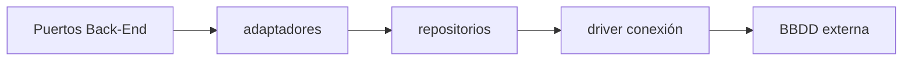

# Persistencia — Guía de implementación

**Componente:** Capa de Persistencia  
**Código:** [`implementacion/persistencia/typescript/`](../../../implementacion/persistencia/typescript/)

> **Desambiguación:** [`desambiguacion-implementacion.md`](../../politicas-transversales/desambiguacion-implementacion.md)  
> **Desacoplamiento por contratos:** [`desacoplamiento-componentes-contratos.md`](../../politicas-transversales/desacoplamiento-componentes-contratos.md) (restricciones transversales y de este componente)

---

## Propósito del componente

Implementar los puertos de repositorio y conexión definidos por el dominio (ZC-5). Traduce agregados y consultas a operaciones sobre el almacén **sin filtrar detalles del motor** al Back-End.

---

## Responsabilidades y límites

### Responsabilidades

- **Implementar** los puertos de repositorio y conexión definidos en el Back-End (ZC-5).
- Traducir entidades de dominio ↔ filas del almacén (mappers, inferencia de clase de planificación).
- Ejecutar **consultas en rango**, listados y operaciones CRUD acordadas en pseudocódigo ZC-5.
- Gestionar **transacciones** (begin/commit/rollback) en colaboración con orquestadores ZC-4.
- Aplicar patrones de borrado acordados (FAQ-311: un `planificacion_id` por operación RE-4).

### Sí hace / No hace

| Sí hace | No hace |
|---------|---------|
| SQL parametrizado o query builder acotado | Exponer detalles del motor al dominio |
| Mapear NULL de herencia en ocurrencias (FAQ-003) | Validar reglas de negocio RT-* (dominio) |
| Unit of Work para operaciones multi-tabla | Renderizar respuestas HTTP |
| Traducir fallos de conexión a excepciones de infraestructura | Definir el esquema relacional (componente BBDD) |

**Regla de redacción:** no nombrar el motor en las reglas de esta guía; el SQL dialect-specific va en [`bbdd/`](../bbdd/) y N4 BBDD.

### Frontera con vecinos

| Vecino | Contrato externo | Rol de Persistencia |
|--------|------------------|---------------------|
| Back-End | Puertos (`*RepositoryPort`, `DatabaseConnectionPort`) | Implementa interfaces; no las redefine |
| BBDD | Esquema ER + migraciones | Consume tablas/restricciones; no altera contrato ER sin acuerdo |
| Shared | — | No depende de DTOs de API; mapea dominio ↔ persistencia |

Ver contratos externos en [`vista-general.md`](../../planificacion/vista-general.md) §3.1.

---

## Mapeo a casos de uso y zonas críticas

La persistencia no expone UC directamente; implementa **puertos** invocados desde ZC-1 a ZC-5 del Back-End.

| Operación (puerto / agregado) | ZC | Notas |
|------------------------------|-----|-------|
| Consulta ocurrencias en rango | ZC-5 (ZC-1) | Composición dinámicas + materializadas |
| CRUD Proyecto, Item, Planificación | ZC-5 | Mappers e inferencia de naturaleza |
| Materialización / mutación ocurrencias | ZC-5 (ZC-2) | Herencia NULL (FAQ-003) |
| Transacciones multi-tabla | ZC-5 (ZC-4) | Unit of Work |
| Borrado masivo RE-4 | ZC-5 | Un `planificacion_id` por TX ([FAQ-311](../../../backlog/000-planificacion-inicial/dudas-y-resoluciones.md)) |

| ZC | Pseudocódigo | N4 Step 12a |
|----|--------------|-------------|
| ZC-5 | [`zc-5-persistencia.md`](../../diagramas-c4/c4-nivel-4/pseudocodigo/zc-5-persistencia.md) | [`typescript/zc-5-persistencia.md`](../../diagramas-c4/c4-nivel-4/implementacion/persistencia/typescript/zc-5-persistencia.md) |

---

## Reglas de dependencia

Política transversal: [`desacoplamiento-componentes-contratos.md`](../../politicas-transversales/desacoplamiento-componentes-contratos.md).

| Desde | Puede importar | No puede importar |
|-------|----------------|-------------------|
| Adaptadores / repos | tipos de `ports` (BE), driver, SQL | `api/`, componentes UI, reglas RT-* |
| Mappers | entidades equivalentes del dominio (vía contrato) | controllers, DTOs de API |

La persistencia **implementa** puertos; no los redefine. Mapeo stack: N4 [`persistencia/typescript/`](../../diagramas-c4/c4-nivel-4/implementacion/persistencia/typescript/).

---

## Convenciones de tests y errores

Taxonomía global: [`errores-validaciones-capas.md`](../../arquitectura/errores-validaciones-capas.md).

### Tests

| Tipo | Alcance |
|------|---------|
| Integración | Repositorios contra BBDD real (Testcontainers u homólogo) |
| Mapper | Inferencia Sin planificar / Puntual / Periódica desde filas |
| Transacción | Commit/rollback en operaciones multi-tabla ZC-4 |
| RE-4 / FAQ-311 | DELETE acotado a un `planificacion_id`; sin DELETE multi-id en una TX |

**No testear aquí:** reglas de negocio RT-* (dominio Back-End), UI, contratos HTTP.

### Errores

| Situación | Comportamiento |
|-----------|----------------|
| Violación FK / UNIQUE | Excepción infra; **no** propagar SQL al dominio |
| Timeout conexión | Excepción infra → Back-End traduce |
| Herencia NULL | Persistir NULL; no resolver herencia en SQL |

---

## Referencias cruzadas

| Bloque | Enlaces |
|--------|---------|
| Arquitectura | [contratos-minimos.md](../../arquitectura/contratos-minimos.md) §1–2, [transacciones-consistencia.md](../../arquitectura/transacciones-consistencia.md) |
| Entidades | [modelo-entidad-relacion.md](../../entidades/modelo-entidad-relacion.md), [planificaciones.md](../../entidades/planificaciones.md), [ocurrencias.md](../../entidades/ocurrencias.md) |
| FAQ | [FAQ-311](../../../backlog/000-planificacion-inicial/dudas-y-resoluciones.md) (borrado RE-4) |
| Pseudocódigo | [zc-5-persistencia.md](../../diagramas-c4/c4-nivel-4/pseudocodigo/zc-5-persistencia.md) |
| N4 Step 12a | [typescript/zc-5-persistencia.md](../../diagramas-c4/c4-nivel-4/implementacion/persistencia/typescript/zc-5-persistencia.md) |
| Código | [`implementacion/persistencia/typescript/`](../../../implementacion/persistencia/typescript/) |
| BBDD (esquema) | [bbdd/README.md](../bbdd/README.md) |
