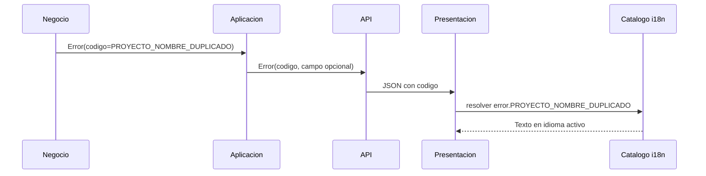

# Politica de internacionalizacion (i18n)

Politica transversal del proyecto Planificacion 2.0. Aplica a la implementacion de la aplicacion, no a la estructura arquitectonica en si.

## Ubicacion

Vive en `docs/politicas-transversales/` junto al resto de politicas globales. La arquitectura (`docs/arquitectura/`) puede referenciarla donde afecte a codigos de error o contratos, sin duplicar su contenido.

## Objetivo

Separar textos orientados al usuario de la logica de dominio, permitiendo traducir la interfaz sin modificar reglas de negocio ni contratos estables.

## Decisiones base

- **Idioma por defecto:** espanol (`es`), coherente con `docs/planificacion/planificacion-inicial.md`.
- **Identificadores estables:** codigos de error, tipos de planificacion en persistencia y enums de dominio no se traducen; se usan como claves.
- **Mensajes al usuario:** se resuelven por clave i18n en la capa que presenta informacion al usuario final.

## Fechas y zonas horarias (FAQ-002)

**Decision:** persistencia y comparaciones en **UTC**; la UI formatea segun locale del usuario.

**Entregable Step 10:** nota operativa en este documento (alineada al ER) al cerrar `modelo-entidad-relacion.md`. Hasta entonces, ver [dudas-y-resoluciones.md](../planificacion/dudas-y-resoluciones.md) (FAQ-002).

## Donde SI aplica i18n

### Presentacion (Front-End) — responsabilidad principal

| Elemento | Clave i18n sugerida | Ejemplo |
|----------|-------------------|---------|
| Titulos y navegacion | `nav.*`, `page.*` | `page.proyectos.titulo` |
| Etiquetas de formulario | `form.*` | `form.proyecto.nombre` |
| Placeholders y ayudas | `form.*.placeholder`, `form.*.hint` | `form.planificacion.fechaInicio` |
| Botones y acciones | `action.*` | `action.guardar`, `action.cancelar` |
| Validaciones locales (UC-01.5) | `validation.*` | `validation.campoObligatorio` |
| Mensajes de error de API | `error.<CODIGO>` | `error.PROYECTO_NOMBRE_DUPLICADO` |
| Confirmaciones y dialogos | `confirm.*` | `confirm.eliminarProyecto` |
| Estados visuales | `status.*` | `status.pendiente`, `status.completada`, `status.expirada` |
| Tipos de planificacion (display) | `planificacion.tipo.*` | `planificacion.tipo.periodica` |
| Calendario (meses, dias) | `calendar.*` | `calendar.mes.enero` |
| Formatos de fecha/hora | locale del usuario | `DD/MM/YYYY`, `HH:mm` |

Reglas:

- UC-01.5 muestra textos via i18n; validaciones locales usan claves, no literales embebidos.
- Los errores de API traen `codigo`; Presentacion resuelve `error.<codigo>` en el idioma activo.
- Los mensajes en espanol de los casos de uso (flujos alternativos) son **referencia UX** para el locale `es`, no texto a embeber en Negocio.

### API (opcional)

- `Accept-Language` o preferencia de usuario para clientes sin Front propio.
- Puede devolver `mensaje` traducido como conveniencia via `MessageResolver` en Aplicacion/API.

### Aplicacion (opcional)

- Solo si la API expone `mensaje` traducido; sin literales de UI en logica de orquestacion.

## Donde NO aplica i18n

| Capa / dato | Motivo |
|-------------|--------|
| Negocio | Emite solo `codigo` de error (SRP + DIP) |
| Persistencia | Sin textos de usuario |
| Logs tecnicos | Idioma del equipo; no expuestos al usuario |
| Contenido de usuario (nombres, observaciones) | No se traduce |
| Codigos de error | Claves estables, no texto final |
| Tipos en BD (`PUNTUAL`, `PERIODICA`, `SIN_PLANIFICAR`) | Valores canonicos; la UI traduce al mostrar |
| Documentacion del proyecto (`docs/`) | Espanol por convencion del proyecto |

## Relacion con arquitectura

- Catalogo de codigos: `docs/arquitectura/errores-validaciones-capas.md`
- Contratos (errores por codigo): `docs/arquitectura/contratos-minimos.md`
- Los mensajes orientativos del catalogo de errores alimentan `locales/es/errors.json`.

## Flujo de mensajes de error



## Mapeo codigo → clave i18n

Convencion: `error.<CODIGO>`.

| Codigo | Clave i18n |
|--------|------------|
| `PROYECTO_NOMBRE_DUPLICADO` | `error.PROYECTO_NOMBRE_DUPLICADO` |
| `ITEM_ULTIMO_NO_ELIMINABLE` | `error.ITEM_ULTIMO_NO_ELIMINABLE` |
| `PLANIFICACION_CONFIGURACION_INVALIDA` | `error.PLANIFICACION_CONFIGURACION_INVALIDA` |
| `ENTRADA_INVALIDA` | `error.ENTRADA_INVALIDA` |
| `ERROR_INTERNO` | `error.ERROR_INTERNO` |

Listado completo en `docs/arquitectura/errores-validaciones-capas.md`.

## Trazabilidad con casos de uso

| Caso de uso | i18n en Presentacion |
|-------------|---------------------|
| UC-01.1 Wizard | Formulario + confirmaciones |
| UC-01.2 a UC-01.4 | Formularios, dialogos de eliminacion |
| UC-01.5 | Componente de captura completo |
| UC-02.1 | Calendario, leyenda de estados |
| UC-02.2 a UC-02.4 | Acciones sobre ocurrencias |
| UC-03 | Listado Sin planificar |

## Estructura sugerida de catalogos (implementacion)

```
locales/
  es/
    common.json
    forms.json
    errors.json
    planificacion.json
    calendar.json
  en/
    ...
```

## Criterio para stack tecnologico (Step 9c)

Al elegir tecnologias en el Step 9c del plan de documentacion, valorar soporte de i18n en Front-End, interpolacion de parametros y formateo de fecha/hora por locale.

## Resultado

i18n es politica global de implementacion: vive principalmente en Presentacion, con resolucion opcional en API/Aplicacion, y sin acoplar Negocio ni Persistencia a idiomas.
