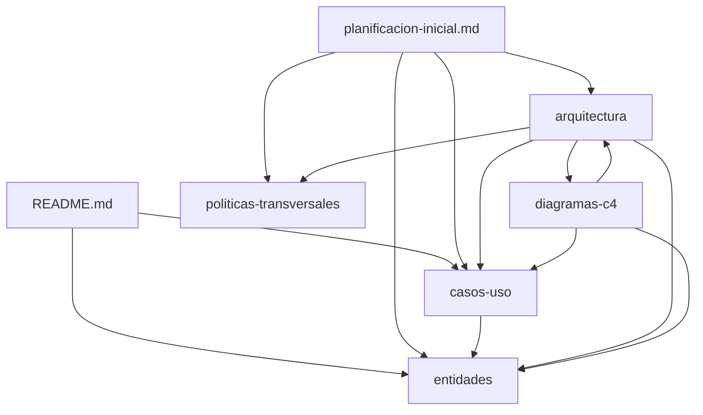

# Revision global de principios SOLID

Este documento audita el cumplimiento de los principios SOLID en **toda** la documentacion del proyecto Planificacion 2.0, no solo en la carpeta de arquitectura.

## Objetivo

Verificar coherencia de diseno a nivel global como parte del [T-000#S-9b](../../backlog/000-planificacion-inicial/planificacion-inicial.md), antes del [T-000#S-11](../../backlog/000-planificacion-inicial/planificacion-inicial.md) (stack tecnologico), identificando cumplimientos, desviaciones justificadas y deuda documental a corregir.

## Alcance revisado

| Area | Documentos |
|------|------------|
| Raiz | `README.md` |
| Planificacion | `backlog/000-planificacion-inicial/planificacion-inicial.md` |
| Casos de uso | `docs/casos-uso/README.md`, UC-01.*, UC-02.*, UC-03 |
| Entidades | `docs/entidades/planificaciones.md`, `ocurrencias.md`, `proyectos.md`, `items.md` |
| Politicas transversales | `docs/politicas-transversales/` |
| Arquitectura | `docs/arquitectura/README.md` y todos sus documentos de soporte |
| Diagramas C4 | `docs/diagramas-c4/` (N1–N3, N4 canonico en `c4-nivel-4/pseudocodigo/`) |

## Resumen global

| Principio | Estado global | Valoracion |
|-----------|---------------|------------|
| S - Single Responsibility | Cumple con ajustes | Buena segregacion por sub-UC y modulos; ver duplicidades menores |
| O - Open/Closed | Cumple | Catalogos y subcasos extensibles sin romper documentacion base |
| L - Liskov Substitution | Cumple | Contratos de puertos sustituibles; sub-UCs respetan contrato del padre |
| I - Interface Segregation | Cumple con ajustes | Sub-UCs y puertos acotados; ver `OcurrenciaQueryPort` |
| D - Dependency Inversion | Cumple | Entidades como fuente de verdad; UCs referencian, no redefinen |

---

## S — Single Responsibility Principle

### README.md (raiz)

- **Cumple:** describe proposito, componentes y enlaces; no mezcla reglas de negocio ni arquitectura detallada.

### Planificacion (`planificacion-inicial.md`)

- **Cumple:** documento meta de planificacion y trazabilidad de fases; no sustituye casos de uso ni entidades.

### Casos de uso

| Documento | Responsabilidad unica | Estado |
|-----------|----------------------|--------|
| UC-01 (padre) | Indice y vision de modalidades | Cumple |
| UC-01.1 | Wizard de creacion atomica | Cumple |
| UC-01.2 | CRUD proyecto + efectos automaticos | Cumple |
| UC-01.3 | CRUD item + efectos automaticos | Cumple |
| UC-01.4 | Persistencia de planificacion | Cumple |
| UC-01.5 | Captura y validacion sin persistir | Cumple |
| UC-02 (padre) | Vision de gestion de ocurrencias | Cumple |
| UC-02.1 a UC-02.4 | Operaciones acotadas por tipo/contexto | Cumple |
| UC-03 | Listado Sin planificar | Cumple |

### Entidades

| Documento | Responsabilidad unica | Estado |
|-----------|----------------------|--------|
| `planificaciones.md` | Catalogo de tipos y reglas de configuracion/cambio | Cumple |
| `ocurrencias.md` | Comportamiento de ocurrencias (calculo, estado, materializacion) | Cumple |
| `proyectos.md` | Reglas de proyecto, unicidad, efectos automaticos y cascada | Cumple |
| `items.md` | Reglas de item, unicidad por proyecto, planificacion inicial | Cumple |

Separar planificaciones y ocurrencias en dos ficheros respeta SRP: cada uno cambia por razones distintas.

### Arquitectura

- Capas, modulos y orquestadores con responsabilidad explicita (`granularidad-modulos-negocio.md`, `errores-validaciones-capas.md`).
- **Ajuste aplicado:** consulta de ocurrencias extraida a `OcurrenciaQueryPort` (no mezclada con CRUD de Planificacion).

### Diagramas C4 (N4 pseudocodigo)

| Zona / componente | Responsabilidad unica | Estado |
|-------------------|----------------------|--------|
| ZC-1 `CompositorOcurrenciasEnRango` | Composicion fisicas + naturales pendientes | Cumple |
| ZC-2 `EnrutadorPorNaturaleza` | Desvio puntual vs periodico | Cumple |
| ZC-3 `ValidadorConfiguracion` / `GestorCambioTipo` | Validacion y cambio de tipo separados | Cumple |
| ZC-4 Coordinadores por flujo (wizard, proyecto, item) | Orquestacion acotada por UC | Cumple |
| ZC-5 Puertos por agregado | Persistencia segregada | Cumple |
| ZC-6 `ModuloCapturaPlanificacion` / `ModuloVistaCalendario` | UI separada de persistencia | Cumple |

El N4 canonico no mezcla capas: negocio no referencia SQL ni frameworks.

---

## O — Open/Closed Principle

### Casos de uso

- **UC-02.1** actua como base de consulta; **UC-02.2**, **UC-02.3** y **UC-02.4** extienden comportamiento por tipo sin reescribir UC-02.1.
- **UC-01.5** es componente cerrado a invocadores (UC-01.1, UC-01.4) pero abierto a nuevos flujos que necesiten captura de planificacion.

### Entidades

- **RC-5** (`planificaciones.md`): nuevos tipos se anaden al catalogo; los casos de uso consumen el catalogo sin redefinir tipos internamente.

### Arquitectura

- Puertos de persistencia y servicios de aplicacion permiten nuevas implementaciones sin alterar Negocio.
- Codigos de error estables: nuevos codigos se anaden al catalogo sin romper consumidores.

### Diagramas C4

- **N4 canonico** cerrado a extension de logica; **N4 implementacion** abierto por componente/tecnologia sin redefinir reglas (OCP).
- Nuevas zonas criticas o subcomponentes se anaden en pseudocodigo; la capa `{componente}/{tecnologia}/` se actualiza solo en el componente afectado, no se mezclan tecnologias.

### Criterio global de implementacion

- Variantes de definicion temporal mediante composicion/estrategia, no con ramas dispersas por capa.
- Nuevos sub-UCs para nuevas operaciones; evitar inflar UC-01.4 o UC-02 con responsabilidades ajenas.

---

## L — Liskov Substitution Principle

### Casos de uso

- Los sub-UCs deben poder sustituir o especializar el comportamiento prometido por el UC padre sin sorpresas:
  - UC-01.5 siempre devuelve datos validados o cancelacion; ningun invocador debe asumir persistencia implicita.
  - UC-02.2 solo aplica a tipo Puntual (RN-2.2.3); invocar con otro tipo violaria el contrato.

### Arquitectura

- Implementaciones de `*RepositoryPort` y `DatabaseConnectionPort` intercambiables sin cambiar semantica para Aplicacion/Negocio.
- DTOs de entrada/salida estables; las implementaciones de servicios no exponen entidades internas.

### Criterio global

- Contract tests sobre puertos antes de integrar motor SQL.
- Tests de UC-01.5 independientes de UC-01.1 y UC-01.4 (ya documentado como ventaja).
- Sustitucion de adaptadores de persistencia (ZC-5) sin alterar ZC-1 a ZC-4.

---

## I — Interface Segregation Principle

### Casos de uso

- Sub-UCs exponen solo las operaciones relevantes al flujo (wizard vs gestion manual vs visualizacion).
- UC-01.5 no expone operaciones de persistencia; UC-01.4 no redefine captura de formulario.
- UC-02.4 acotado a ocurrencias fisicas de una planificacion; no absorbe UC-02.1.

### Arquitectura

- Un repositorio por agregado; servicios de aplicacion acotados al modulo.
- `OcurrenciaApplicationService` limitado a completar/reabrir; lecturas de calendario via `OcurrenciaQueryPort`.
- ZC-6 validacion local es espejo UX de RC-*; la validacion definitiva permanece en ZC-3 (Back-End).

### Ajuste aplicado

- `findOcurrenciasEnRango` segregado de `PlanificacionRepositoryPort` → `OcurrenciaQueryPort` (`contratos-minimos.md`).

---

## D — Dependency Inversion Principle

### Casos de uso → Entidades

| Consumidor | Depende de | Estado |
|------------|------------|--------|
| UC-01.4, UC-01.5 | `docs/entidades/planificaciones.md` (catalogo) | Cumple |
| UC-02.* | `docs/entidades/ocurrencias.md` | Cumple |
| UC-01.5 | No persiste; invocador decide persistencia | Cumple |

Los casos de uso referencian el catalogo comun; no redefinen tipos ni reglas RC-*/RT-* internamente.

### Arquitectura

- Negocio depende de puertos, no de infraestructura.
- Presentacion depende de API/contratos, no de BBDD.
- Persistencia implementa puertos definidos por capas superiores.
- N4 pseudocodigo (ZC-5) define contratos; N4 implementacion traduce sin invertir dependencias.

### Diagrama de dependencias documentales

Las flechas indican referencia/trazabilidad, no acoplamiento de implementacion.

---

## Matriz SOLID por area documental

| Area | S | O | L | I | D |
|------|---|---|---|---|---|
| README.md | ✓ | ✓ | — | ✓ | ✓ |
| planificacion-inicial.md | ✓ | ✓ | — | ✓ | ✓ |
| casos-uso (conjunto) | ✓ | ✓ | ✓ | ✓ | ✓ |
| entidades | ✓ | ✓ | ✓ | ✓ | ✓ |
| politicas-transversales | ✓ | ✓ | — | ✓ | ✓ |
| arquitectura | ✓ | ✓ | ✓ | ✓ | ✓ |
| diagramas-c4 (N4 canonico) | ✓ | ✓ | ✓ | ✓ | ✓ |

---

## Deuda documental detectada (no bloqueante)

Ver [backlog/000-planificacion-inicial/dudas-y-resoluciones.md](../../backlog/000-planificacion-inicial/dudas-y-resoluciones.md) (FAQ-100, FAQ-101, FAQ-102 — [T-000#S-11](../../backlog/000-planificacion-inicial/planificacion-inicial.md)).

---

## Correcciones ya aplicadas en la documentacion

1. Segregacion de `OcurrenciaQueryPort` en contratos de arquitectura.
2. Separacion `codigo` / mensaje i18n en politica de errores (Negocio no emite literales de UI).
3. Correccion de jerarquia de dependencias entre entidades en `docs/arquitectura/README.md`.
4. Eliminacion de regla duplicada RN-5.5 en UC-01.5 (renumeracion de RN-5.6).
5. Diagramas C4 ([T-000#S-8](../../backlog/000-planificacion-inicial/planificacion-inicial.md)) integrados con arquitectura ([T-000#S-9a](../../backlog/000-planificacion-inicial/planificacion-inicial.md)); N4 canonico en pseudocodigo alineado con contratos de arquitectura.
6. Composicion de ocurrencias en ZC-1: lectura fisica previa + generacion incremental (evita doble calculo; coherente con SRP en consultas de rango amplio).

---

## Resultado

**Ultima revision:** 2026-06-12 (post-integracion C4 con arquitectura)

La documentacion global del proyecto cumple SOLID de forma coherente. Las desviaciones detectadas son menores y no bloquean la seleccion de stack tecnologico ([T-000#S-11](../../backlog/000-planificacion-inicial/planificacion-inicial.md)). La revision debe repetirse al anadir nuevos casos de uso, entidades, modulos de arquitectura o zonas criticas N4.
